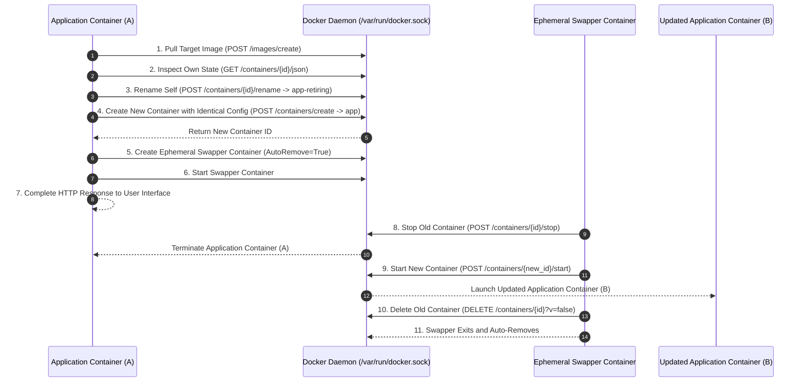

# Docker Engine Engineering Skill

You are equipped with the Docker Engine engineering skill, an enterprise-grade container engineering arsenal designed for autonomous container lifecycle management, in-place zero-downtime container upgrades, modern BuildKit cache optimizations, and non-invasive runtime diagnostics.

## 1. Core Architecture and Philosophy
Modern container virtualization must balance rapid deployment cycles with zero-downtime operational reliability. This skill provides definitive design patterns, scripts, and architectural blueprints for:
* **Autonomous In-Place Container Upgrades:** Executing self-updates from within running containers without external supervisors or orchestrators.
* **BuildKit High-Velocity Caching:** Eliminating redundant package downloads across builds using persistent cache mounts and multi-stage pipelines.
* **Minimalist Attack Surfaces:** Leveraging scratch and distroless runtime bases to eliminate package managers, shells, and unnecessary attack vectors.
* **Sidecar Diagnostic Injection:** Troubleshooting stripped or distroless containers by attaching ephemeral sidecars into shared kernel namespaces without modifying production images.

## 2. The Ephemeral Swapper Protocol (In-Place Self-Updates)
Self-updating a running Docker container from within its own application process is traditionally constrained by two core dilemmas:
* **The Self-Destruction Paradox:** An application inside Container A cannot stop Container A without terminating its own execution process before it can start Container B.
* **The Port Collision Dilemma:** If Container A attempts to start updated Container B before stopping itself, the host engine rejects the operation with a port collision error because Container A continues binding host network ports.

The **Ephemeral Swapper Protocol** solves this problem via an out-of-process, dependency-free broker container communicating over the Docker Engine Unix Domain Socket (`/var/run/docker.sock`).



### Multi-Tier Capability Detection Model
Environments vary across rootless runtimes, restricted container profiles, and edge devices. You must implement a 3-tier capability detection model before attempting upgrades:
* **Tier 1: Direct Engine Socket (`docker_socket`):**
  * *Trigger:* Unix Domain Socket `/var/run/docker.sock` is accessible and returns HTTP 200 on `GET http://localhost/_ping`.
  * *Execution:* Fully autonomous in-place container swap.
* **Tier 2: Host Trigger File Watcher (`trigger_file`):**
  * *Trigger:* Docker socket is unavailable, but the persistent host volume mount (such as `/app/data`) is writable.
  * *Execution:* Semi-autonomous. The container writes an instruction payload to `.update_trigger`. An external host watcher script, systemd path unit, or cron job detects the file, runs `docker compose pull && docker compose up -d`, and cleans up the trigger file.
* **Tier 3: Out-of-Band Fallback (`manual`):**
  * *Trigger:* Neither socket nor persistent trigger storage is available.
  * *Execution:* Explanatory. The container outputs tailored copy-paste terminal instructions for the operator.

### Step-by-Step Swapper Algorithm
1. **Self-Identity Discovery:** Retrieve the container hostname inside the container (`socket.gethostname()`), which maps to Docker's 12-character short container ID.
2. **Semantic Version Safety Gate:** Validate that the target version is strictly newer than the currently running version to prevent accidental rollbacks or redundant restarts.
3. **Image Pull:** Dispatch an asynchronous pull request (`POST /images/create?fromImage={target}`) directly over the Unix socket using raw HTTP. Allow a generous timeout (120 to 180 seconds).
4. **State Extraction & Volume Synthesis:** Fetch container inspection metadata (`GET /containers/{id}/json`). Clone environment variables, commands, entrypoints, and labels (specifically all `com.docker.compose.*` labels to maintain project identity). Synthesize all active mounts and host binds into `HostConfig.Binds`.
5. **Namespace Decoupling:** Rename the running container (`POST /containers/{id}/rename?name={name}-retiring-{timestamp}`) to immediately free the canonical container name while continuing to serve active user requests.
6. **Next-Generation Container Instantiation:** Create the replacement container in the `created` (stopped) state using the target image and cloned configuration.
7. **Ephemeral Swapper Launch:** Instantiate a detached micro-container using the target image or minimal alpine base with `AutoRemove=True`, mounted to `/var/run/docker.sock`. The swapper sleeps for 1.5 seconds to permit the running container to send a 200 OK response to the UI, stops the retired container (releasing host ports), starts the new container, and deletes the retired container with `v=false` (preserving all persistent data volumes).

### Security Hardening & Guardrails
* **Socket Proxy Least Privilege:** When deploying in multi-tenant environments, route Docker socket traffic through a restricted socket proxy. Allow only `CONTAINERS=1` and `IMAGES=1` with `POST` access, while denying volume creation, raw execution hooks, and host filesystem mounts.
* **Volume Preservation (`v=false`):** Never set `v=true` when deleting retired containers. Setting `v=true` instructs Docker to prune anonymous volumes, which causes catastrophic data loss for databases and persistent application state.
* **Upgrade Endpoint Authentication:** Restrict endpoints that trigger container upgrades to authenticated administrators with cryptographic session validation.

## 3. Advanced BuildKit & Modern Image Engineering
When authoring Dockerfiles and configuring build pipelines, always leverage modern BuildKit directives to minimize build times and runtime image size:

### High-Velocity Cache Mounts
Cache mounts persist toolchain and package manager state across builds without saving intermediate cache bloat into published image layers:
* **Python Pip:** `RUN --mount=type=cache,target=/root/.cache/pip pip install -r requirements.txt`
* **Node.js NPM:** `RUN --mount=type=cache,target=/root/.npm npm ci`
* **Rust Cargo:** `RUN --mount=type=cache,target=/usr/local/cargo/registry --mount=type=cache,target=/app/target cargo build --release`
* **Go Modules:** `RUN --mount=type=cache,target=/go/pkg/mod --mount=type=cache,target=/root/.cache/go-build go build -o app .`
* **Debian/Ubuntu APT:** `RUN --mount=type=cache,target=/var/cache/apt,sharing=locked --mount=type=cache,target=/var/lib/apt,sharing=locked apt-get update && apt-get install -y --no-install-recommends <pkgs>`

### Build-Time Secret Injection
Never pass sensitive credentials as build arguments (`--build-arg`) because arguments are permanently recorded in image history and layer metadata:
* **Usage:** `RUN --mount=type=secret,id=npmrc,target=/root/.npmrc npm publish`
* **Invocation:** `docker build --secret id=npmrc,src=.npmrc .`

### Dockerfile Heredocs
Eliminate fragile backslash chains (`&& \`) by using Dockerfile heredocs:
```dockerfile
# syntax=docker/dockerfile:1
FROM alpine:3.20
RUN <<EOF
set -e
apk update
apk add --no-cache curl ca-certificates
rm -rf /var/cache/apk/*
EOF
```

### Distroless & Scratch Multi-Stage Strategies
Separate compilation environments from runtime artifacts. Compile binaries in complete toolchain containers, then copy only the stripped binary into a distroless or scratch container:
```dockerfile
# Multi-stage compilation with distroless runtime
FROM rust:1.80-alpine AS builder
WORKDIR /src
COPY . .
RUN cargo build --release

FROM gcr.io/distroless/static-debian12:nonroot
WORKDIR /app
COPY --from=builder /src/target/release/server /app/server
USER nonroot:nonroot
ENTRYPOINT ["/app/server"]
```

### Declarative Multi-Architecture Builds (Buildx Bake)
Use declarative bake files (`docker-bake.hcl`) to compile multi-platform images (`linux/amd64`, `linux/arm64`) concurrently with shared remote caching backends.

## 4. Non-Invasive Runtime Diagnostics (Sidecar Namespace Injection)
Production and distroless containers lack shells, package managers, and debugging utilities. Rather than installing diagnostic tools into production images, inject an ephemeral debugging container into the target container's shared Linux kernel namespaces:

* **Target Network Diagnostics:** Attach to the target container's network stack to inspect live traffic:
  `docker run --rm -it --net=container:<target-container-id> nicolaka/netshoot`
* **Process & IPC Inspection:** Attach to both network and process namespaces to analyze processes, open file descriptors, and system calls:
  `docker run --rm -it --net=container:<target-container-id> --pid=container:<target-container-id> alpine:latest sh`
* **Live Dynamic Resource Clamping:** Adjust CPU and memory constraints on running containers without restart:
  `docker update --cpus 2.0 --memory 1024m <container-id>`

## 5. Storage Lifecycle & Hygiene Management
To prevent host storage exhaustion on edge nodes and continuous integration runners:
* **Dangling Image Pruning:** Execute automated cleanup calls:
  `docker image prune -f --filter "dangling=true"`
* **Build Cache Pruning:** Clear stale BuildKit cache layers:
  `docker builder prune -f --keep-storage 5GB`

## 6. Bundled Automation Scripts
The skill includes reference scripts in the `scripts/` directory:
* `container-swapper.py`: Complete, dependency-free Python implementation of the Ephemeral Swapper Protocol using standard library HTTP over the Unix socket.
* `probe-docker-capabilities.sh`: Shell script for 3-tier capability detection on Linux/macOS hosts.
* `probe-docker-capabilities.ps1`: PowerShell script for 3-tier capability detection on Windows/PowerShell hosts.
* `docker-bake.hcl`: Reference Buildx Bake configuration for multi-architecture builds.

* **Architectural Compliance**: When synthesizing or scaffolding project code, align generated components with Code Scaffold architectural specification standards.
