# Kinetic Canvas

**Version:** 6
**Target:** `.skills/kinetic-canvas`

## Description
Kinetic Canvas is a heavily optimized, zero-dependency WebGL shader engine uniquely branded and extended for the Code Scaffold ecosystem. It provides AI agents with instant access to ultra-premium canvas effects (like `KineticFluid`, `KineticMesh`, and `Caustics`), specifically tailored for reactive, motion-driven interfaces. 

## Capabilities & Use Cases
* **Proprietary Aliasing:** A completely native WebGL ecosystem engineered exclusively for Code Scaffold. Ensures all deployed shaders (`ThermalAura`, `QuantumPlasma`, `RibbedGlass`, etc.) maintain a cohesive architectural identity.
* **Logo Animations & Typography:** Provides explicit patterns for clipping shaders to massive hero text elements using CSS blend modes or providing highly dynamic backdrops to typography elements.
* **Environmental Effects:** Deploys massive, performant 3D spatial backgrounds (e.g. `OrbitalParticles`, `VaporRing`) that agents are instructed to wrap in GSAP or Web Audio API state bounds.
* **Optics & Optics Simulations:** Allows agents to overlay physical material simulations like `Caustics` (Water) and `OrganicPulp` (Paper Texture) onto standard DOM layouts, heavily bound to cursor velocity physics.

## Visual Capabilities Gallery

This skill provides proprietary high-performance shaders, categorized into three distinct domains.

### 1. Fluid & Aura Overlays
Highly fluid, colorful, and liquid-like shaders perfect for clipping to logos or acting as dynamic abstract auras.

| Shader Alias | Visual |
| :--- | :--- |
| **Kinetic Fluid** |  |
| **Thermal Aura** | 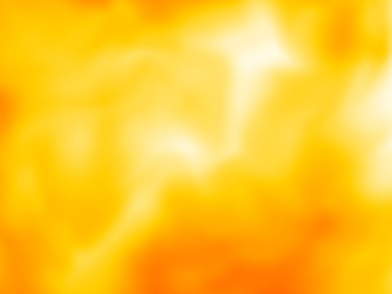 |
| **Fluid Aura** | 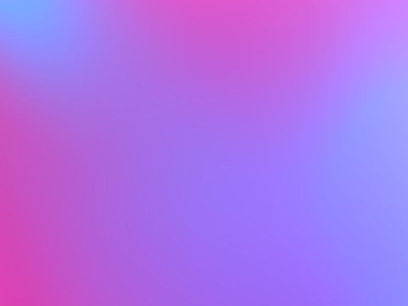 |
| **Crystalline Vapor** | 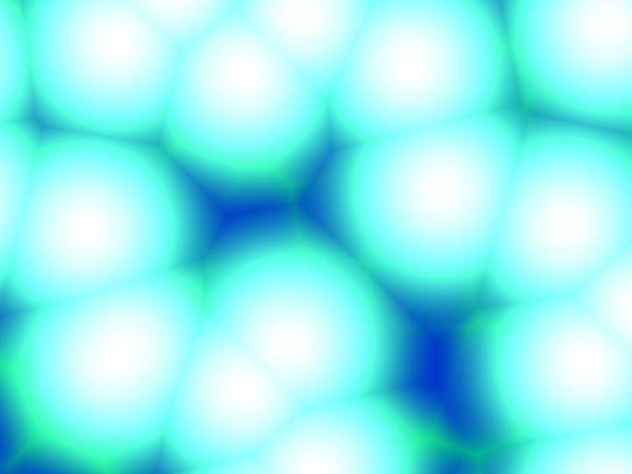 |
| **Quantum Plasma** | 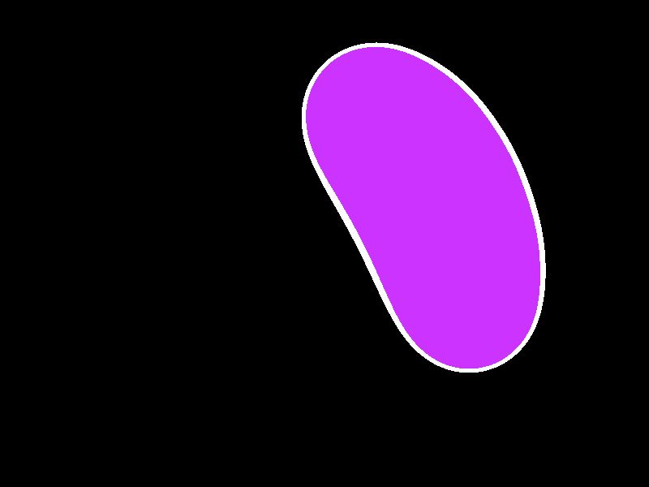 |

### 2. Spatial & Environmental
Massive, full-bleed 3D math backgrounds intended to be bound to GSAP ScrollTriggers or Web Audio APIs for stateful interactivity.

| Shader Alias | Visual |
| :--- | :--- |
| **Kinetic Mesh** | 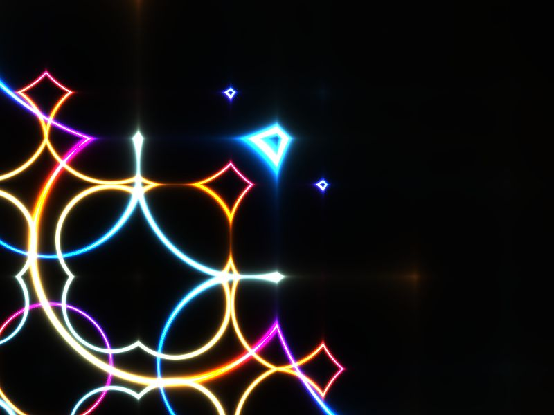 |
| **Orbital Particles** | 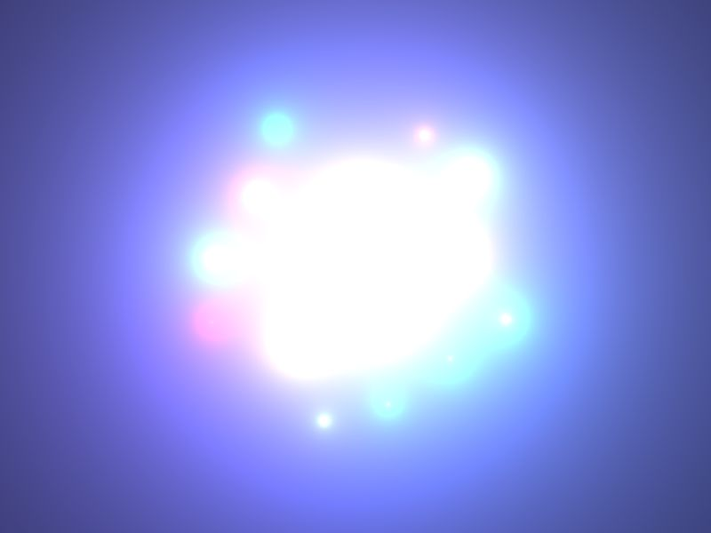 |
| **Volumetric Light** | 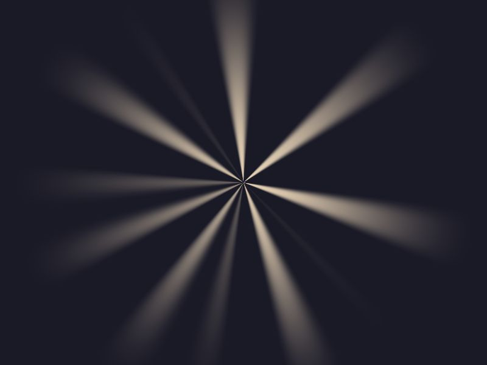 |
| **Vapor Ring** | 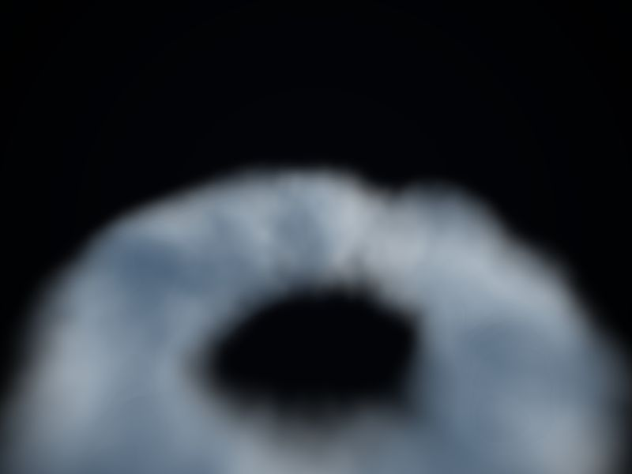 |
| **Cellular Voronoi** | 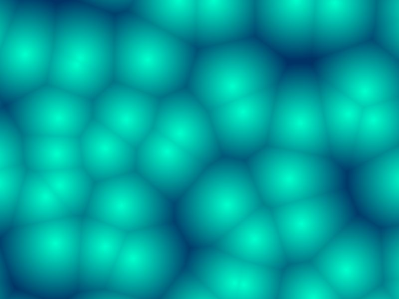 |
| **Crystalline** | 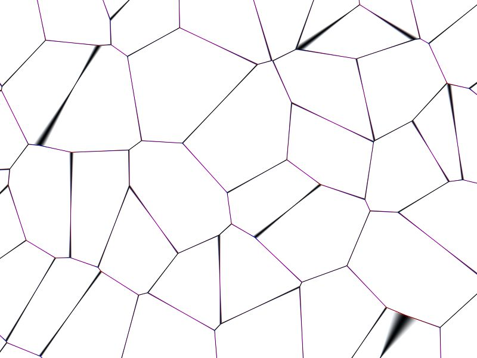 |
| **Wireframe** | 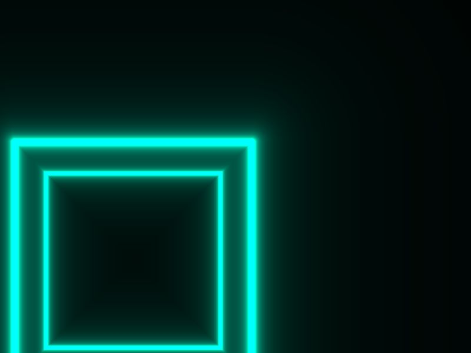 |

### 3. Glass, Optics & Material Simulations
Physical material simulations and lens effects intended to be overlaid on standard DOM elements or used as textured masks.

| Shader Alias | Visual |
| :--- | :--- |
| **Caustics** | 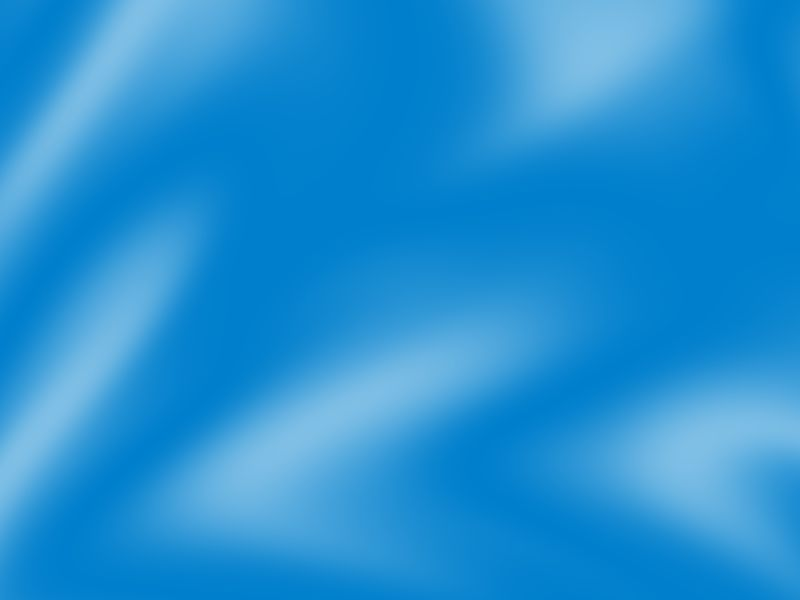 |
| **Prism** | 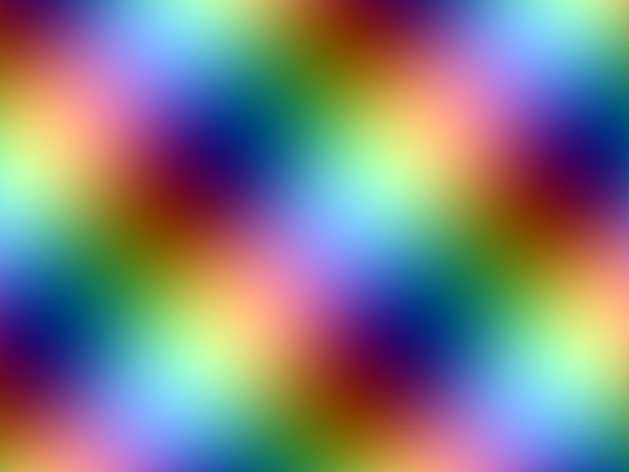 |
| **Ribbed Glass** | 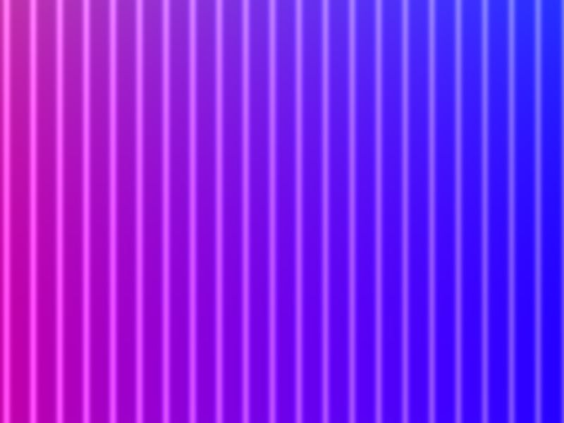 |
| **Organic Pulp** | 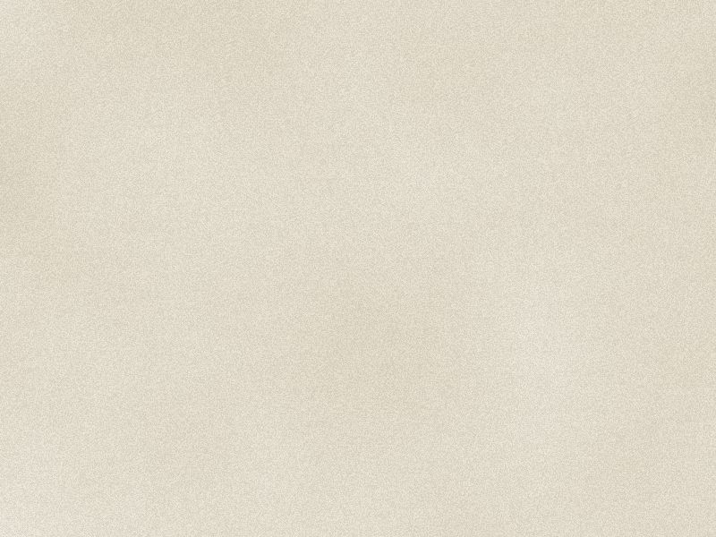 |
| **Retro Halftone** | 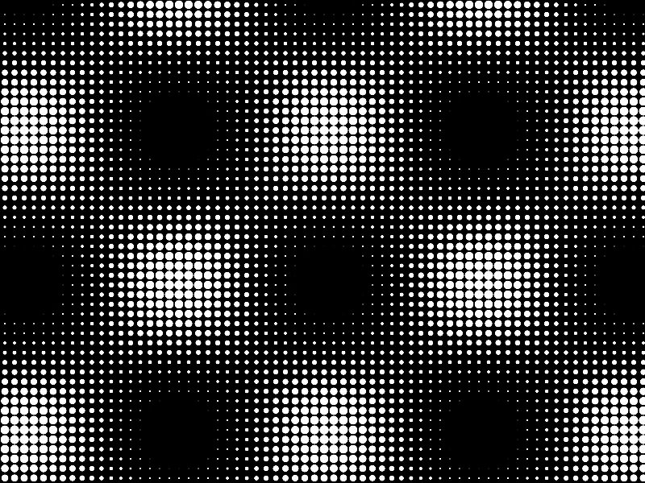 |
| **Halftone** | 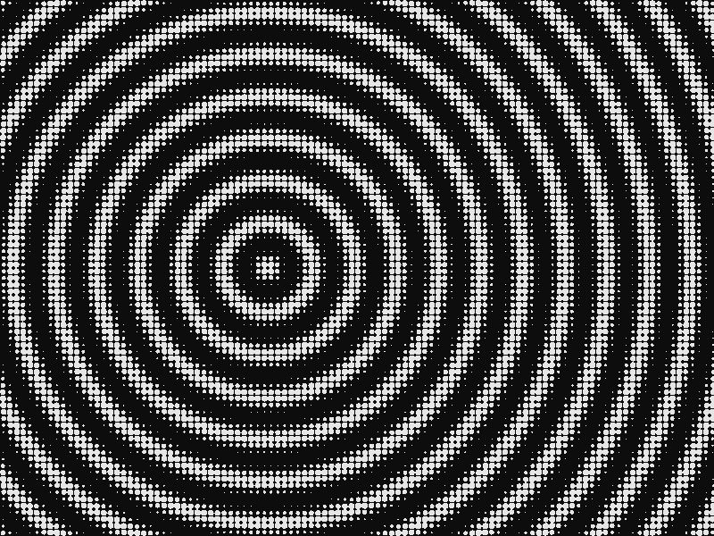 |

## Design Engineering & Advanced Animation
Kinetic Canvas must strictly adhere to our Design Engineering principles to guarantee premium, fluid interactions:
* **Restraint & Purpose:** The best animation is often no animation. Use shaders for purpose (feedback, spatial consistency, state indication), not decoration.
* **Custom Easings:** Never use linear defaults. Always implement custom easing curves (e.g., `power3.out`, `expo.inOut`) for smooth transitions.
* **Spring Physics:** For interactive elements and dragging, utilize spring physics (via GSAP or framer-motion concepts) to respect inertia and gesture velocity.
* **Micro-Interactions:** Buttons and interactive elements should use subtle scale adjustments (e.g., `scale(0.97)` on click). Never scale from 0; always start from a near-final state like `0.95`.
* **GSAP Context:** When using GSAP with React, ALWAYS leverage the `@gsap/react` `useGSAP()` hook for automatic cleanup and context management.

## Usage
Agents should read `SKILL.md` to understand how to bind the shader modules to React state for maximal interactivity using the proprietary `KineticCanvas` component aliases. Below are explicit examples of how this engine should be provisioned:

### Typography Example
Clip the `KineticFluid` shader to massive brutalist text elements using CSS blend modes:
```jsx
import { KineticFluid } from '@/components/kinetic/index';

export function KineticHeroText() {
  return (
    <div style={{ WebkitBackgroundClip: 'text', color: 'transparent' }}>
      <div className="absolute inset-0 z-[-1]" style={{ WebkitMaskImage: 'url(/logo.svg)', WebkitMaskSize: 'contain' }}>
        <KineticFluid speed={0.5} style={{ width: '100%', height: '100%' }} />
      </div>
      <span className="mix-blend-overlay">KINETIC</span>
    </div>
  );
}
```

### Caustics Example
Overlay physical material simulations like `Caustics` heavily bound to cursor velocity physics:
```jsx
import { Caustics } from '@/components/kinetic/index';

export function RepellentCaustics({ mouseVelocity }) {
  // mouseVelocity calculates dx/dy over dt
  return (
    <div className="relative w-full h-full overflow-hidden">
      <Caustics 
        speed={mouseVelocity} 
        style={{ width: '100%', height: '100%', transition: 'none' }} 
      />
    </div>
  );
}
```

## Changelog
* **6** : Updated `readme.md` to reflect the massive library expansion to 18 native shaders. Categorized shaders into Fluid & Aura, Spatial & Environmental, and Material Simulations. Overhauled visual gallery assets to point to the new high-fidelity 1:1 headless Playwright sandbox captures generated by the automated pipeline.
* **5** : Completely stripped the legacy @paper-design dependency. Engineered native replacements for the 10 remaining core shaders using pure WebGL/React. Re-architected the sandbox into 12 dedicated demo HTML pages and integrated a local Node.js/Playwright pipeline to capture mathematically perfect 1:1 headless WebGL screenshots for the Sandbox Hub index cards. Hardcoded this standard pipeline into the SKILL.md.
* **4** : Introduced Design Engineering & Advanced Animation principles. Migrated components to leverage GSAP's `useGSAP` hook for optimal React context cleanup. Replaced manual requestAnimationFrame loops with GSAP physics and spring easing in `RepellentCaustics` and `ScrollKineticMesh` for superior UX.
* **3** : Integrated Canvas UI components (Blaze, Frost, Cipher Reveal, Liquid Glass) under the SkillForge protocol. Renamed and mapped them into the Code Scaffold taxonomy (`KineticBlaze`, etc.). Added DOM Distortion category to the visual gallery with automated screenshot generation.
* **2** : Full 13-shader visual gallery capabilities mapped out in readme.
* **1** : Initial creation of the Kinetic Canvas skill via the SkillForge protocol. Integrated the proprietary taxonomy (`KineticMesh`, `KineticFluid`, etc.) with Code Scaffold. Added categorical examples for Logo Animations, Environmental Effects, and Image Filters.

