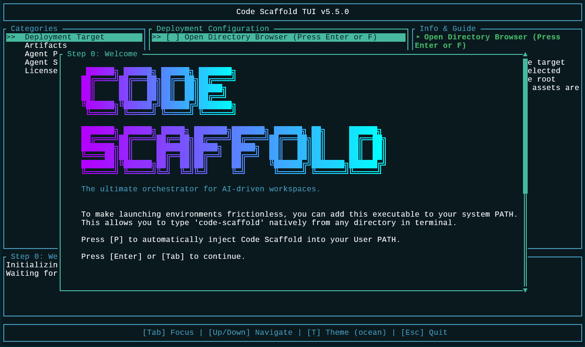
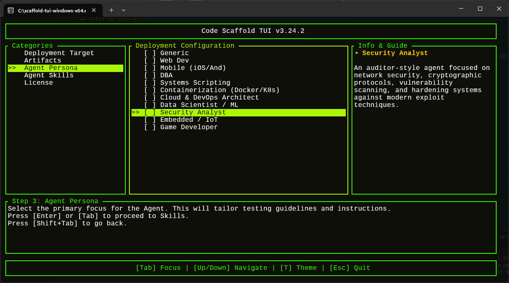

# Code Scaffold

[](https://GitHub.com/upioneer/code-scaffold/stargazers/)
[](https://GitHub.com/upioneer/code-scaffold/network/)
[](https://GitHub.com/upioneer/code-scaffold/issues/)
[](https://GitHub.com/upioneer/code-scaffold/pulls/)
[](https://GitHub.com/upioneer/code-scaffold/graphs/contributors/)
[](https://github.com/upioneer/code-scaffold/commits/main)


Code Scaffold is a modular, robust, and highly visual PowerShell-based provisioning engine. It is designed to bootstrap new development projects with predefined directory structures, architectural templates, and complex skill payloads, all driven by a high-fidelity Terminal User Interface (TUI).



## Features

* **High-Fidelity TUI**: A deeply interactive, color-coded terminal interface featuring animated ASCII branding, staggered visual loading, and clean category-based module selection.
* **Remote Synchronization Engine**: Capable of dynamically fetching the latest `manifest.json` from the remote GitHub repository. If an update is detected, it automatically downloads and caches the latest `.templates` and `.skills` payloads before execution.
* **Intelligent Environment Detection**: Detects if it is running in "Local Dev" mode (within the core repository) to preserve source files, or in "Production" mode where it uses a secure temporary workspace (`$env:TEMP\Scaffold_Workspace`).
* **Dynamic Payload Library**: Easily extensible. By placing a new folder with a `meta.json` inside the `.skills` directory, the engine will automatically discover it and present it as an option in the UI.
* **Secure Provisioning**: Automatically generates a stringent `.gitignore` for standard security policies, and in production mode, the `scaffold.ps1` script acts as a self-destructing bootstrapper.
* **Automated Baseline Documentation**: Automatically generates a structured `README.md` in the target directory, dynamically titled with the project's folder name, to provide a consistent starting point for all scaffolded projects.
* **Immutable Version History**: Adheres to a strict versioning protocol, maintaining snapshots of every significant deployment cycle in `project_details\history`.



## Architecture Overview

The system operates on a dual-layer architecture:
1. **The Core Script (`scaffold.ps1`)**: The bootstrapper that handles the sync engine, user interface rendering, and file provisioning logic.
2. **The Payload Library (`.skills` & `.templates`)**: Hidden directories containing raw source code and Markdown files. Each skill subdirectory must contain a strict `meta.json` file schema:

```json
{
  "label": "The UI display name",
  "description": "A brief explanation of the payload",
  "version": "1.0.0",
  "target": "The exact relative path where this payload should be deployed e.g. .skills/supabase"
}
```

## Usage

Run the script from your terminal:

```powershell
.\scaffold.ps1
```

1. **Target Selection**: The script will prompt you for a target directory. Leave it blank to use the current directory.
2. **Module Selection**: Navigate the menu using the **[Up/Down Arrow]** keys.
3. **Shortcuts**: 
    * **[Space]**: Toggle individual selection (prompts to overwrite if the artifact already exists).
    * **[T]**: Toggle **All/None** selections (prompts to overwrite if any selected artifacts already exist).
4. **Execution**: Press **[Enter]** to begin the provisioning process.

## Built-In Scaffolding Options

* **Core Applications**: `/src`, `/tests`, `/docs`
* **Artifacts**: Boilerplate markdown files (`AGENT.md`, `DESIGN.md`, `PLAN.md`, `README.md`, etc.) automatically routed to `project_details` (except README and LICENSE).
* **Agent Skills**: Pre-configured integration snippets (Braille Animations, Clerk Authentication Perimeter, Excalidraw, Firebase, Firecrawl, GitHub, Hyperframes, Manim, Marp, Mermaid, Node, Open Design, OpenCLI, p5.js, PlayCanvas Editor, PlayCanvas Engine, PlayCanvas SuperSplat, Playwright, Ratatui, Resend, SEO GEO AEO Auditor, Supabase, Telegram, Trackio ML Tracking, Upstash Redis Management, Vercel Deployment Routine, Website Deploy Linux) deployed to their designated `target` paths.

## Agent Skills Library

Code Scaffold features a rapidly growing library of specialized AI skills. For a complete list of available payloads, detailed descriptions, and their target deployment paths, please refer to the **[Agent Skills Library](.skills/README.md)**.

## Project Constraints

This tool was designed under strict constraints to ensure broad compatibility and robust performance:
* No emojis allowed in the UI or generated code.
* Absolutely no semicolons used in the PowerShell logic.
* Automated documentation adheres strictly to Markdown formatting with asterisks for lists (no em-dashes).
