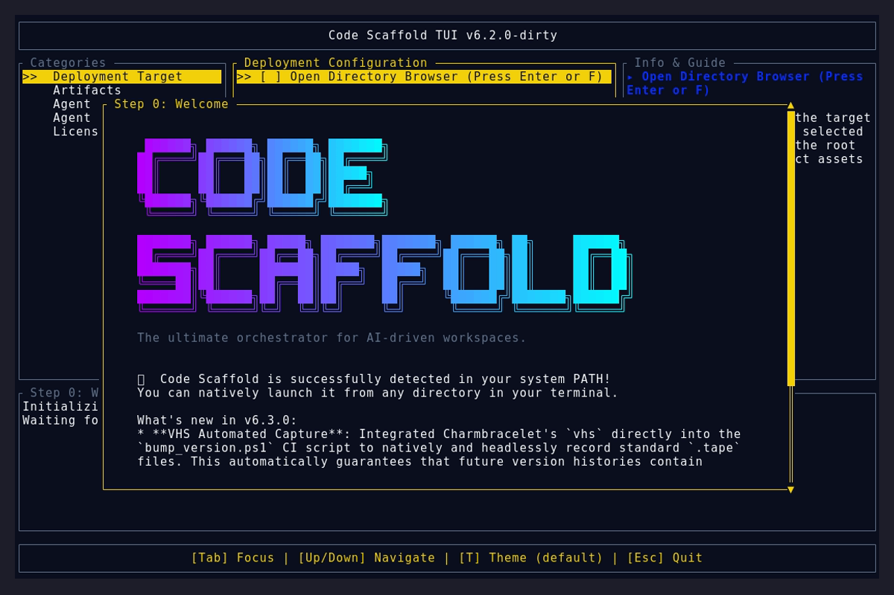
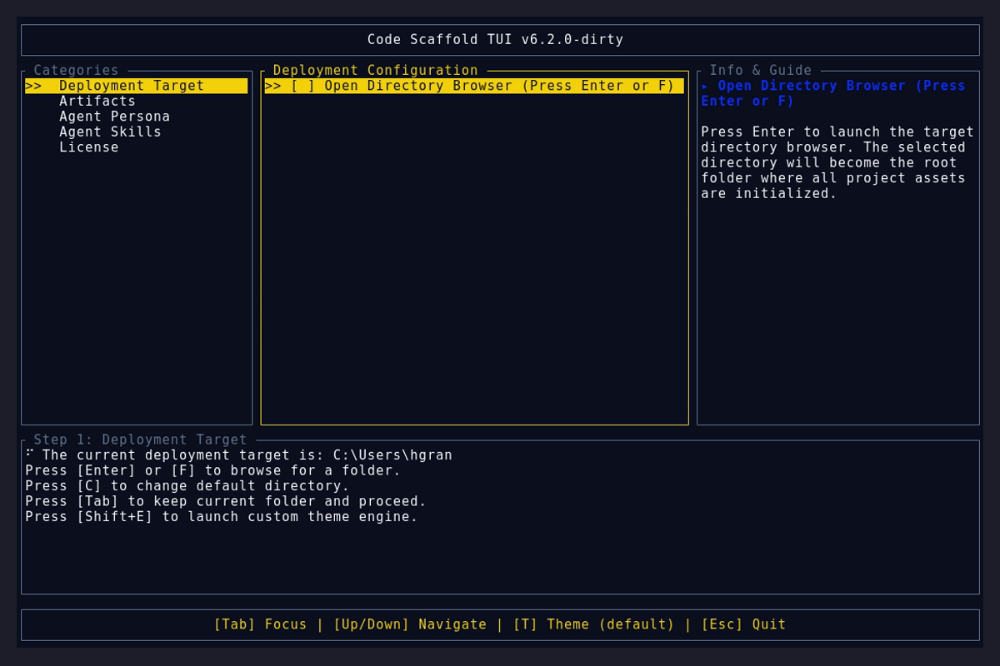
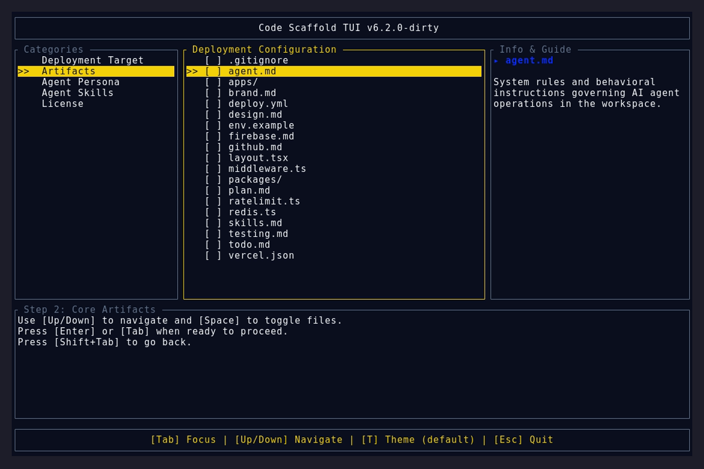

# Version 6.3.0

## Features
* **VHS Automated Capture**: Integrated Charmbracelet's `vhs` directly into the `bump_version.ps1` CI script to natively and headlessly record standard `.tape` files. This automatically guarantees that future version histories contain pristine, up-to-date screenshots and GIFs.
* **TUI Tools Skill**: Rebranded and heavily expanded the `tui-splash` skill into `tui-tools` (v2), documenting advanced guidelines for automated TUI screenshotting and headless GIF generation.
* **Agent Rule Enforcement**: Updated `.agents/AGENTS.md` to rigidly enforce embedding the automatically generated VHS demo assets (`.png` and `.gif`) directly into the version history readmes.

## Bug Fixes
* **Welcome Scroll Indicator**: Repaired a logic gate (`!is_in_path`) that was accidentally suffocating the `▼ Scroll ▼` indicator when the application was already in the user's PATH, ensuring users aren't prematurely pushed past critical changelog details.

## UI Artifacts

