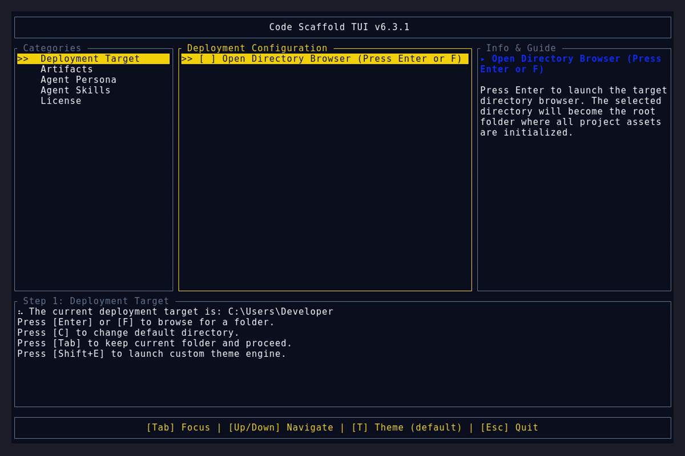
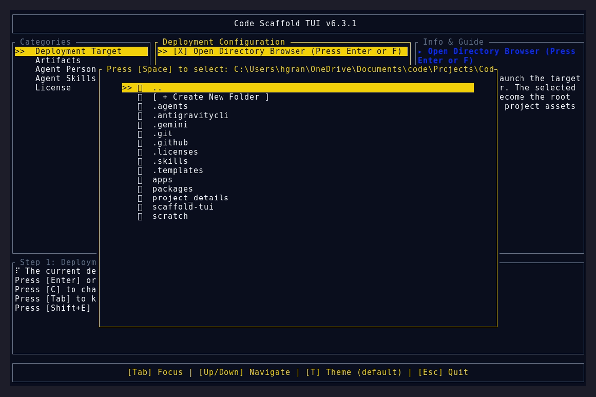
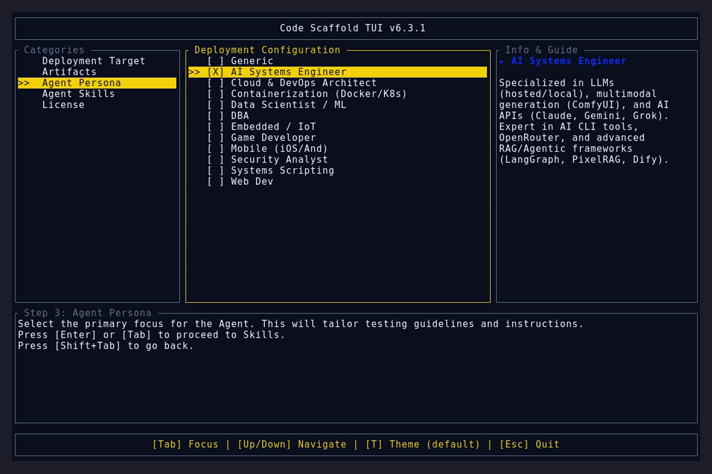

# Version 6.3.1

## Bug Fixes
* **Preferences Isolation**: Modified `get_prefs_path` in `src/prefs.rs` using `#[cfg(debug_assertions)]` compiler macros. Development runs (`cargo run`) now isolate their preferences, themes, and version states into a dedicated `code-scaffold-dev` directory, preventing them from overriding or polluting the production executable's configuration.
* **Auto-Healing Version Strings**: Implemented logic in `build.rs` to seamlessly cross-reference `git describe` against `CARGO_PKG_VERSION`. If the compilation detects that `Cargo.toml` has bypassed the current Git tag (such as during mid-bump CI scripts), it natively overrides the dirty Git tag and renders the pristine target version string instead. This guarantees pristine and perfectly aligned version labels in headless VHS captures.
* **WSL Syntax Repair**: Fixed a PowerShell syntax evaluation error in `bump_version.ps1` that caused the `Get-Command wsl` fallback check to crash during automation.

## UI Artifacts

