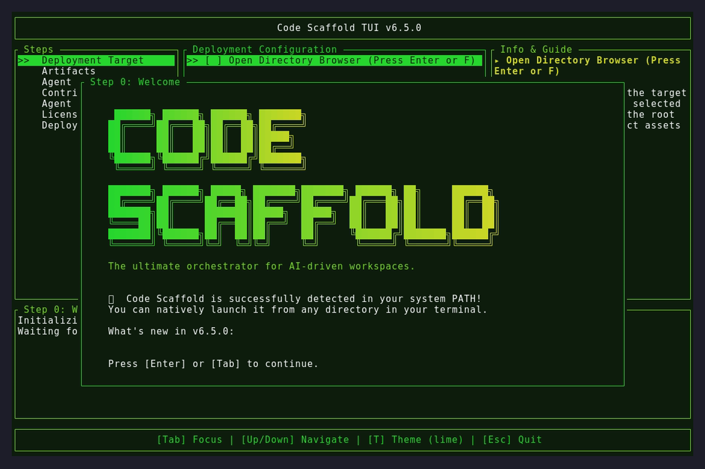
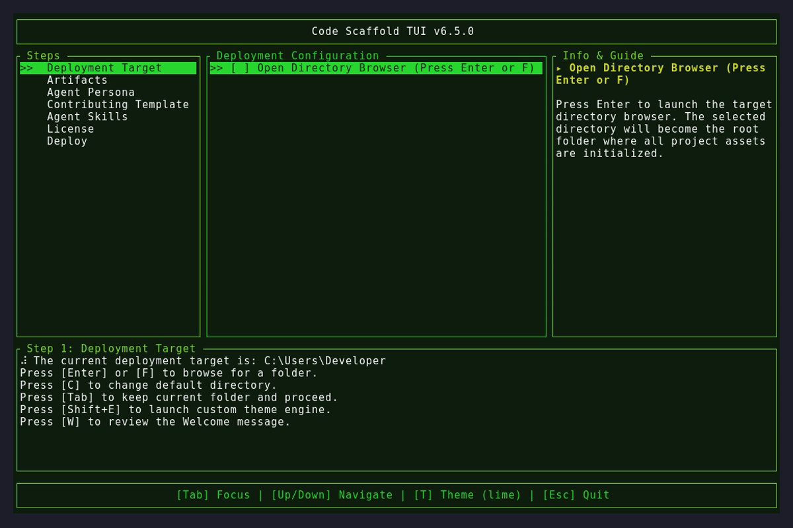
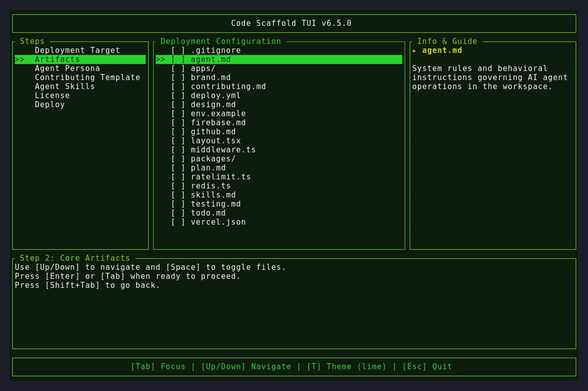

# v6.5.0

## Features & UI Enhancements
* **Dynamic Splash Screen Gradient**: Hot-swapped the hardcoded cyan-to-purple welcome splash with a dynamic mathematical interpolation algorithm that maps left-to-right from the active theme's `Primary` color to its `Accent` color.
* **Intelligent Distance Fallback**: Engineered a 3D-color distance validation check for the splash screen gradient. If the `Primary` and `Accent` colors are virtually indistinguishable (distance < 10.0), it dynamically cascades to the `Secondary` color, guaranteeing a vibrant gradient for every custom and built-in theme.
* **Contextual Theme Prompts**: Re-engineered the custom theme builder UI to proactively prefix the active input buffer (`Background: > █`, `Primary: > █`), preventing users from losing their place in the wizard sequence.
* **Inspirational Workflow Linking**: Injected an inline navigational recommendation to `schemecolor.com/palettes` directly within the UI of the custom theme builder modal.
* **On-Demand Welcome Review**: Introduced a new `[W]` hotkey binding directly accessible from the deployment target view (and standard UI loops), enabling users to instantly hot-swap back to the Welcome wizard on demand without restarting the binary.

## Demonstration

