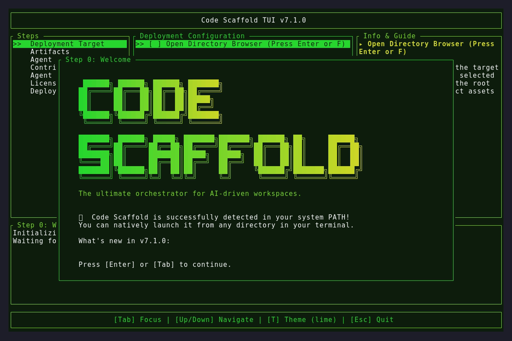
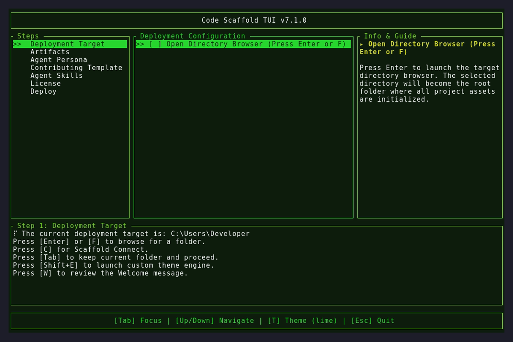
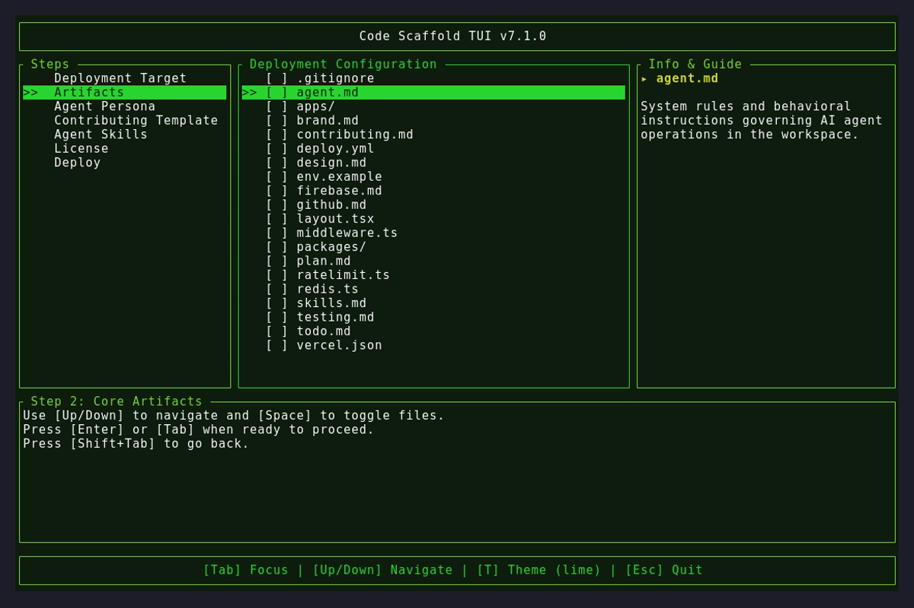

# Version 7.1.0

## Changelog
* **Timer Duration Selection**: Refactored the Agent Copilot session timer to use a direct numeric text input field (1 to 480 minutes) instead of a fixed menu list.
* **Live Session Countdown**: Injected a dynamically calculated, real-time `HH:MM:SS` countdown timer directly into the Agent Copilot relay screen leveraging the native 60fps terminal tick event loop.
* **Dynamic Modals**: Extended the minimum vertical percentage constraint for the Agent Copilot layout modals from 40% to 90% to prevent QR code cutoff on ultra-short terminal layouts.
* **Key Rotation Navigation**: Addressed a minor state machine bug by forcing empty sessions bypassing the Welcome screen directly into the Timer selection modal.

## Assets

