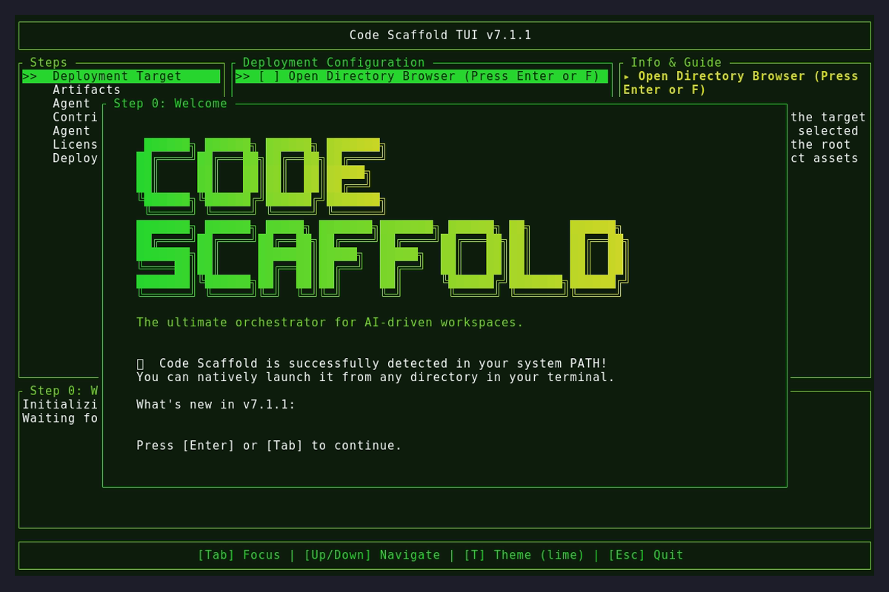
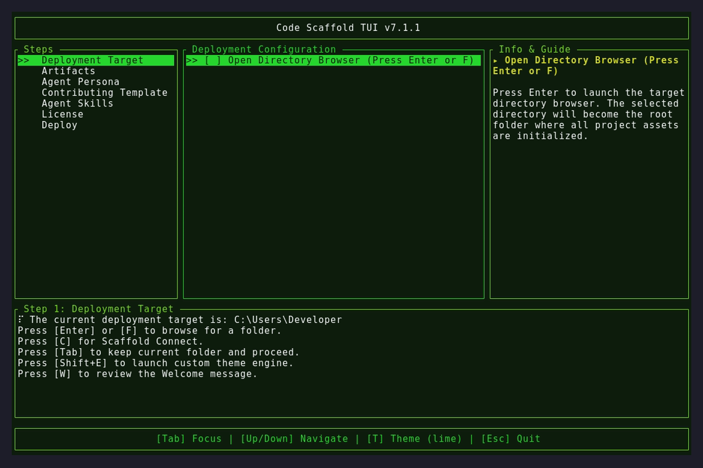
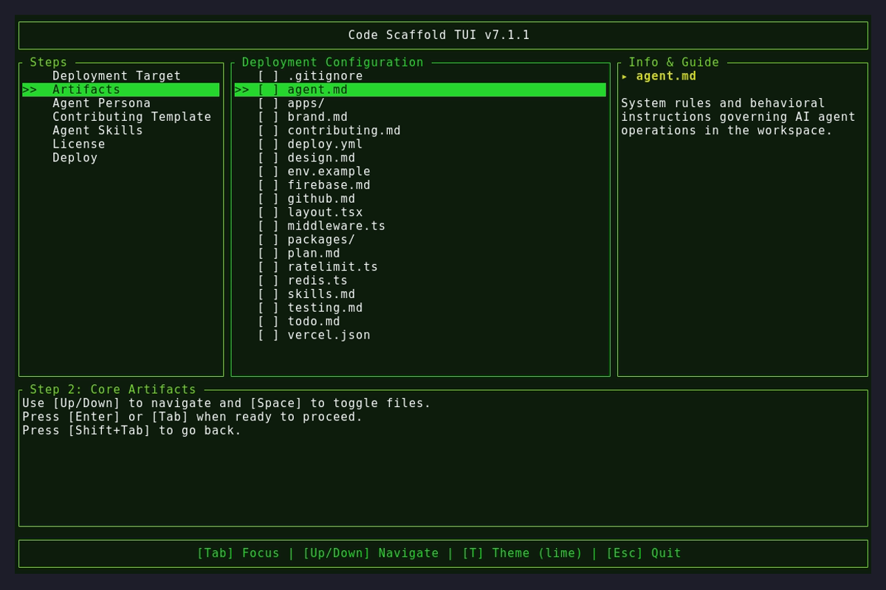

# Version 7.1.1

## Changelog
* **Code Hygiene**: Addressed trailing whitespace issues in the core `app.rs` state machine to strictly adhere to `cargo fmt` standards.
* **NPM Package Version Bump**: Bumped the `@code-scaffold/skills-cli` NPM package to `v1.0.6` to resolve a registry publication conflict.

## Assets

