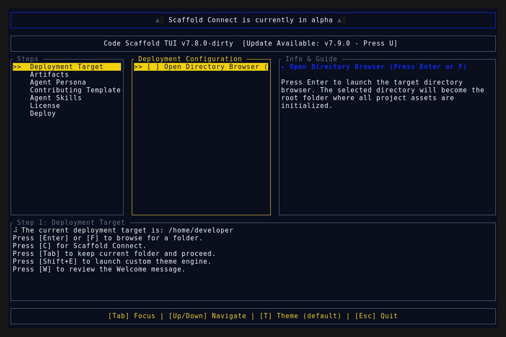

# v7.10.0

## Changelog
* **feat(tasty):** Upgraded the Tasty skill to v2 by integrating the Impeccable aesthetic protocol.
* **docs:** Added advanced command vocabulary (`/tasty polish`, `/tasty distill`, etc.) and strict anti-pattern rules to `tasty/SKILL.md`.
* **chore:** Synced all skill manifests, meta payloads, and root indexing to reflect the v2 overhaul.

## TUI Demo

## TUI Splash Screen

