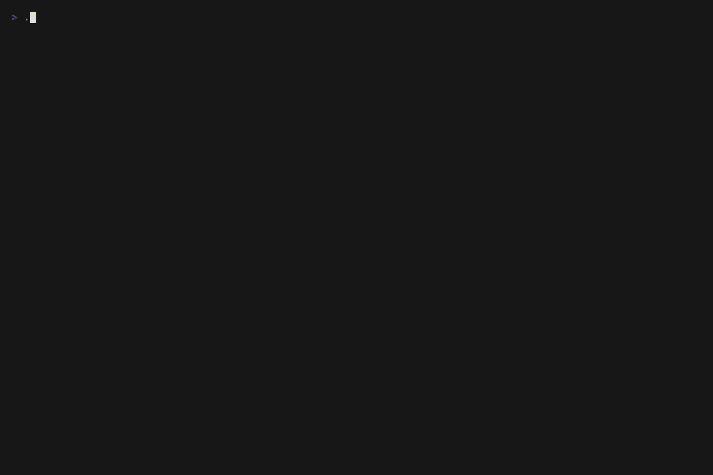
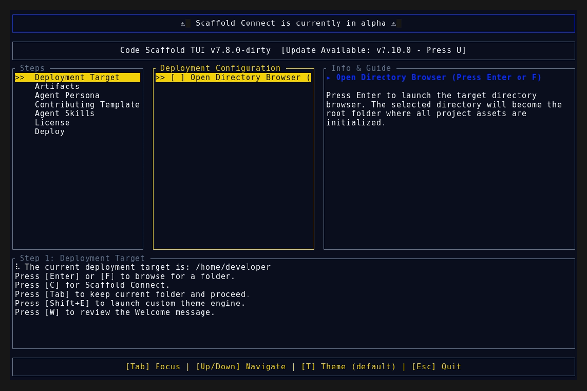
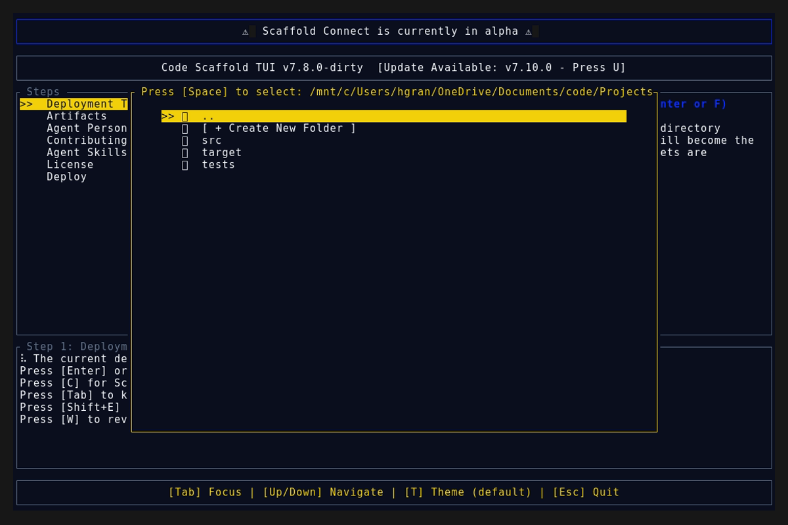
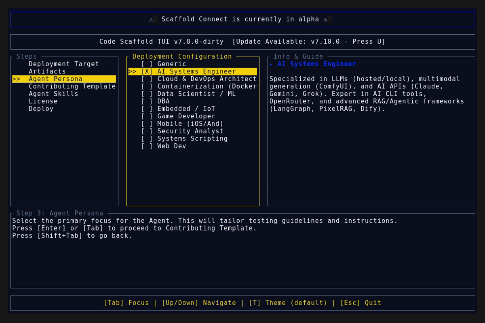

# Version 7.11.0

## Kinetic Canvas Sandbox Improvements & Design Engineering

* Introduced **Design Engineering & Advanced Animation** principles to the `kinetic-canvas` skill, aligning with GSAP best practices and Emil Kowalski's animation philosophies (purposeful restraint, custom easings, and spring physics).
* Upgraded React sandbox components (`RepellentCaustics`, `ScrollKineticMesh`, `TextKineticFluid`, `AudioKineticMesh`) to utilize GSAP's `useGSAP` hook for deterministic context cleanup and strict state management.
* Replaced manual `requestAnimationFrame` velocity decay loops with GSAP physics and advanced spring/elastic easings (`elastic.out`, `power3.out`).
* Synchronized the updated sandbox components back to the root `.skills/kinetic-canvas/components` directory.
* Incremented `kinetic-canvas` skill whole-number version from **3** to **4**.

## Deployment Assets

### TUI Demo

### Splash Screen

### Main Interface

### Final View

