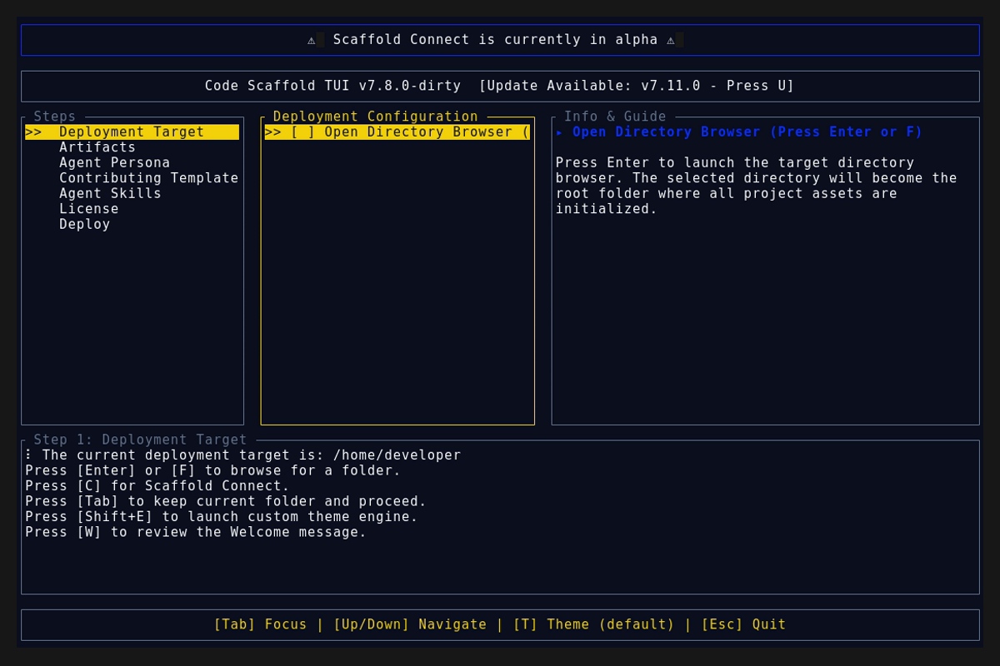
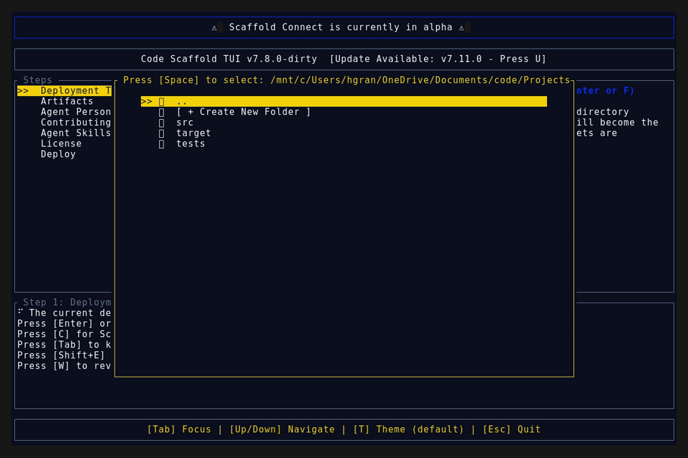
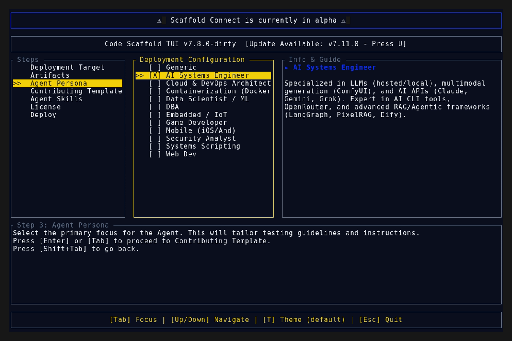

# Version 7.12.0

## Dynamic Skill Sandboxing Expansion

* Created the `generate_all_sandboxes.ps1` execution playbook to autonomously provision high-fidelity presentation layers for any raw skill payloads.
* Dynamically built and deployed 48 new interactive HTML sandboxes across the `.skills` directory, natively integrating GSAP intro animations, ASCII logo embedding, and glassmorphic UI cards to fulfill the Sandbox Architecture contract.
* Preserved existing custom React/Vite sandboxes (e.g., `kinetic-canvas`) from being overwritten by the generic generation loop.

## Deployment Assets

### TUI Demo

### Splash Screen

### Main Interface

### Final View

