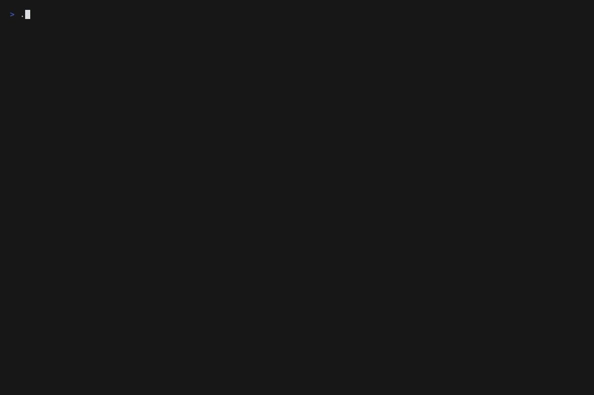
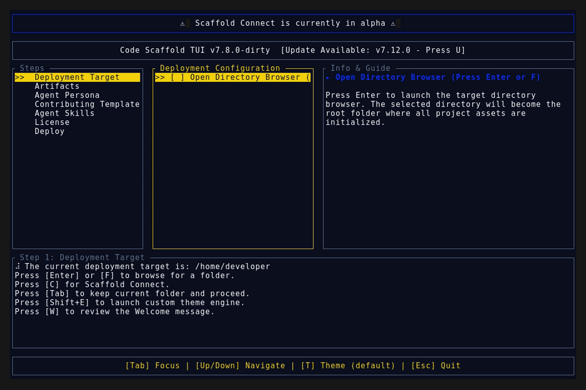
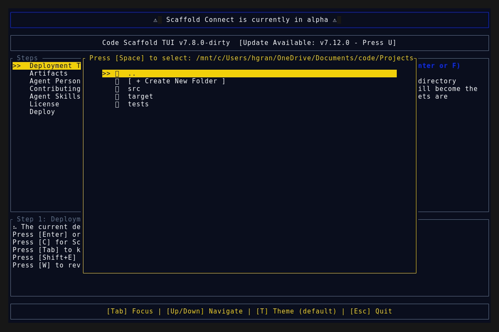
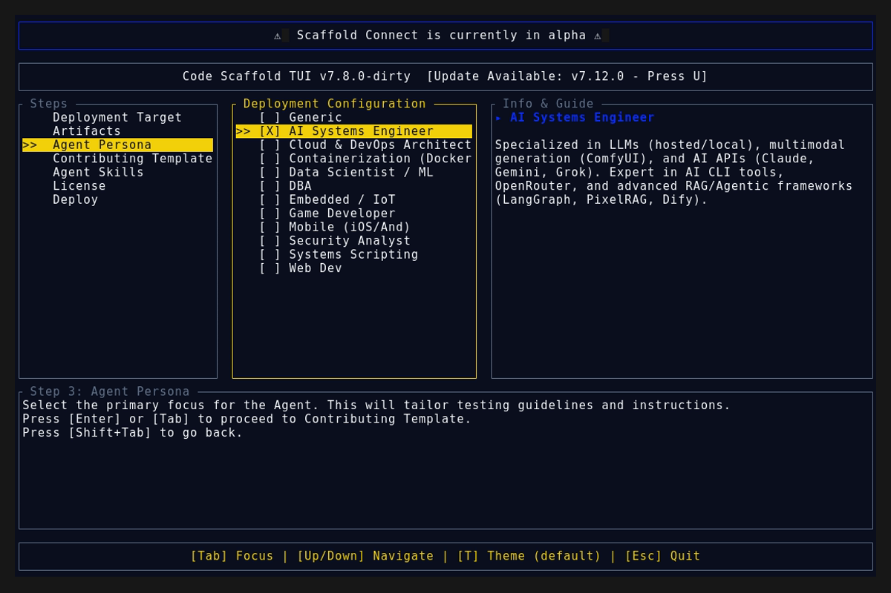

# Version 7.13.0

## Dynamic Skill Sandboxing Improvements

* **Skill Sandbox Generator Overhaul:** Completely rewrote the base HTML template inside `generate_all_sandboxes.ps1`. All generic backend/CLI skill sandboxes now feature a native `min-h-screen` scrollable layout rather than a fixed modal card, resolving the "window within a window" iframe behavior.
* **Braille Animations Custom Sandbox:** Gutted the generic sandbox payload for `braille-animations` and deployed a highly interactive, bespoke Vite/React sandbox that demonstrates live unicode spinners (classic, snake, line, dots) mapped directly to React state.
* **SkillForge Protocol Verification:** Validated that the generator correctly excludes custom Vite payloads from being overwritten.
* **Skill Version Bump:** Incremented `braille-animations` version from **2** to **3**.

## Deployment Assets

### TUI Demo

### Splash Screen

### Main Interface

### Final View

