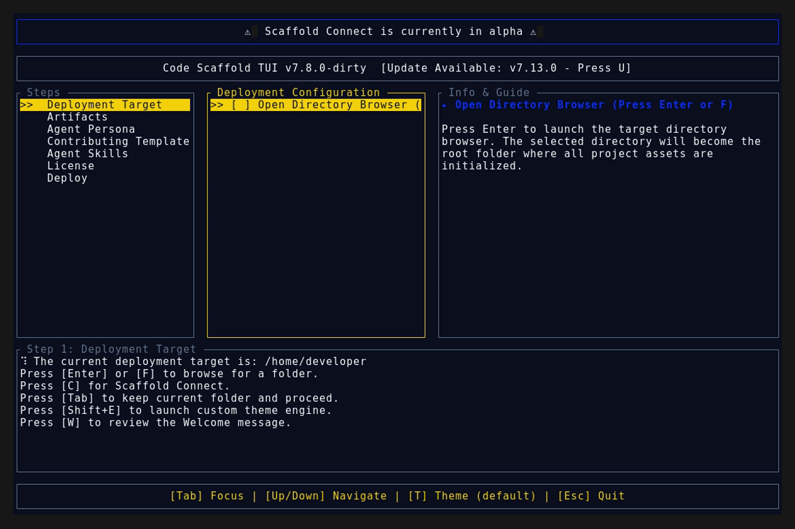
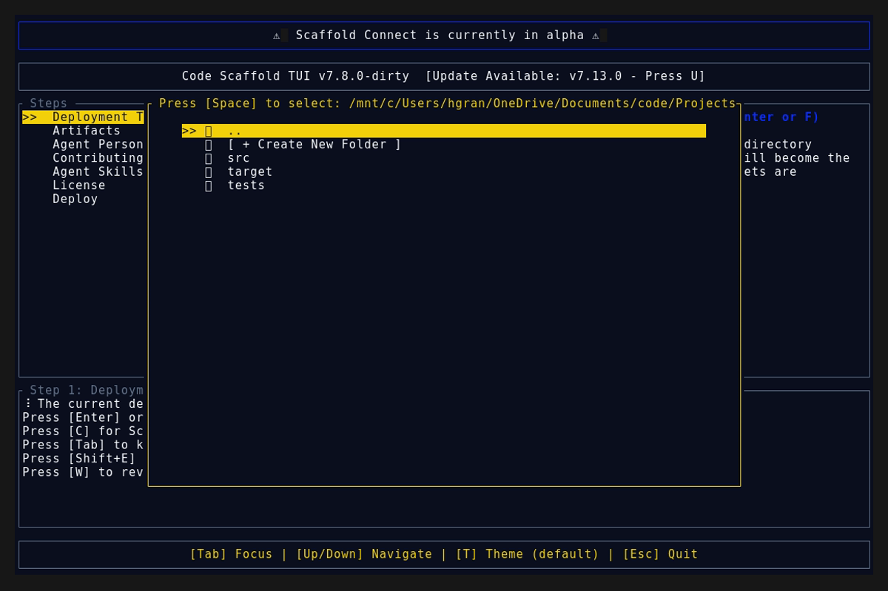
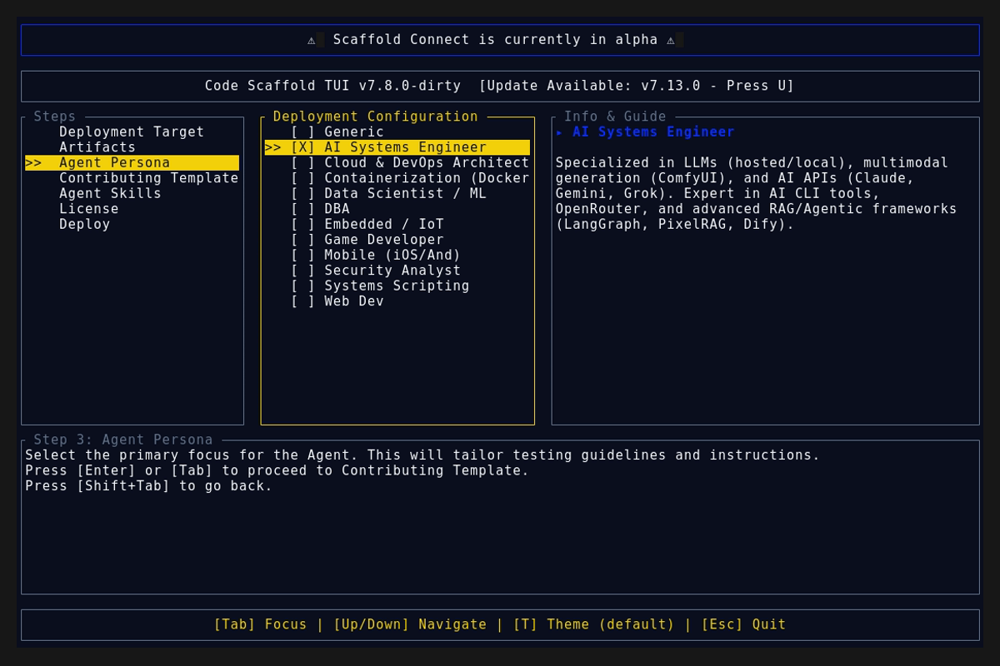

# Version 7.14.0

## Dynamic Skill Sandboxing Improvements

* **Sandbox CLI Correction:** Patched all 49 generic skill sandboxes to correctly instruct users to run `npx @code-scaffold/skills install <skill>` instead of the internal agent command.
* **Bespoke Excalidraw Sandbox:** Gutted the generic template for the Excalidraw skill and embedded a full, live, borderless interactive Excalidraw canvas via iframe.
* **Bespoke Mermaid Sandbox:** Upgraded the Mermaid skill sandbox to natively compile and render architecture topologies using `mermaid.js` alongside the Markdown code block.
* **Bespoke P5.js Sandbox:** Upgraded the p5.js sandbox to execute a live, generative physics particle engine directly in the browser.

## Deployment Assets

### TUI Demo

### Splash Screen

### Main Interface

### Final View

