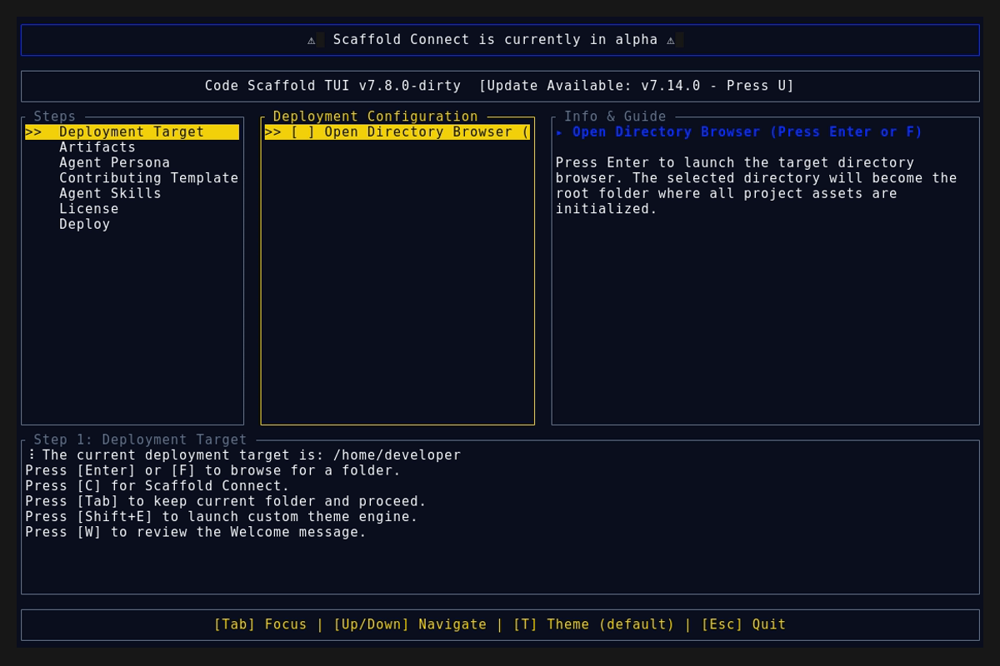
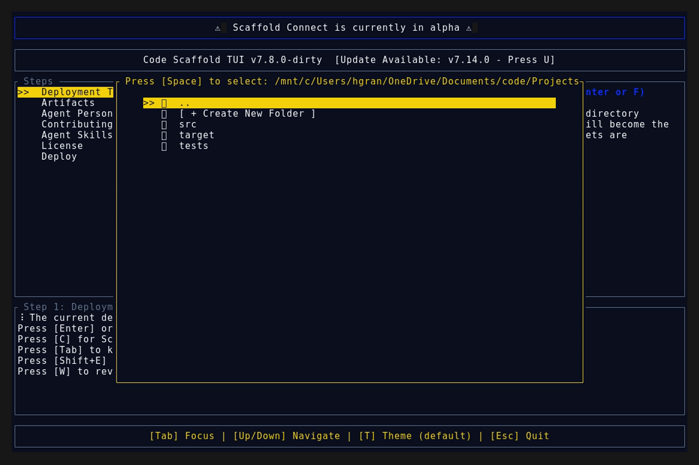
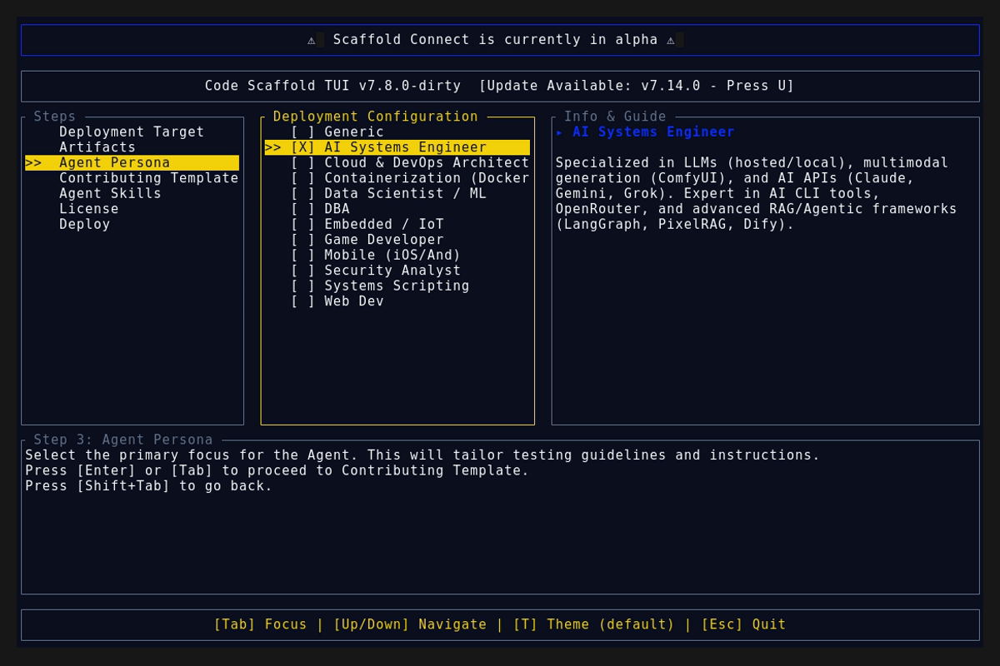

# Version 7.14.1

## Dynamic Skill Sandboxing Improvements

* **Sandbox Scrollbar UI Sync:** Applied global `::-webkit-scrollbar` styling across all 49 generic and bespoke sandbox payloads to perfectly match the Code Scaffold frontend UI and eliminate default browser double-scrollbars.
* **Generator Safeguards:** Hardened the payload generator to correctly detect and skip all manually crafted bespoke HTML sandboxes during ecosystem re-builds.

## Deployment Assets

### TUI Demo

### Splash Screen

### Main Interface

### Final View

