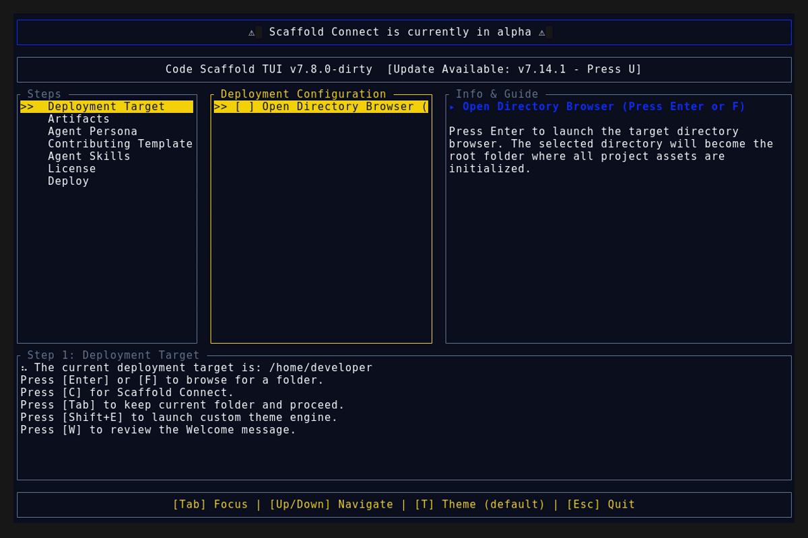

# Code Scaffold v7.15.0

## Release Summary
This release bundles several new feature additions and major skill architecture overhauls (TUI modal integrations, the brand new Lingo skill, and the Scrollytelling v3 overhaul).

## Changelog
* **Domain Migration**: Updated all website references and QR codes from `code-scaffold.web.app` to the new official domain `code-scaffold.com` across all core files.
* **Agent Onboarding Modal**: Implemented a new `Shift+A` trigger within the TUI to spawn an agent instruction modal.
* **VS Code & Antigravity Integration**: Implemented a new `Shift+O` trigger within the TUI to seamlessly launch `code` and the `agy` CLI pointing directly at the target directory.
* **Lingo Skill (v2)**: Introduced a brand new deterministic shorthand glossary skill mapping over 250+ user acronyms, lingo, and abbreviations to their full meanings to accelerate human-agent communication.
* **Scrollytelling Skill (v3)**: Architected a massive overhaul to the scrollytelling playbook, introducing cinematic WebGL environmental storytelling patterns (procedural scenes, continuous camera paths, and alpha-preserving foreground layering).

## TUI Screenshots & Demos

