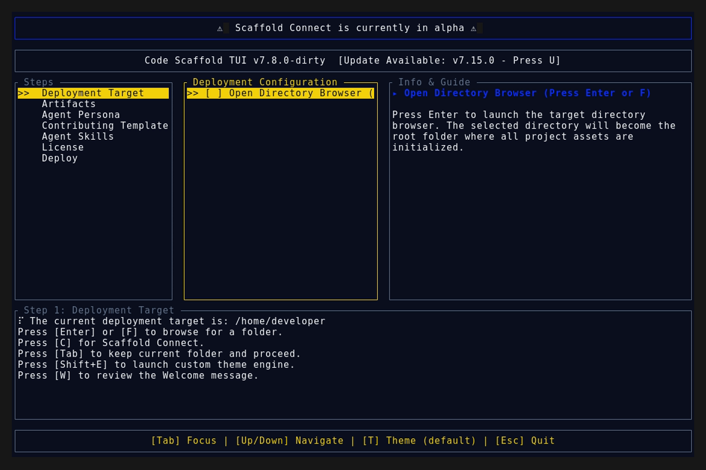

# Code Scaffold v7.16.0

## Release Summary
This minor release introduces a significant UI/UX enhancement to the core engine's boot sequence, completely overhauling the static ASCII splash screen with a dynamic Hologram Assembly effect.

## Changelog
* **Procedural Hologram Splash Screen**: Replaced the static block-text ASCII logo on the TUI splash screen with a dynamic, time-based hologram assembly sequence.
* **High-Density Render Engine Integration**: Leveraged the Unicode Braille Patterns block (U+2800) to introduce glitch states, where characters briefly render as randomized sub-character pixel arrays (Braille dots) before solidifying into the final ANSI Shadow text logo.

## TUI Screenshots & Demos

