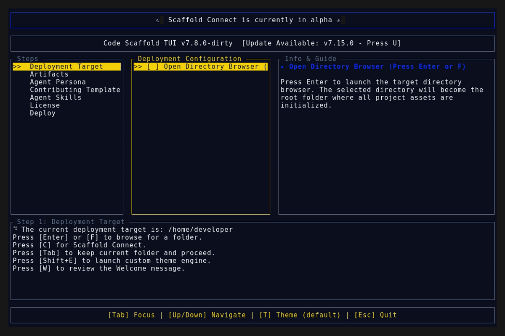

# Code Scaffold v7.16.1

## Release Summary
This patch resolves a trailing whitespace hygiene failure that broke the GitHub Actions CI/CD matrix build for the `v7.16.0` release. No new features are being added.

## Changelog
* **CI/CD Hygiene Patch**: Stripped trailing whitespace in `scaffold-tui/src/app.rs` introduced during the splash screen overhaul, successfully resolving the `cargo fmt` pipeline failure.
* **Pre-commit Guardrails**: Introduced a permanent local `.git/hooks/pre-commit` script to enforce zero-trust automated `cargo fmt --check` testing prior to allowing commits.

## TUI Screenshots & Demos

