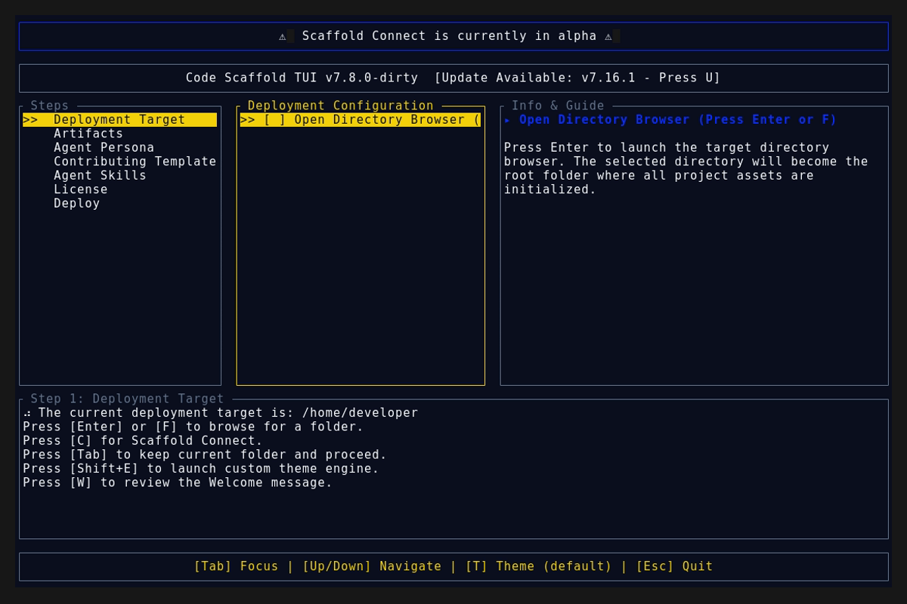
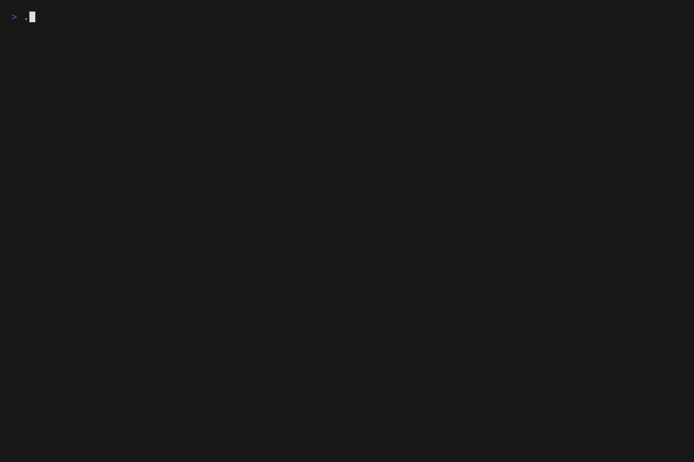

# Code Scaffold v7.16.2

## Release Summary
This patch introduces QoL enhancements to the TUI (replaying animations and adding "(Conditional)" text qualifiers to wizard headers) alongside a massive glossary expansion and prompt logic update to the Lingo skill.

## Changelog
* **Hologram Replay Support**: Reset the rendering tick counter when users explicitly press `[W]` to return to the Welcome state, allowing the procedural hologram assembly animation to be replayed on demand.
* **TUI Clarity Pass**: Appended "(Conditional)" qualifiers to the headers of the optional wizard steps (Persona, Template, Skills, and Licensing) to better communicate non-blocking pathways.
* **Lingo Skill Expansion (v3)**: Massive Gen-Z slang expansion. Integrated definitions for: `no cap`, `cap`, `rizz`, `yolo`, `full send`, `crash out`, `bet`, `bussin`, `sus`, `mid`, `drip`, `tea`, `slaps`, `salty`, and `ghost`.
* **Lingo Bidirectional Mode (v4)**: Added logic to prompt the user upon initialization to ask whether Lingo should apply to inputs only, or both inputs and outputs to aggressively reduce generated token counts.

## TUI Screenshots & Demos

