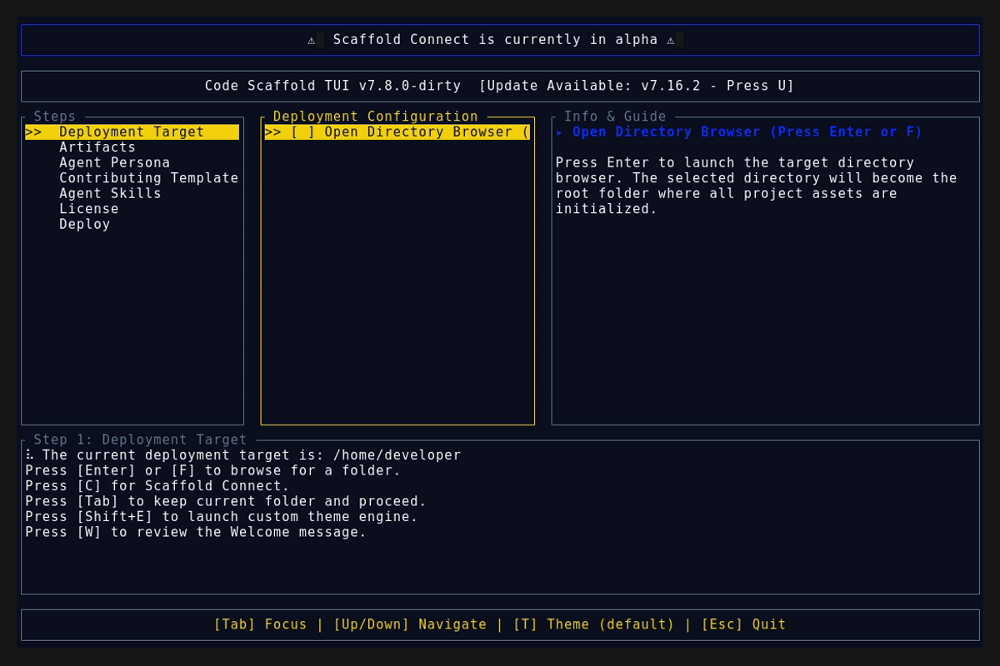

# Code Scaffold v7.17.0

## Release Summary
This minor release radically upgrades the internal SkillForge Protocol incubation pipeline, fundamentally shifting how Code Scaffold's ecosystem mandates the execution of highly repeatable tasks.

## Changelog
* **SkillForge - Declarative YAML Workflows:** Radically upgraded the SkillForge incubation pipeline. The Protocol now enforces an *Execution Paradigm Routing* constraint that forces AI agents to orchestrate highly repeatable, deterministic logic via declarative YAML workflows (modeled on Swamp) rather than outputting raw, unparseable bash or PowerShell scripts.

## TUI Screenshots & Demos

