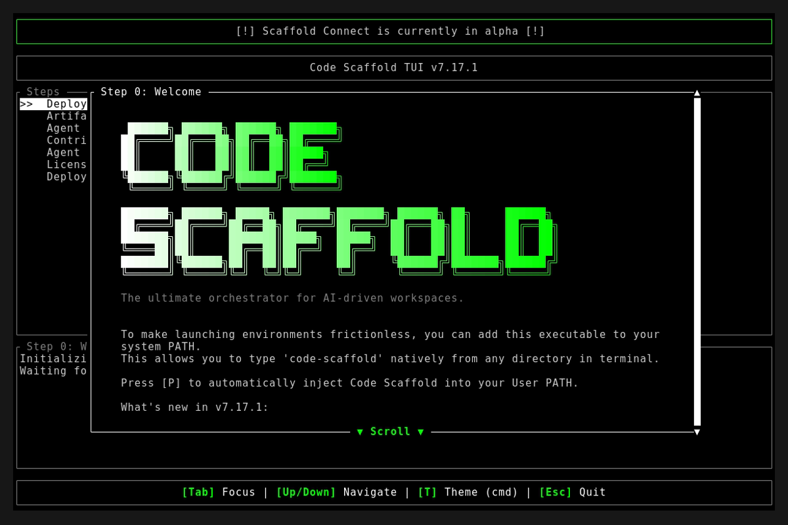

# Code Scaffold v7.17.1

## Release Summary
This patch refactors the `playwright` skill instructions, obliterating all legacy Javascript definitions and replacing them with strict, declarative YAML schemas modeled directly on the new Swamp protocol mandate.

## Changelog
* **Playwright Skill (v3) - Declarative Porting**: Executed a massive rewrite adhering to the new SkillForge Declarative Workflow mandate. The agent now orchestrates browser automation by authoring rigid YAML workflows (with CEL expression injection for zero-trust secrets) instead of unparseable raw Javascript scripts.
* **TUI Asset Fix**: Purged a stale Linux binary (`code-scaffold`) from the `/target/debug` directory that was interfering with WSL-based automated TUI captures, ensuring that the VHS assets dynamically pull the current Windows executable version.

## TUI Screenshots & Demos

