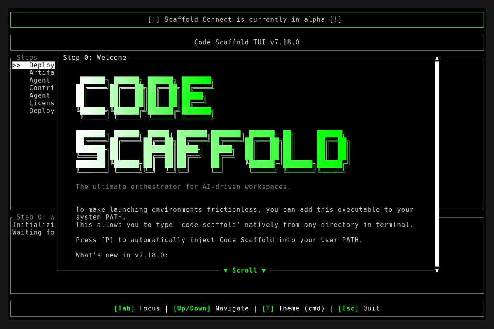

# Code Scaffold v7.18.0

## Release Notes

* **React Modernization Skill (v1):** Added a comprehensive new skill playbook standardizing React 19 architecture, Zod/React Hook Form validation pipelines, and modern UI best practices (Radix, shadcn/ui, HeroUI, Framer Motion).
* **React Sandbox Demo:** Bundled a fully styled, glassmorphic React 19 form demo utilizing `useOptimistic` and spring physics into `.skills/react-modernization/sandbox/`.
* **Scrollytelling Sandbox Demo:** Engineered and bundled a highly cinematic, zero-build WebGL demo featuring GSAP scroll interpolation, 3D wireframe morphing, and a spatial explosion effect into `.skills/scrollytelling/sandbox/`.
* **Index Update:** Alphabetized and registered the new React Modernization skill into the global `.skills/readme.md` index.

## Assets

