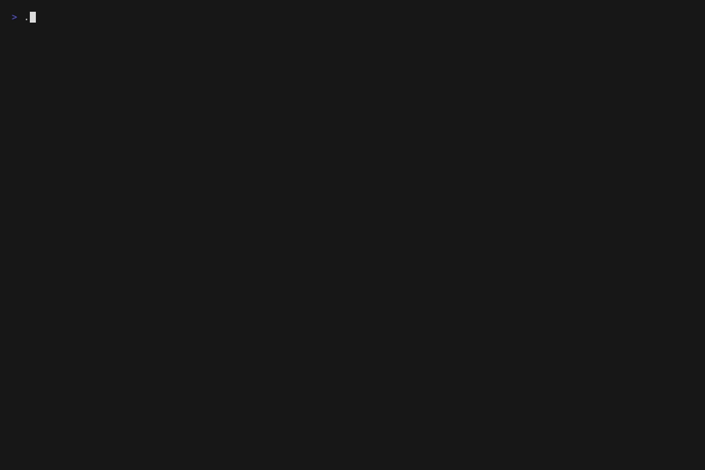
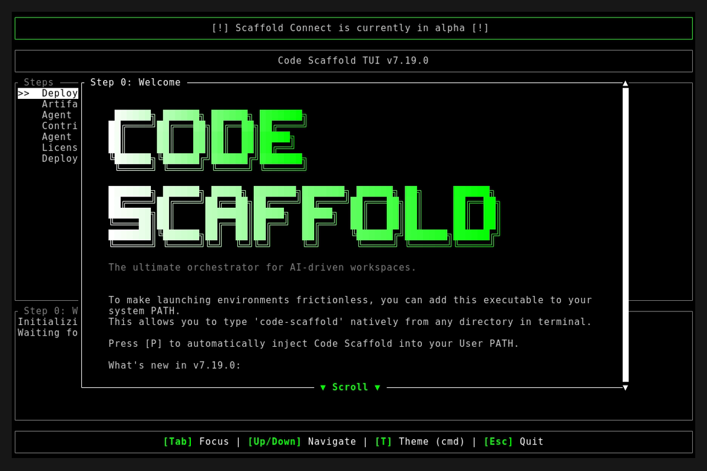

# Version 7.19.0

**Release Date:** 2026-08-15

## Overview
This release bundles a massive architectural overhaul of the `kinetic-canvas` WebGL skill. The legacy `@paper-design` dependency has been completely eradicated, and all 12 core shader environments have been reverse-engineered and rebuilt directly as native React components utilizing raw GLSL.

## Changelog
* **Native Shader Engine Refactoring:** Completely ripped out the monolithic `@paper-design/shaders-react` package. All shaders are now natively owned, resulting in zero external WebGL dependencies for the Kinetic Canvas ecosystem.
* **Sandbox Hub Restructuring:** Demolished the legacy `core-shaders-demo.html` viewer. Built a clean, grid-based Hub interface linking to 12 newly generated, highly optimized full-screen `.html` sandbox demo environments.
* **1:1 Playwright Screenshot Previews:** Hardcoded a local Playwright headless rendering pipeline into the `kinetic-canvas` workflow that captures mathematically perfect `1:1` screenshots of WebGL shaders after a 1000ms buffer compilation delay, replacing all CSS gradients with true renders.
* **Algorithmic Adjustments:** Heavily modified the `KineticCrystalline` effect to leverage perfectly sharp Voronoi `F2-F1` boundary distances (shattered glass shards) rather than soft cellular centers. Completely rewrote `VaporRing` from a planar 2D hack into a dense, cinematic 3D volumetric raymarched smoke torus using Fractional Brownian Motion.
* **Removed Legacy Artifacts:** Purged the "Core Shaders" legacy button/router from the Sandbox index.

## Deployment Assets

