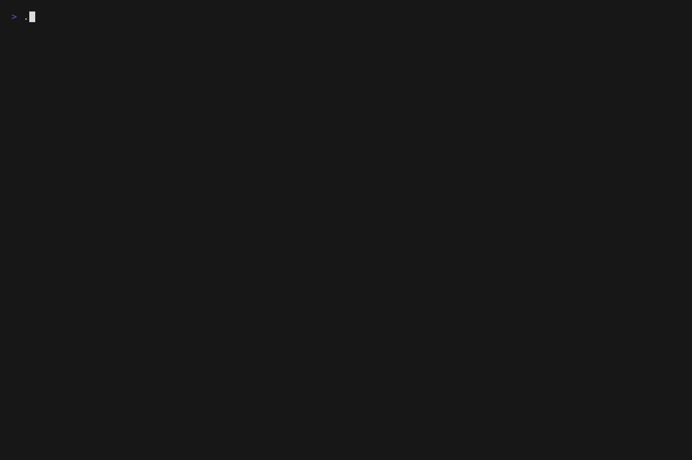
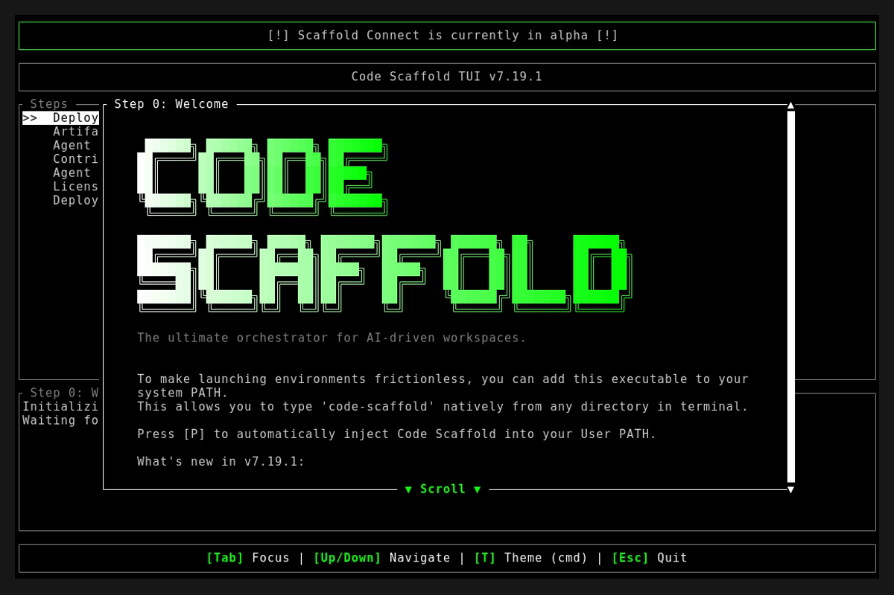

# Version 7.19.1

**Release Date:** 2026-08-15

## Overview
This patch directly addresses usability and UI/UX layout bugs discovered on the `Kinetic Canvas Sandbox Hub` immediately following the `v7.19.0` overhaul. 

## Changelog
* **Hub Scroll Interception Fix**: Resolved a deadzone bug on the `Kinetic Canvas Sandbox Hub` where the `.bg-grid` background DOM element incorrectly intercepted scroll-wheel events on the left and right gutters. Anchored the grid using `position: fixed` and `pointer-events: none` to restore full page scrollability.
* **Text Contrast Overhaul**: Refactored the `rebuild_html.js` generator and all native standalone sandbox `.html` environments to improve legibility against light-colored WebGL shaders (e.g., Caustics). Stripped the previous `mix-blend-mode: overlay` property and injected a heavy `text-shadow: 0 4px 20px rgba(0,0,0,0.9)` drop-shadow to guarantee maximum contrast. 
* **Global Text Alignment**: Ensured the overlaid hero typography across all standalone effect previews defaults to a perfectly centered alignment, rather than left-aligned, standardizing the visual layout across all 18 sandbox views.

## Deployment Assets

