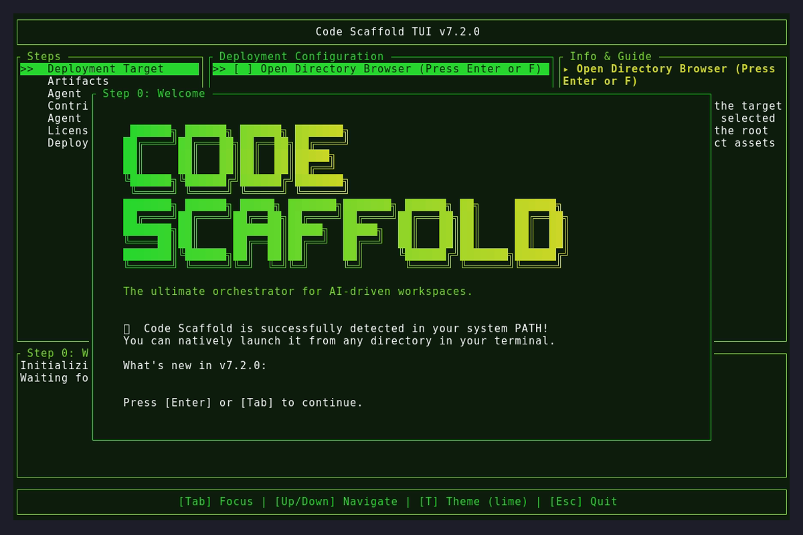
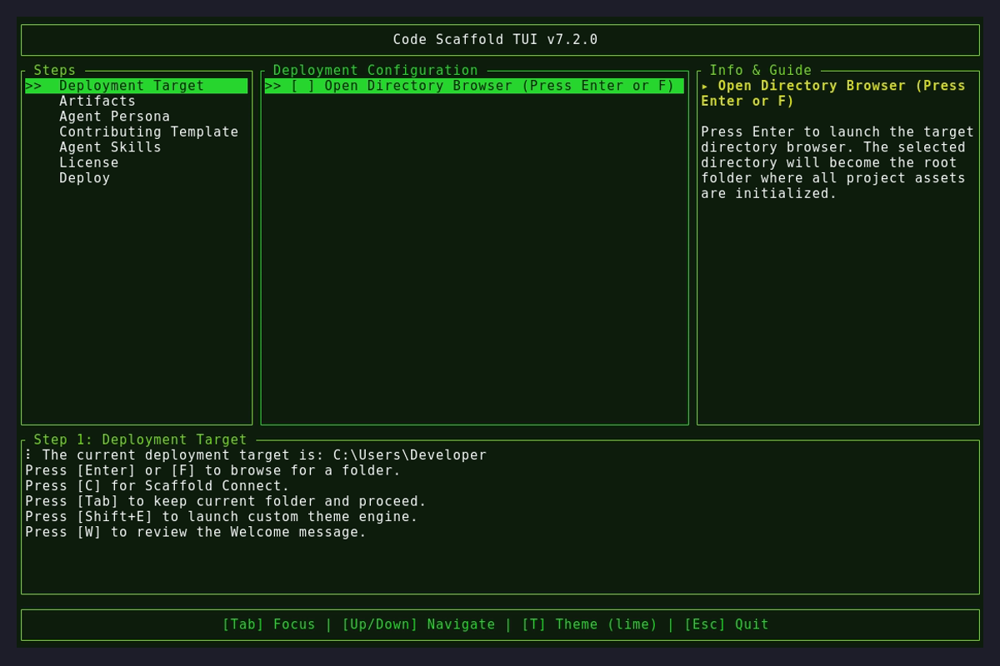
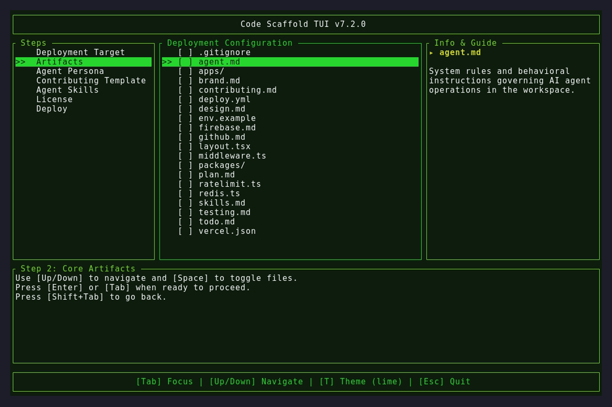

# Version 7.2.0

## Changelog
* **Agent Client Protocol (ACP)**: Officially integrated native `--acp` headless server to allow parent agent orchestrators to interface with Code Scaffold via `stdio` using `agent_client_protocol` standard.
* **OIDC Provenance Fix**: Patched `@code-scaffold/skills-cli` NPM package (v1.0.7) to inject the missing `repository` configuration required by GitHub Actions `--provenance` tokens, resolving the CI/CD deployment failure.
* **Agent Harness Rules**: Fortified `AGENTS.md` instructions requiring the Code Scaffold agent to validate a `0` exit code on `cargo fmt --check`, `cargo clippy`, and `cargo test` prior to executing GitHub commits, eliminating preventable downstream CI failures.

## Assets

