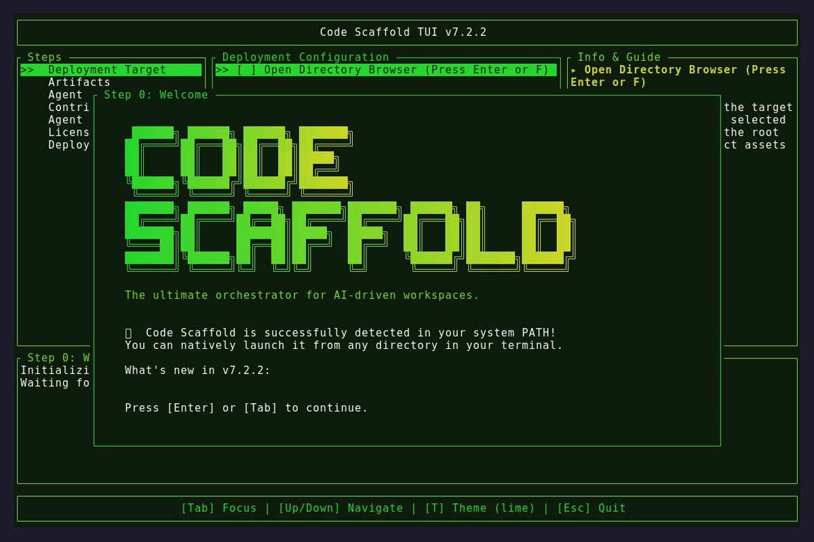

# Code Scaffold v7.2.2

## Changelog
* **Agent Rule Hardening**: Enforced strict communication constraints on the Code Scaffold agent, requiring explicit user approval of drafted changelogs before executing version bumps or pushes.
* **NPM OIDC Provenance Fix**: Removed the `registry-url` parameter from the `actions/setup-node` CI step. This prevents the generation of a legacy `.npmrc` token file that was overriding the OIDC handshake and triggering `403 Forbidden` errors.
* **NPM Version Bump**: Incremented `@code-scaffold/skills-cli` to `1.0.8` to ensure a completely clean upload state.

## Assets

