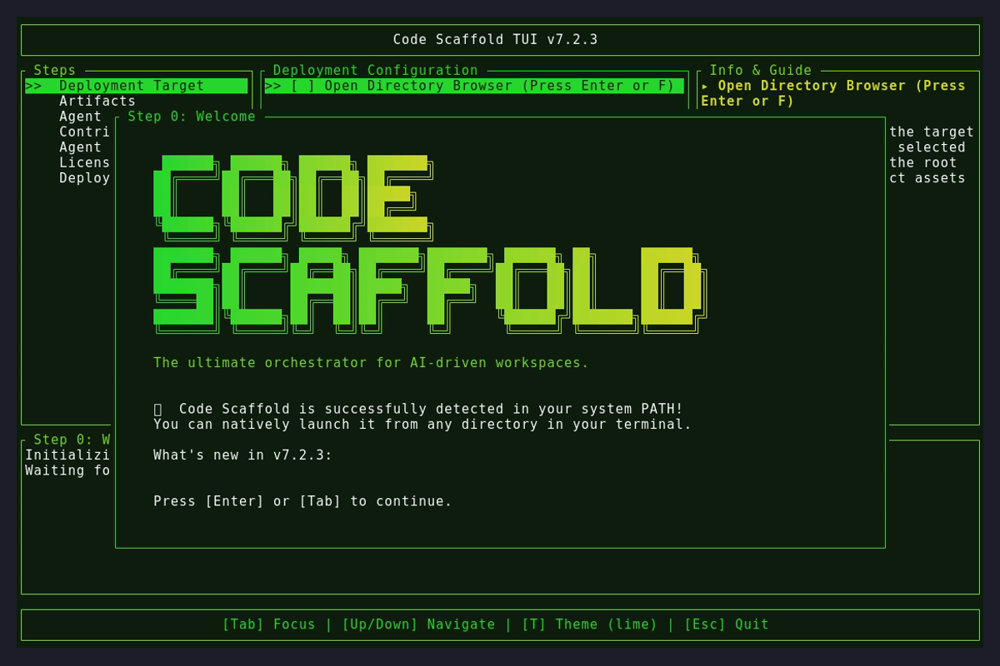

# Code Scaffold v7.2.3

## Changelog
* **NPM OIDC Authentication Fix**: Restored `registry-url` to the `actions/setup-node` step. This explicit declaration is strictly required for the NPM CLI to initiate the passwordless OIDC handshake, resolving the `ENEEDAUTH` bypass failure.
* **CI/CD Node.js & NPM Upgrade**: Upgraded the GitHub Actions runner environment from Node 20 to Node 24 and injected a step to forcefully install `npm@latest` to guarantee compatibility with NPM Trusted Publishing and resolve upstream action deprecation warnings.
* **NPM Version Bump**: Incremented `@code-scaffold/skills-cli` to `1.0.9`.

## Assets

