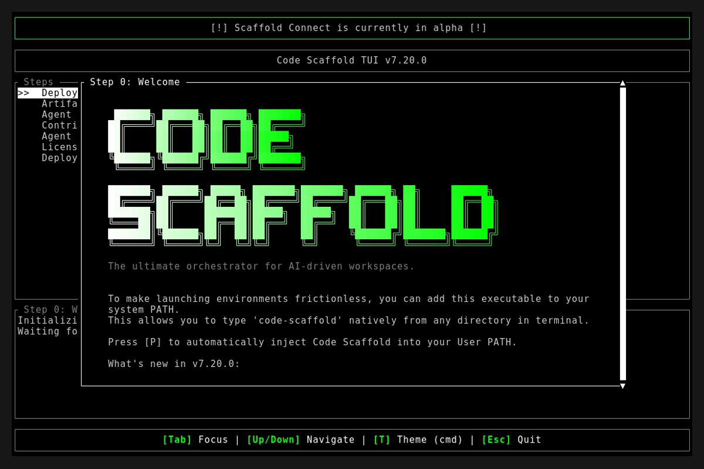
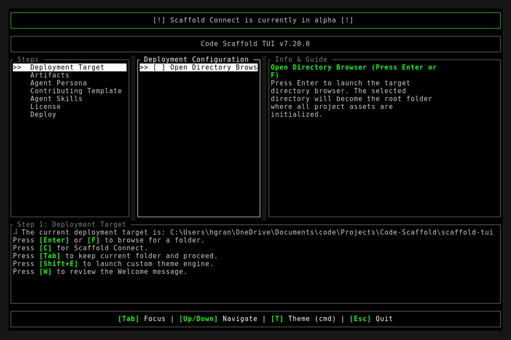
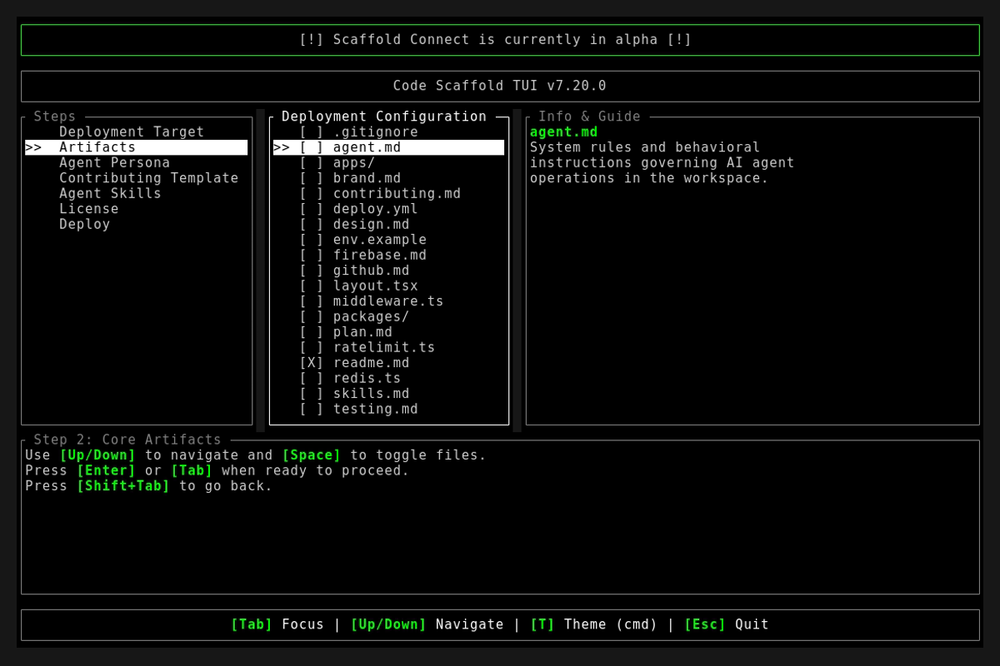

# Code Scaffold v7.20.0 Release Walkthrough

**Release Version:** `v7.20.0`
**Type:** Minor Feature Release (+0.1.0)
**Date:** September 2026

## Overview
Code Scaffold `v7.20.0` introduces major architectural elevations across the scaffolding runtime, web application templates, and skill discovery ecosystem. This release establishes dynamic runtime launch directory resolution, built-in fallback engines for contributing governance templates, mandatory Mobile-First Responsive Design and SEO/GEO/AEO Discovery protocols, the dual-engine Stealth Browser & Ghost Graph extraction powerhouse, and automated compliance gatekeepers across all 51 skills.

---

## Visual Demonstration

### Interactive TUI Visuals

---

## Key Features and Enhancements

### 1. Dynamic Runtime Launch Directory
* Scaffolding target directory now dynamically initializes to the exact working directory where `code-scaffold` was executed (`std::env::current_dir()`), with graceful home directory fallback.
* Eliminates accidental scaffolding into unexpected parent paths when invoked directly from project directories.

### 2. Contributing Template Fallback and Direct Write Engine
* Fixed an issue where the Contributing Template selection could display an empty list in standalone distributions.
* Extracted `.contributions` during remote zip payload syncing and provided guaranteed built-in fallback options (`open-source` and `strict-ownership`).
* Added direct `"write"` artifact generation support in the manifest engine to guarantee template creation regardless of disk layout.

### 3. Mandatory Mobile-First and SEO/GEO/AEO Discovery Protocols
* Injected two mandatory execution protocols into `.templates/agent.md` and modernized `.templates/layout.tsx`:
  * **Mandatory Mobile-First Responsive Design Protocol**: Enforces styling for mobile viewports (320px to 390px) first, viewport meta compliance, minimum 48px touch targets, fluid units (rem, clamp, grid), and zero horizontal scroll overflow.
  * **Mandatory SEO, GEO & AEO Discovery Protocol**: Enforces dynamic route metadata, canonical URLs, JSON-LD structured schemas, automated sitemap.xml and robots.txt generation, and single H1 semantic hierarchies with direct-answer formatting for AI search engines (Perplexity, ChatGPT, Gemini).
* Elevated `Web Dev` persona with companion auto-toggles (`seo-geo-aeo-auditor`, `playwright`, `open-design`, `privacy-policy`, `website-deploy-linux`, `tasty`).

### 4. Stealth Browser MCP & Ghost Graph (v2)
* Upgraded `.skills/stealth-browser-mcp` into a dual-engine ghost browsing stack:
  * **Engine 1 (Ghost Graph Pipelines)**: Direct prompt-to-JSON extraction (`scripts/scrape.py`), multi-source research synthesis (`scripts/search.py`), and Pydantic validation supporting Gemini, Claude, OpenAI, Groq, and local Ollama.
  * **Engine 2 (FastMCP Stealth Browser Automation)**: Low-level anti-detection browser automation using `nodriver`, CDP hooks, and Cloudflare bypass.

### 5. Playwright Responsive QA Suites (v4)
* Added `scripts/test-responsive.js` automated viewport testing utility across iPhone 14, Pixel 7, iPad, and Desktop viewports, detecting layout overflow and capturing full-page regression screenshots.

### 6. SEO GEO AEO Auditor CLI (v3)
* Added `scripts/audit.js` zero-dependency Node.js CLI runner for auditing HTML files and live web endpoints for mobile viewport meta, social preview tags, heading structures, and JSON-LD schemas.

### 7. SkillForge SEO Discovery Standard & Automated Compliance Gatekeeper
* Enforced search `category` and granular `keywords` metadata across all 51 skills and generated a categorized index in `/.skills/README.md`.
* Created `project_details/playbooks/verify_skills.js` automated gatekeeper asserting 100% compliance with 5-file skill anatomy, whole-number version matching, zero external brand leakage, and typography rules.
* Updated SkillForge Ecosystem Topology v3 vector diagrams (`topology.svg`).

---

## Verification and Testing
* `cargo fmt --check`: Passed with 0 formatting errors.
* `cargo clippy`: Passed with 0 warnings.
* `cargo test`: 4/4 unit tests passed.
* `node project_details/playbooks/verify_skills.js`: 51/51 skills passed.
