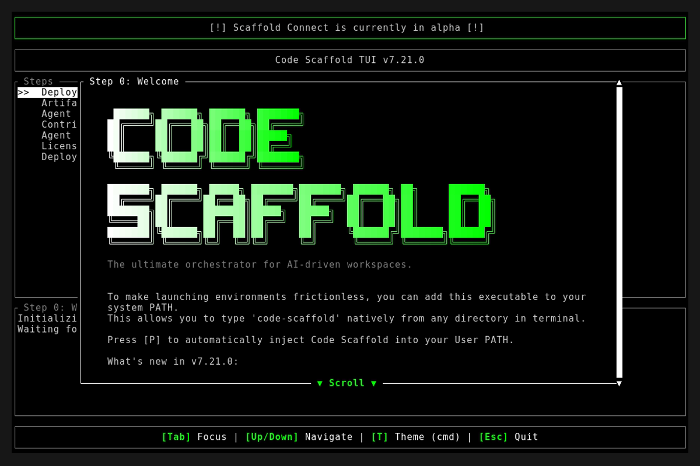
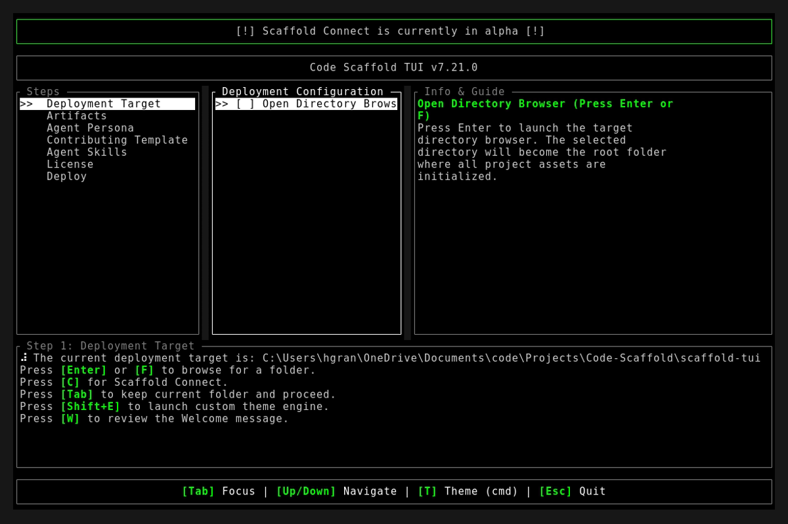
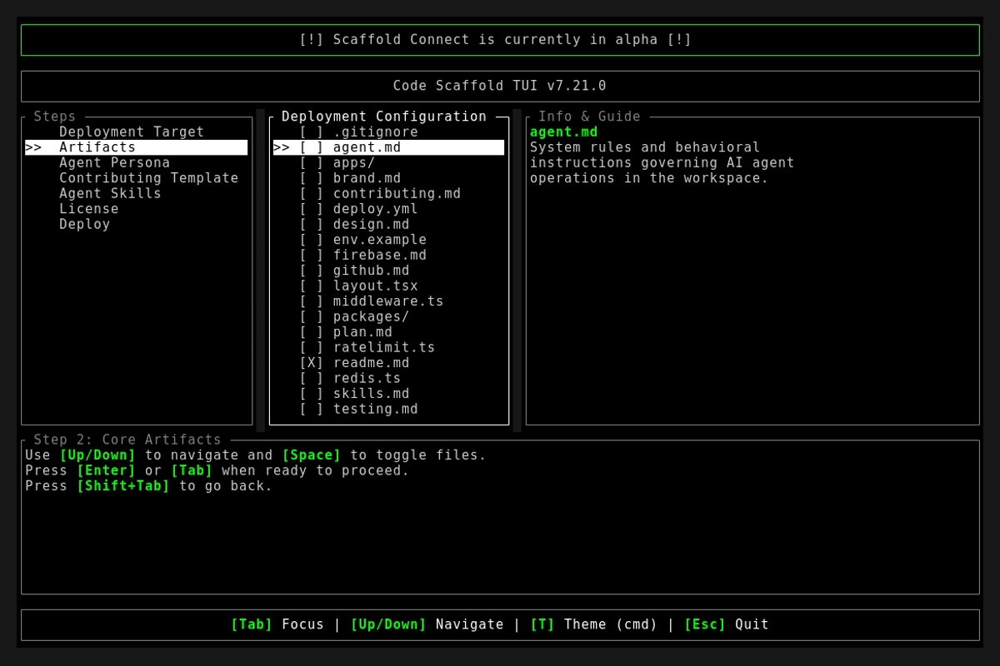

# Code Scaffold v7.21.0 Release Walkthrough

**Release Version:** `v7.21.0`
**Type:** Minor Feature Release (+0.1.0)
**Date:** September 2026

## Overview
Code Scaffold `v7.21.0` delivers the Native Skill Package Manager CLI suite, unlocking ad-hoc discovery, search, atomic installation, updating, and auditing of AI agent skills across any project workspace. This release empowers both autonomous agents and human developers to query, install, and manage skills directly from the command line without launching the full interactive TUI wizard, while introducing comprehensive Agent Client Protocol (ACP) MCP tooling for automated agent orchestration.

---

## Visual Demonstration

### Interactive TUI Visuals

---

## Key Features and Enhancements

### 1. Native Skill Package Manager CLI (`code-scaffold skills`)
* Introduced a complete standalone subcommand suite for modular skill management:
  * `list`: Catalogs all 51 skills grouped across 7 functional categories with version and installation status indicators.
  * `categories`: Displays an organized breakdown of all 7 registry categories and skill counts.
  * `search <query>`: Instant relevance-ranked search across skill slugs, labels, descriptions, and discovery keywords.
  * `info <name>`: Deep inspection card featuring full ASCII block branding, required permissions, engine constraints, and target workspace status.
  * `install <names...>`: Atomic 3-phase installation pipeline (Stage, Commit, Record) with automatic rollback on filesystem errors.
  * `uninstall <names...>`: Safe removal of installed skill directories with automated lockfile pruning.
  * `update [names...]`: Intelligent version comparison and in-place upgrading of installed skills.
  * `outdated`: Quick-scan auditor identifying all skills in a project with available upgrades.
  * `doctor`: Comprehensive health audit validating 5-file skill anatomy, version synchronization, schema integrity, and typography compliance.
  * `diff <name>`: File-level delta inspection between installed skill files and the latest source payload.
  * `export <names...>`: Bundles selected skills into portable ZIP distribution archives with generated `export-manifest.json` metadata.

### 2. Multi-Field Weighted Relevance Search Engine
* Designed a zero-dependency relevance scoring engine optimized for natural language queries and agent intent:
  * Weighted multi-field matching prioritizing exact slugs (50.0), labels (40.0), curated discovery keywords (35.0), functional categories (20.0), and descriptions (5.0).
  * Conjunction token requirement ensuring multi-word queries match accurately without spurious results.

### 3. Atomic 3-Phase Installation Pipeline & Version Lockfile
* Guaranteed filesystem integrity during skill installation:
  * Stage: Copies payload source into isolated temporary staging directories.
  * Commit: Atomically moves staged files into `.skills/<name>` with automatic backup and rollback on failure.
  * Record: Synchronizes `.skills/.lockfile.json` tracking exact whole-number versions, installation timestamps, and deterministic SHA-256 integrity digests.

### 4. Agent Client Protocol (ACP) MCP Tools Expansion
* Extended the headless ACP stdio server with 3 native MCP tools for autonomous AI agents:
  * `search_skills`: Allows agents to query and evaluate available capabilities by intent or domain.
  * `install_skills`: Enables agents to programmatically install skills into their target workspace on demand.
  * `get_skill_info`: Exposes structured skill metadata, engine requirements, and permission scopes.

### 5. Unified Machine-Readable JSON Mode
* Added universal `--json` output across all 11 subcommands, enabling seamless integration into automated CI/CD pipelines, agent harnesses, and external CLI tools.

---

## Verification and Testing
* `cargo fmt --check`: Passed with 0 formatting errors.
* `cargo clippy -- -D warnings`: Passed with 0 warnings.
* `cargo test`: 9/9 unit tests passed (including SHA-256 vectors and search ranking).
* `node project_details/playbooks/verify_skills.js`: 51/51 skills passed with 100% compliance.
* Smoke tests verified across real target workspaces.
