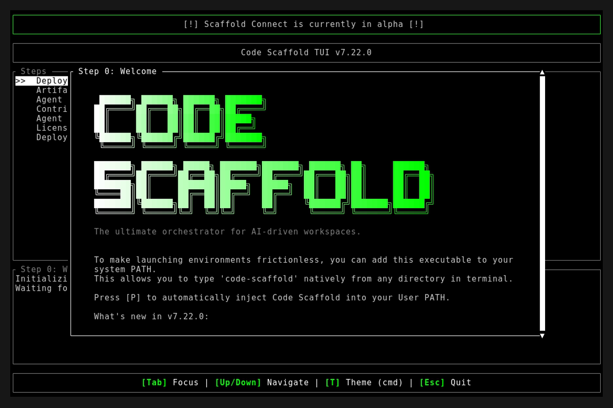
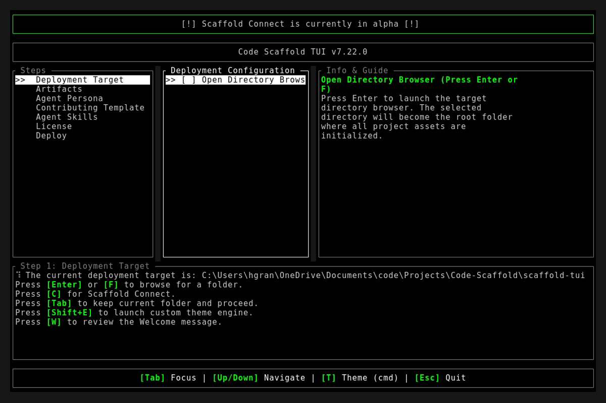
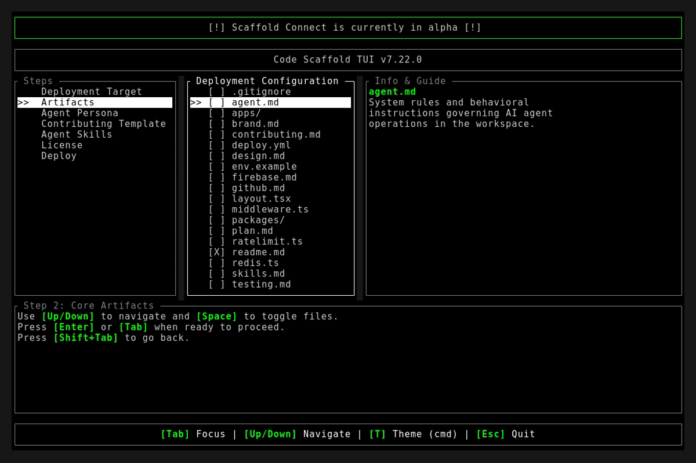

# Code Scaffold v7.22.0 Release Walkthrough

**Release Version:** `v7.22.0`
**Type:** Minor Feature Release (+0.1.0)
**Date:** September 2026

## Overview
Code Scaffold `v7.22.0` introduces the upgraded Tri-Engine Stealth Browser architecture, bringing together Ghost Graph prompt-driven web extraction pipelines, FastMCP undetectable browser automation, and the bespoke Ghost Core native CDP micro-engine. In addition, this release normalizes the skill packaging identifier to `stealth-browser` for improved CLI ergonomics and reinforces agent baseline security rules with strict project root containment boundaries.

---

## Visual Demonstration

### Interactive TUI Visuals

---

## Key Features and Enhancements

### 1. Tri-Engine Stealth Browser Architecture (`stealth-browser` v3)
* Upgraded the stealth browser capability stack into three complementary engine tiers:
  * **Engine 1 (Ghost Graph Extraction Pipelines)**: Direct prompt-driven scraping, multi-source search graph synthesis, and Pydantic schema validation using local (Ollama) or cloud (Gemini, Claude, OpenAI, Groq) LLMs.
  * **Engine 2 (FastMCP Stealth Browser Automation)**: Undetectable low-level browser automation (`nodriver`, Chrome DevTools Protocol, Cloudflare bypass, and real-time network interception).
  * **Engine 3 (Ghost Core Ultra-Light CDP Micro-Engine)**: Bespoke native headless engine with a lean ~30MB memory footprint, sub-100ms startup latency, built-in hardware fingerprint randomization (WebGL GPU vendors, 2D Canvas noise seeds, AudioContext jitter), and drop-in CDP compatibility.

### 2. Skill Identifier & Directory Normalization
* Cleaned up the skill name, package identifier, and directory path from `stealth-browser-mcp` to `stealth-browser`:
  * Seamless CLI installation: `code-scaffold skills install stealth-browser`
  * Synchronized metadata across `meta.json`, `skill-manifest.json`, and `readme.md`.
  * Updated global skill registry table in `/.skills/README.md`.
  * Refreshed ANSI block logo and documentation walkthroughs.

### 3. Agent Security Hardening: Project Root Containment
* Added strict baseline boundary instructions across agent rule templates:
  * Established project root containment as a critical baseline invariant in `.templates/agent.md` and `.agents/AGENTS.md`.
  * Mandated that agents must never escape, read from, write to, or execute commands in parent or external directories outside the project root boundary without explicit reasoning and direct human approval.

---

## Verification and Testing
* `cargo fmt --check`: Passed with 0 formatting errors.
* `cargo clippy -- -D warnings`: Passed with 0 warnings.
* `cargo test`: 9/9 unit tests passed cleanly.
* `node project_details/playbooks/verify_skills.js`: 51/51 skills passed with 100% architectural compliance.
