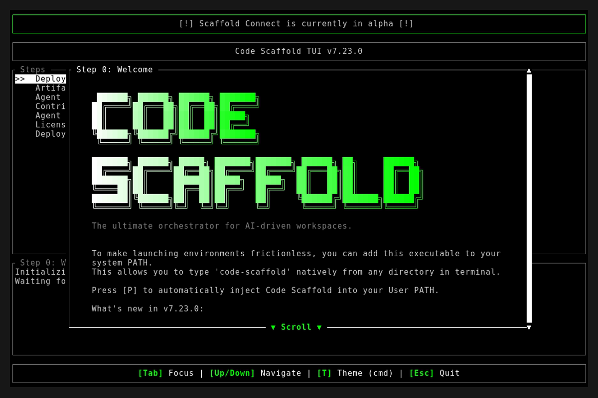
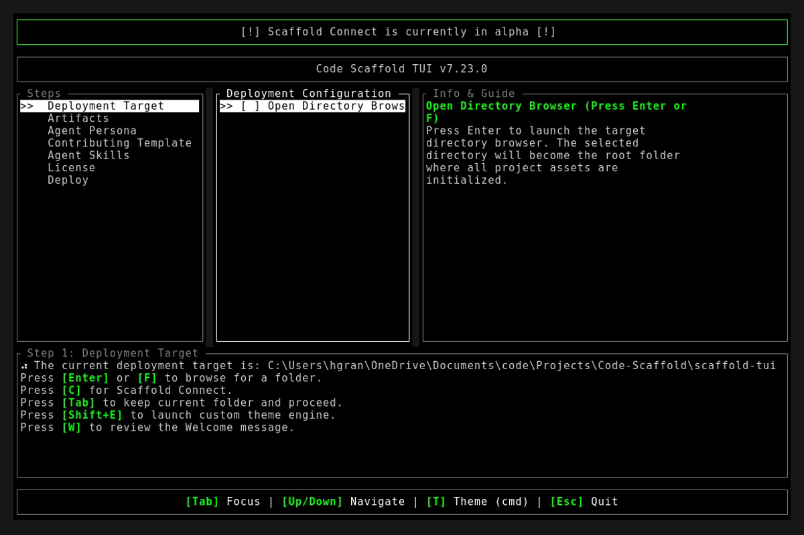
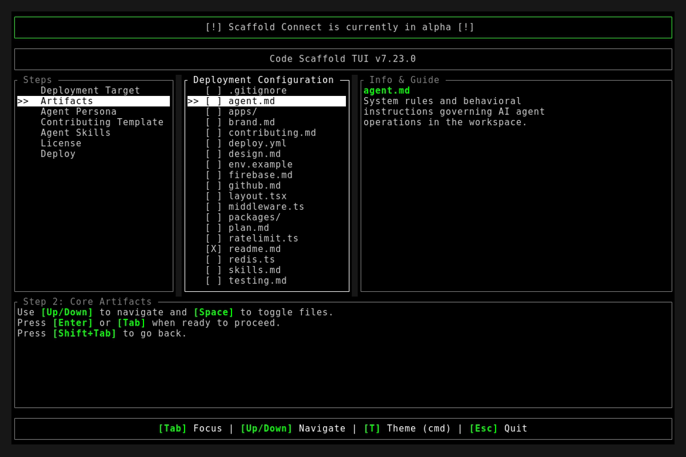

# Code Scaffold v7.23.0 Release Walkthrough

**Release Version:** `v7.23.0`
**Type:** Minor Feature Release (+0.1.0)
**Date:** September 2026

## Overview
Code Scaffold `v7.23.0` introduces the unified Smart Home & IoT Automation ecosystem, bridging Home Assistant, Apple HomeKit, Amazon Alexa, Google Home, and Matter/Thread fabrics into a cohesive agentic control plane. In addition, this release upgrades the Firebase platform skill to v4 with foundational CLI lifecycle management and Cloud Firestore multi-database architectures, expanding the Code Scaffold curated skill library to 52 specialized payloads.

---

## Visual Demonstration

### Interactive TUI Visuals

---

## Key Features and Enhancements

### 1. Net-New Smart Home Skill (`smart-home` v1)
* Introduced a multi-tier smart home orchestration engine bridging five primary ecosystems:
  * **Home Assistant Core Automation Hub**: Local REST API integration, real-time WebSocket event streaming, Jinja2 template evaluation, and declarative automation blueprints.
  * **Apple HomeKit & HAP Mesh**: HomeKit Accessory Protocol bridging, Swift HMHomeManager data hierarchy, Action Sets, and MatterSupport extension integrations.
  * **Amazon Alexa Smart Home**: Smart Home Skill API directives (Discovery, PowerController, ThermostatController, LockController) and AWS Lambda bridge adapters.
  * **Google Home Graph**: Cloud-to-Cloud trait synchronization (OnOff, Brightness, ColorSetting, TemperatureSetting, LockUnlock) with local fulfillment over mDNS/HTTP.
  * **Matter & Thread Multi-Admin Fabric**: Cross-ecosystem device commissioning via setup codes and QR payloads, OpenThread Border Router synchronization, and multi-admin fabric sharing.
  * **Zero-Dependency Python Controller**: Bundled standalone script (`.skills/smart-home/scripts/smart_home_client.py`) utilizing Python standard library for connection health checks, entity querying, service dispatching, and schema dumping.

### 2. Upgraded Firebase Platform Skill (`firebase` v4)
* Expanded Firebase capabilities to cover complete developer and agent lifecycle operations:
  * **Foundational CLI Lifecycle**: Automated version verification, active project context management (`firebase use`), and non-interactive headless authentication (`--no-localhost`).
  * **Cloud Firestore Multi-Database Management**: Instance discovery (`firestore:databases:list`), edition detection (Standard vs Enterprise), and multi-database targeting (`--database`).
  * **Mobile SDK Config Provisioning**: Automated retrieval of Android (`google-services.json`) and Apple iOS (`GoogleService-Info.plist`) configuration files.
  * **Security Rules & Composite Indexes**: Declarative rule validation (`firestore.rules`), local emulation orchestration, and index deployment routines.

### 3. SkillForge Visual Topology & Registry Expansion
* Established the 8th functional category in the global library: `### Smart Home & IoT Automation`.
* Updated the architectural synergy matrix (`topology_v4.svg`) mapping cross-domain integrations between Smart Home, Proxmox virtualization, Ansible configuration management, and Firebase push alerts.
* Maintained 100% compliance across all 52 skills via automated gatekeeper audits.

---

## Verification and Testing
* `cargo fmt --check`: Passed with 0 formatting errors.
* `cargo clippy -- -D warnings`: Passed with 0 warnings.
* `cargo test`: 9/9 unit tests passed cleanly.
* `node project_details/playbooks/verify_skills.js`: 52/52 skills passed with 100% architectural compliance.
* Verified CLI subcommands: `code-scaffold skills info smart-home` and `code-scaffold skills search "home assistant"`.
