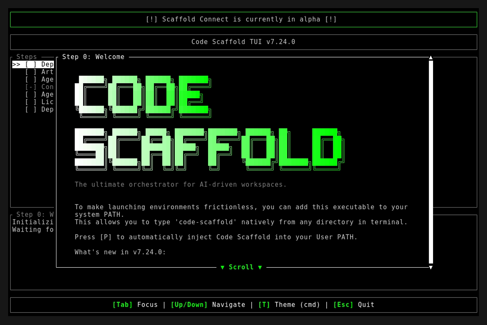
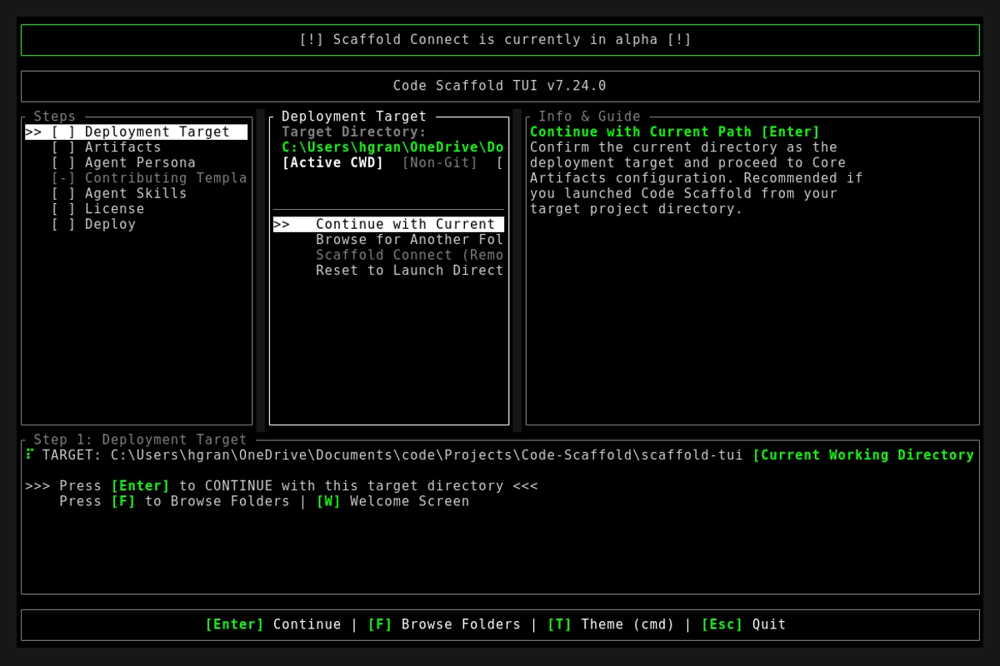
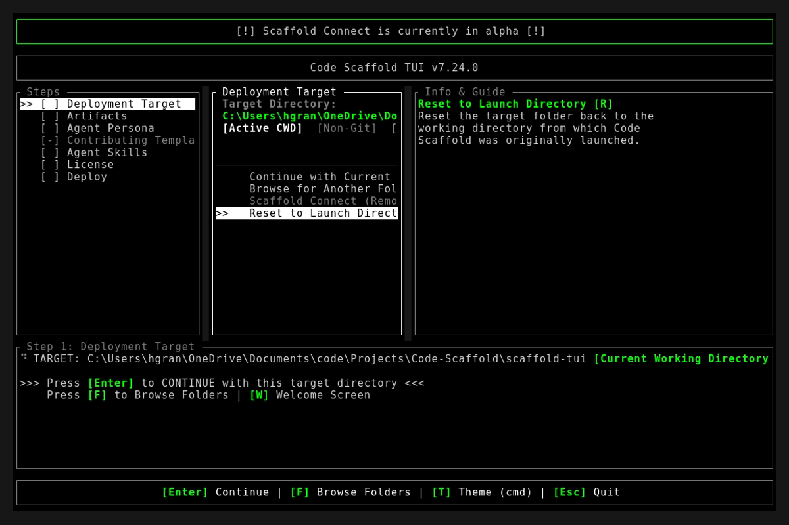

# Code Scaffold v7.24.0 Release Walkthrough

**Release Version:** `v7.24.0`
**Type:** Minor Feature Release (+0.1.0)
**Date:** September 2026

## Overview
Code Scaffold `v7.24.0` introduces the enterprise-grade Docker Engine skill featuring the Ephemeral Swapper Protocol for in-place zero-downtime container self-updates, BuildKit high-velocity cache mounts, and non-invasive sidecar diagnostics. Additionally, this release elevates the CyberSecurity Toolkit to v7 with the Sentinel Autonomous Security Engine (SASE) multi-agent orchestration mesh and ChainAST context compaction, integrates UI Primitives v2 with motion presentation shaders, and streamlines TUI deployment path ergonomics. The curated skill library now encompasses 54 specialized payloads.

---

## Visual Demonstration

### Interactive TUI Visuals

---

## Key Features and Enhancements

### 1. Net-New Docker Engine Skill (`docker` v1)
* Introduced a complete container virtualization and lifecycle orchestration engine:
  * **The Ephemeral Swapper Protocol**: Solves the container self-destruction paradox and port collision dilemmas through an out-of-process broker container communicating directly over `/var/run/docker.sock`.
  * **Multi-Tier Capability Detection**: Automatically routes between Tier 1 direct engine sockets (`docker_socket`), Tier 2 persistent host trigger files (`trigger_file`), and Tier 3 manual terminal instruction fallbacks.
  * **State Extraction & Volume Synthesis**: Preserves persistent database volumes and host binds with `v=false` deletion safety while replicating `com.docker.compose.*` labels to maintain project identity.
  * **BuildKit High-Velocity Caching**: Implements persistent cache mounts (`--mount=type=cache`) across Pip, Cargo, NPM, Go, and APT, alongside build-time secret injection and heredoc syntax.
  * **Minimalist Attack Surfaces**: Integrates multi-stage compilation patterns with distroless and scratch runtime bases for tiny footprint, shell-free deployments.
  * **Sidecar Diagnostic Injection**: Troubleshoots stripped production containers non-invasively by attaching ephemeral sidecars into shared network and process namespaces (`--net=container:<id> --pid=container:<id>`).
  * **Bundled Tooling**: Delivers standalone Python swapper script (`container-swapper.py`), cross-platform capability probes, and declarative multi-architecture bake definitions (`docker-bake.hcl`).

### 2. Upgraded CyberSecurity Toolkit (`cybersecurity-toolkit` v7)
* Advanced the cybersecurity arsenal into an autonomous agentic testing suite:
  * **Sentinel Autonomous Security Engine (SASE)**: Decoupled multi-agent orchestration mesh comprising Orchestrator, Reconnaissance Specialist, Strategy Planner, and Sandboxed Execution Agent.
  * **Tripartite Memory Architecture**: Operates across Long-Term Knowledge Memory, Working Context Graphs, and persistent Episodic Experience logs (`.audit_workspace/memory/episodic.json`).
  * **Sentinel ChainAST Context Compactor**: Synthesizes high-volume raw scanning outputs and HTTP traffic into compact Abstract Syntax Trees to prevent context saturation.
  * **Cross-Platform Orchestration Scripts**: Provisioned `invoke-sentinel-orchestrator.ps1` and `invoke-sentinel-orchestrator.sh` for automated multi-phase audits.

### 3. Upgraded UI Primitives Skill (`ui-primitives` v2)
* Enhanced micro-interaction systems with Motion Presentation Studio, Light Field Shaders, dynamic slider controls, and high-fidelity showcase sandboxes.

### 4. TUI Navigation & Deployment Ergonomics
* **Streamlined Path Selection**: Lowered friction on Step 1 with `[Enter]` to continue directly with current target directory, and `[F]` to browse folders.
* **Bracketed Step Status Tracking**: Unified left navigation tree with clear completion markers: `[ ]` for pending, `[x]` for completed, and `[-]` for disabled steps.
* **Scaffold Connect Teaser**: Added disabled "coming soon..." state for Scaffold Connect to preview upcoming cloud connectivity features.
* **Input Cleansing**: Refined keyboard handling to eliminate ambiguous tab navigation behaviors.

---

## Verification and Testing
* `cargo fmt --check`: Passed with 0 formatting errors.
* `cargo clippy -- -D warnings`: Passed with 0 warnings.
* `cargo test`: 12/12 unit tests passed cleanly.
* `node project_details/playbooks/verify_skills.js`: 54/54 skills passed with 100% architectural compliance.
