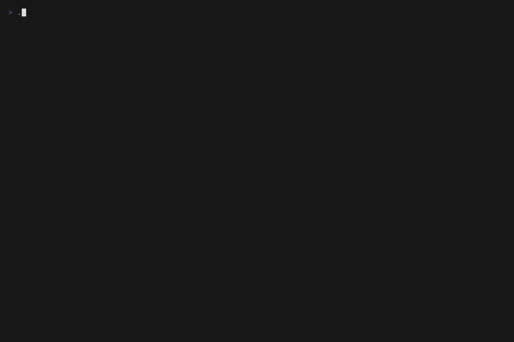
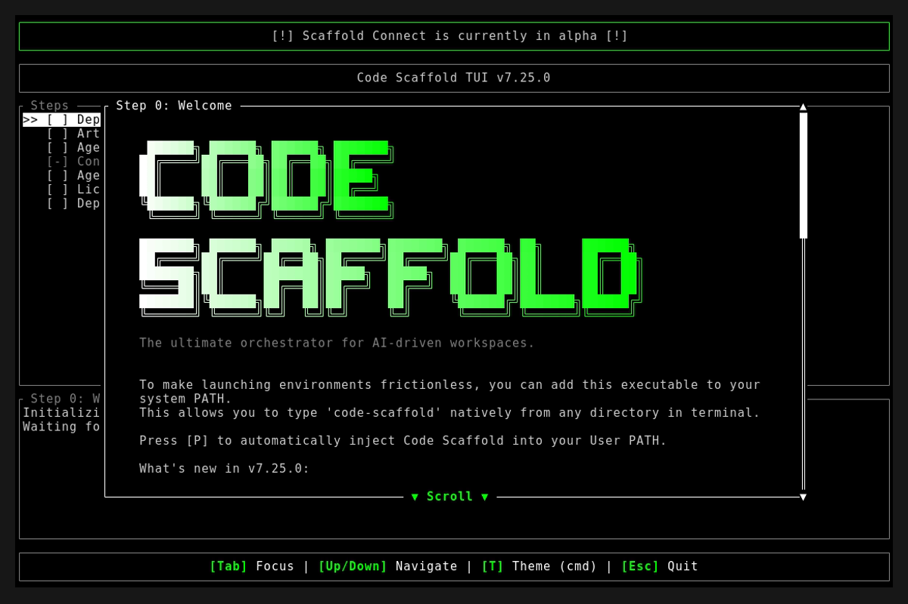
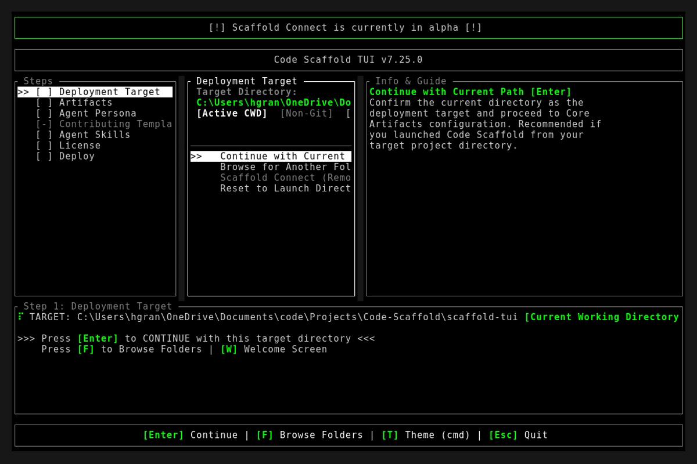
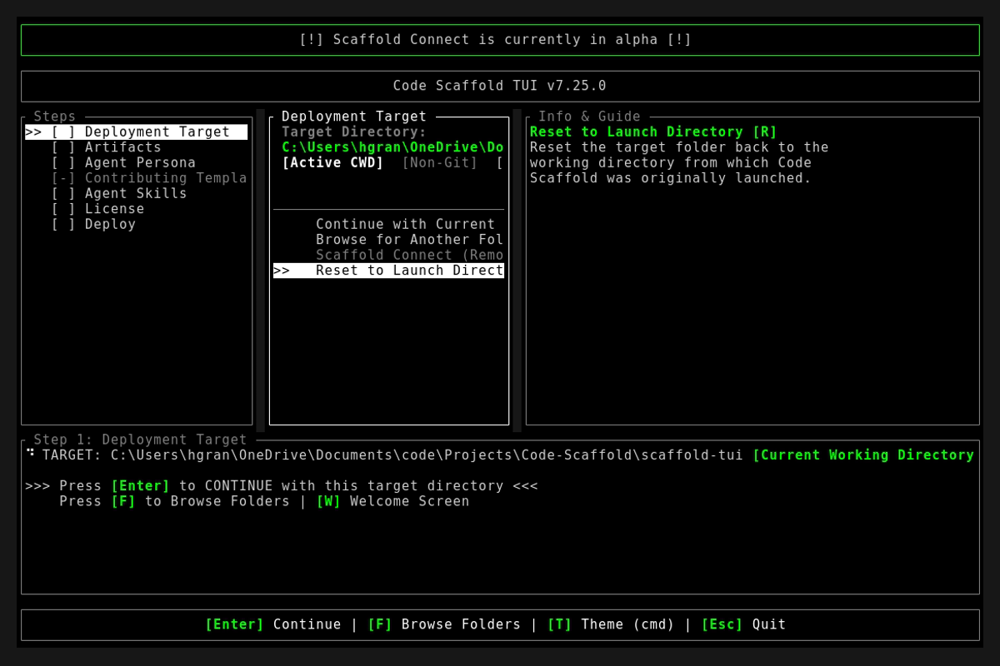

# Code Scaffold v7.25.0 Release Walkthrough

**Release Version:** `v7.25.0`
**Type:** Minor Feature Release (+0.1.0)
**Date:** September 2026

## Overview
Code Scaffold `v7.25.0` delivers two major skill upgrades. The Firebase skill reaches v5 with a fully autonomous zero-touch project provisioning pipeline that generates clean, memorable web hosting IDs and gracefully handles global Google Cloud naming conflicts. The UI Primitives skill reaches v3 with seven new high-fidelity component primitives drawn from the frontier of the agent-ready component ecosystem: perimeter border beams, visceral liquid gooey physics, spring magnification docks, spotlight bento grids, a universal motion transition system, kinetic typography, and an atomic token architecture.

---

## Visual Demonstration

### Interactive TUI Visuals

---

## Key Features and Enhancements

### 1. Firebase Skill v4 to v5: Autonomous Project Provisioning Pipeline

* **Zero-Touch Project Provisioning**: Introduced bundled cross-platform scripts (`provision-firebase-project.ps1` and `provision-firebase-project.sh`) that execute the full end-to-end provisioning lifecycle without requiring the user to open a browser.
* **Clean Project ID Generation**: Derives a human-readable candidate Project ID directly from the workspace folder name, strictly conforming to Google Cloud standards (6 to 30 characters, lowercase alphanumeric and hyphens). No ugly random hex hashes.
* **Hosting Domain Mapping Protocol**: Agents proactively explain that the Project ID maps directly to `https://<id>.web.app` and `https://<id>.firebaseapp.com`, and surface a live URL preview to the user before any creation is attempted.
* **Account-Level Detection**: Pre-checks `projects:list` to detect if the project already exists in the user's account and binds to it rather than failing.
* **Graceful Global Collision Handling**: When a global name collision is detected (HTTP 409 or `already exists` in `firebase-debug.log`), the script never crashes or appends random hashes. It returns a structured JSON payload with clean semantic alternatives (`-app`, `-web`, `-hub`, `-dev`) and their corresponding hosting URL previews.
* **Credential Auto-Injection**: Fetches client SDK config (`apps:sdkconfig WEB`) and merges all seven `NEXT_PUBLIC_FIREBASE_*` variables into `.env.local` without clobbering existing keys.
* **Template Synchronization**: Updated `.templates/firebase.md` with hosting domain mapping, clean naming protocol, and autonomous provisioning instructions. Updated `.templates/env.example` with the full Firebase Client SDK parameter block.
* **MCP Protocol Integration**: `SKILL.md` documents how to execute the same provisioning pipeline natively through `firebase_create_project`, `firebase_create_app`, and `firebase_get_sdk_config` MCP tool calls.

### 2. UI Primitives Skill v2 to v3: Seven New Frontier Primitives

* **Perimeter Border Beam Engine**: Hardware-accelerated luminescent border tracers using CSS `@property --angle` and conic-gradient rotation, running on the compositor thread with zero layout interference. Customizable velocity, color, and glow intensity.
* **Visceral Liquid Gooey Fluid Engine**: SVG filter pipeline (`feGaussianBlur` + `feColorMatrix`) enabling organic droplet detachment, bubble coalescence, and coalescing morphing tabs. Includes pre-built bubble clusters and a liquid coalescing button pattern.
* **Spring Magnification Dynamic Dock**: Gaussian distance falloff physics for pointer-proximity icon magnification, matching the elastic spring feel of native application docks.
* **Spotlight Bento Grid**: Responsive bento card layouts with dynamic CSS variable mouse-coordinate tracking (`--mouse-x`, `--mouse-y`) powering radial gradient ambient highlight borders.
* **Universal Motion Transition System**: Framework-agnostic namespaced CSS timing tokens (`--cs-ease-spring`, `--cs-ease-out-quint`, `--cs-dur-normal`) with micro-state animators: error shakes, success pops, notification badge pings, modal spring reveals, and FLIP-safe card resizing.
* **Kinetic Typography and 3D Perspective Tilt**: Hacker glyph scramble decoder with configurable duration, and a 3D gyroscopic tilt card with dynamic specular glare tracking using `perspective(1000px)` + `rotateX/Y`.
* **Atomic Design Token Architecture**: StyleX-grade type-safe CSS token system covering surface layers, brand accents, border tiers, text hierarchy, elevation shadows, and WAI-ARIA dual-ring keyboard focus contracts.
* **Eight new `references/` files** bundled for agent copy-paste retrieval: `border-beam.css`, `gooey-fluid.css`, `gooey-fluid.svg`, `dock-bento.css`, `dock-bento.js`, `kinetic-text.css`, `kinetic-text.js`, `universal-transitions.css`, `atomic-tokens.css`.

---

## Verification and Testing
* `node project_details/playbooks/verify_skills.js`: 54/54 skills passed with 100% architectural compliance (zero brand leakage, zero typography violations, version synchronization confirmed).
