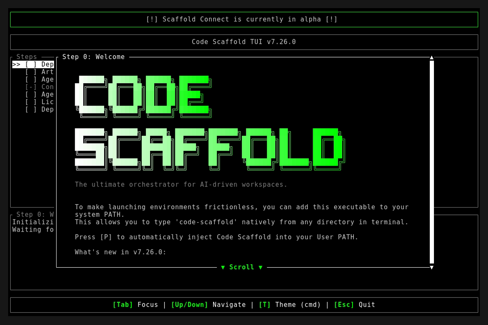
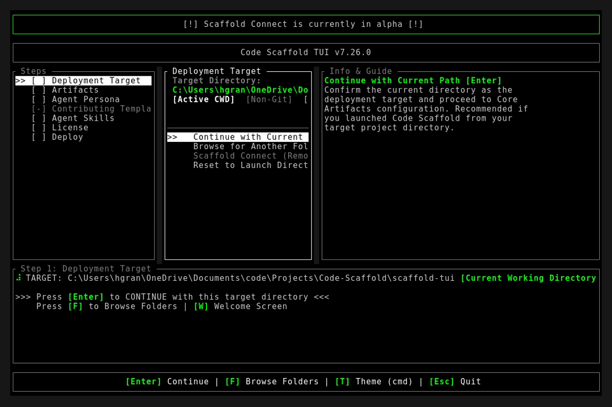
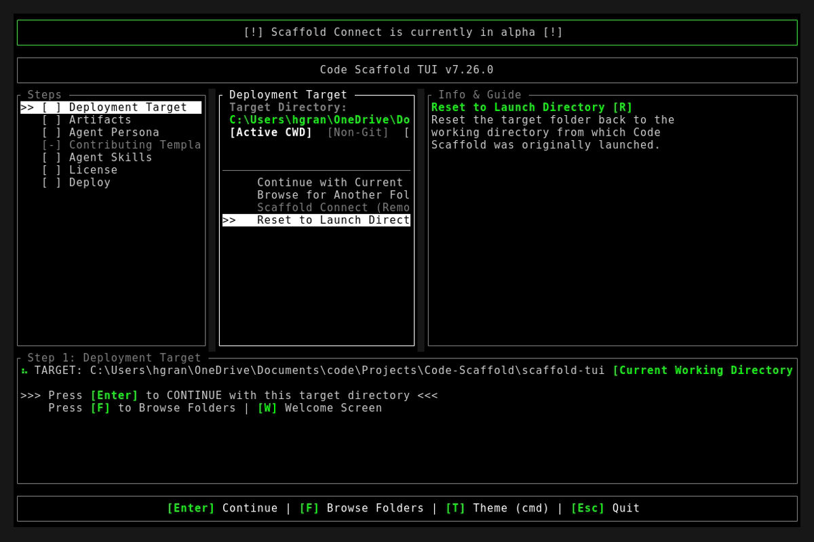

# Code Scaffold v7.26.0 Release Walkthrough

**Release Version:** `v7.26.0`
**Type:** Minor Feature Release (+0.1.0)
**Date:** September 2026

## Overview
Code Scaffold `v7.26.0` introduces the GhostPrint Engine, an industrial grade cryptographic code provenance and steganographic entanglement system engineered to defeat unauthorized code copying, automated AI refactorings, and closed-source SaaS exfiltration. This milestone also debuts the Quiver AI Vector Studio skill, major upgrades to the Proxmox VE Helper Script and UI Primitives skills, an environment-centric configuration architecture eliminating sensitive parameters from documentation, and a mandatory pre-commit README Shields.io badges verification gatekeeper.

---

## Visual Demonstration

### Interactive TUI Visuals

---

## Key Features and Enhancements

### 1. GhostPrint Engine: Cryptographic Code Provenance and Digital Forensics
* **Nine Layer Steganographic Defense in Depth**: Implements an adversarial gradient spanning sacrificial honeypot decoys, cryptographic pre-image constants, poly-algorithmic functional entanglement, multi-channel Unicode steganography, linguistic stylometry lexicon binding, AST topological invariants, soft constant statistical distribution signatures, remote runtime behavioral oracles, and temporal proof anchoring.
* **Kerckhoffs Steganographic Invariant**: Engineered so that even an adversary or automated AI agent equipped with the full GhostPrint engine specification cannot detect or sanitize all embedded fingerprints without possessing the author private root passphrase.
* **Hierarchical Deterministic (HD) Ratchet Key Tree**: Single master root passphrase (12 to 24 words) deterministically derives distinct, polymorphic layer constants for every release version via HKDF-SHA256, eliminating key sprawl and preserving permanent historical auditability across all past and future releases.
* **Spectral Cyan Key Ceremony**: Interactive terminal user interface featuring real-time dynamic entropy calculation, live animated progress meters, and selectable security profiles up to 24 words benchmarked against cosmic universe lifespans.
* **Cryptographic Compute Benchmarks**: Every entropy tier is framed with explicit hardware compute requirements simulating a dedicated supercomputer guessing 1 trillion keys every second:
  * 9 Words (99-bit): 20 Million Years (1,500 × all of recorded human history).
  * 12 Words (128-bit): 17 Sextillion Years (1.2 Trillion × the age of the universe).
  * 15 Words (160-bit): 140 Nonillion Years (100 Quintillion × the age of the universe; immune to quantum Grover search).
  * 18 Words (192-bit): 1.2 Undecillion Years (80 Nonillion × the age of the universe).
  * 21 Words (224-bit): 10 Tredecillion Years (700 Undecillion × the age of the universe).
  * 24 Words (256-bit): 93 Quindecillion Years (Effectively infinite: exceeds the estimated heat death of the cosmos).
* **Anti-Correlation Policy Gatekeeper**: Automatically audits project metadata (git configuration, remote URLs, package names, author handles) and enforces a mandatory 75% external dictionary word threshold, preventing authors from establishing vulnerable keys composed of public project terms.
* **Project-Segmented Vault Topology**: Automatically segments credentials into isolated project vaults (`~/.ghostprint/projects/<slug>.vault.json.enc`), ensuring client and personal repositories remain completely segregated with zero cross-contamination.
* **Universal Git Slug Auto-Routing**: Automatically resolves git remote origin URLs into canonical filesystem slugs (e.g. `organization-project-slug`, `core-infrastructure-repo`), enabling seamless single-command vault access.
* **Master Portfolio Key Reuse**: Allows authors to use a single 24-word master passphrase across 50 independent repositories while HKDF automatically derives 100% uncorrelated layer constants for each project using repository URLs as cryptographic salt.
* **Poly-Algorithmic Functional Entanglement**: Entangles watermark constants into active computational logic (cache hash offsets, spatial camera jitter vectors, perceptual color curves, backoff delays) so that tampering or deleting constants breaks runtime execution.
* **Statistical Distribution Watermarking (Layer 6)**: Seeds 40 or more soft discretionary constants (timeouts, debounce intervals, buffer boundaries, batch sizes) with pseudo-random values whose collective joint probability distribution yields astronomical uniqueness (coincidence probability p < 10^-50), surviving complete variable renames and AI code refactorings.
* **Remote Black-Box Oracle Probing (Layer 7)**: Audits closed-source cloud deployments and private SaaS applications over public HTTP interfaces via timing jitter analysis, synthetic edge-case error message capture, and numerical rendering delta checks without requiring source code access.
* **Court Admissible Digital Forensics Dossier**: Automatically generates sealed forensic evidence reports (Markdown and PDF formats) detailing derivation trees, AST coordinate mapping, statistical impossibility proofs exceeding the federal Daubert standard, and independent sandbox reproduction scripts for judicial examiners.
* **Natural Language Intent Engine**: Provides conversational CLI dispatch allowing developers and AI agents to invoke commands naturally (`ghostprint "list my registered projects"`, `ghostprint "audit ../competitor-app"`, `ghostprint "probe https://suspect-site.com"`).
* **Security Analyst Persona Auto-Selection**: Automatically pre-selects the `ghostprint` skill alongside `cybersecurity-toolkit` whenever the Security Analyst persona is activated in the deployment wizard.
* **Unified Architectural Identity**: Standardized the skill directory (`.skills/ghostprint`), manifest name, CLI command, and vault hierarchy under the single unified `ghostprint` namespace.
* **Code Scaffold Provenance Sealed**: Code Scaffold itself was officially sealed using a 256-bit Maximum Sovereign 24-word master passphrase into `~/.ghostprint/projects/upioneer-code-scaffold.vault.json.enc`.

### 2. Quiver AI Vector Studio Skill (v1)
* **AI-Native Vector Graphics Generation**: Text-to-SVG prompt generation, raster-to-vector image tracing, multi-model selection (`arrow-2`, `bolt-1`, `recolor-1`, `edit-1`), and localized vector path editing.
* **Model Context Protocol (MCP) Integration**: Built-in architectural blueprints for hosted and local MCP vector tools.
* **Standalone Interactive Sandbox**: Bundled with a dark-mode interactive testing canvas (`sandbox/index.html`) demonstrating prompt generation, SVG rendering, and quantization controls.

### 3. Proxmox VE Helper Script Engineering Upgrade (v2)
* **Two-Tier Architecture Enforcement**: Strict separation between the PVE host orchestrator (`ct/<app>.sh`) and the in-container provisioner (`install/<app>-install.sh`).
* **Modern Container Templates**: Standardized on Alpine Linux 3.21 and Debian 12 minimal container configurations with unprivileged execution flags (`--unprivileged 1`).
* **Non-Destructive Package Hygiene**: Enforced automated cleanup (`apt-get clean`, cache removal) and pre-flight healthcheck diagnostic contracts.

### 4. UI Primitives Frontier Upgrade (v4)
* **Five New Frontier Visual Primitives**: Ingested CSS mask-composite alpha cutouts, WebGL fragment cursor shaders, dynamic conic-gradient animated borders, GSAP timeline choreography, and Three.js 3D backdrop scene.
* **Standalone Reference Implementations**: Bundled 5 standalone code files in `references/` for fast copy-paste agent retrieval.

### 5. Environment-Centric Configuration Standard (.env / .env.example)
* **Credential Sanitization**: Removed hardcoded credentials, project IDs, and service parameters from `project_details/*.md` and `.templates/*.md` documentation files.
* **Unified Environment Schema**: Documented full parameter blocks for GitHub, Vercel, Firebase, Clerk, Upstash, and Quiver AI in `.templates/env.example` and the root `.env.example`.
* **Autonomous Self-Healing**: Instructs downstream agents to read configuration strictly from `.env`, self-healing missing keys using `.env.example` as a template.

### 6. Pre-Commit README Shields.io Badges Verification & Playbook
* **Pre-Commit Enforcement Rule**: Injected a mandatory rule in `.agents/AGENTS.md` and `.templates/agent.md` requiring agents to verify the presence of shields.io badges in the root `README.md` prior to committing.
* **Shields.io Badges Playbook**: Created comprehensive playbook in `project_details/github.md` and `.templates/github.md` detailing standard badge categories and layout conventions.

---

## Verification and Testing
* `node project_details/playbooks/verify_skills.js`: 56/56 skills passed with 100% architectural compliance (zero brand leakage, zero typography violations, version synchronization confirmed).
* `cargo fmt --check`: Clean exit code 0.
* `cargo clippy -- -D warnings`: Clean exit code 0 with zero warnings.
* `cargo test`: 12/12 unit tests passed.
