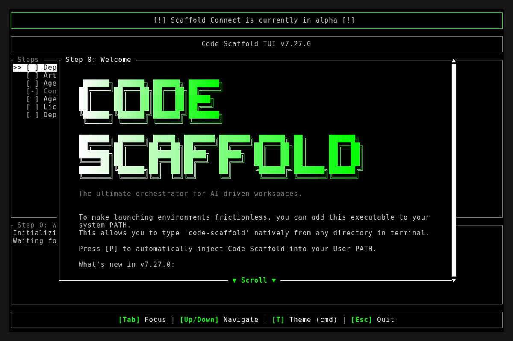
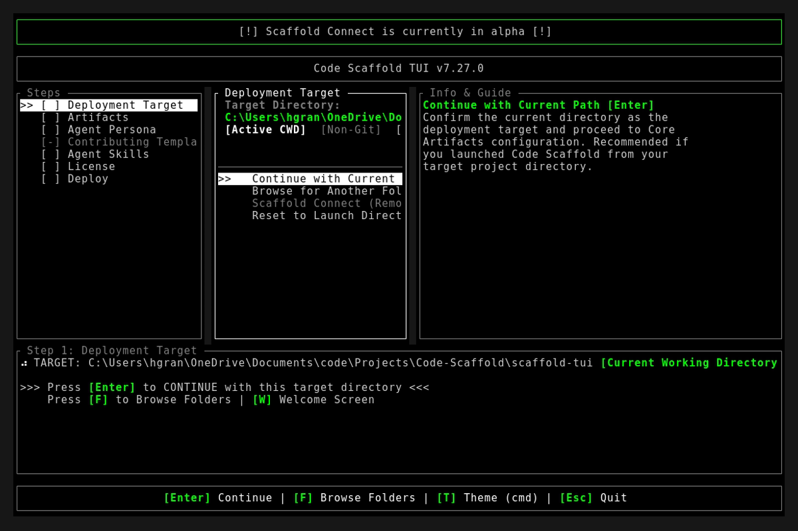
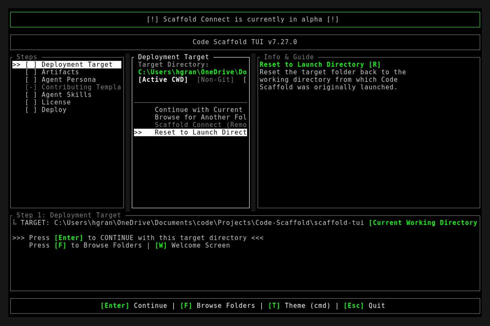

# Code Scaffold v7.27.0 Release Walkthrough

**Release Version:** `v7.27.0`
**Type:** Minor Feature Release (+0.1.0)
**Date:** September 2026

## Overview
Code Scaffold `v7.27.0` establishes an ecosystem-wide architectural contract for interactive skill sandboxes across `code-scaffold.com`. This milestone introduces the standardized `hasSandbox: boolean` specification across all 56 skill manifests and metadata schemas, bridges sandbox telemetry directly into the Rust TUI data models and CLI search registry, bundles seven high-fidelity interactive visual studio sandboxes, and modernizes the All Rights Reserved proprietary license template and root project licensing.

---

## Visual Demonstration

### Interactive TUI Visuals

---

## Key Features and Enhancements

### 1. Ecosystem hasSandbox Architecture and Web Platform Alignment
* **Binary Presentation Routing**: Standardized the `hasSandbox: boolean` invariant across all 56 `.skills/<slug>/meta.json` and `.skills/<slug>/skill-manifest.json` definitions, enabling `code-scaffold.com` to mount live interactive WebGL/DOM studios while rendering clean Architectural Contract cards for headless backends.
* **SkillForge Decision Matrix**: Updated `project_details/skillforge/PROTOCOL.md` and `.agents/AGENTS.md` with an explicit decision rubric categorizing skills by visual utility, interactive simulation value, and security telemetry needs.
* **Cross-File Gatekeeper Verification**: Augmented `project_details/playbooks/verify_skills.js` to assert `hasSandbox` boolean integrity, exact value synchronization between `meta.json` and `skill-manifest.json`, and valid `cs:sha256:` provenance integrity tokens.

### 2. Seven Newly Upgraded Interactive Visual Sandboxes
* **Markmap Studio (v2)** : Split-pane real-time markdown editor paired with an auto-syncing D3 SVG hierarchical mindmap tree, zoom/pan controls, SVG export, and pre-seeded Code Scaffold architecture maps.
* **Manim Mathematical Animation Studio (v3)** : Canvas 2D 60fps simulation engine featuring Fourier epicycle circle decomposition with adjustable harmonic orders, Euler complex phase plane projection, and Riemann partition definite integration with interactive scrub controls.
* **tldraw Spatial Computing Studio (v2)** : Infinite spatial whiteboard canvas with pan/zoom, brush/pen, shapes, connector arrows, sticky notes, pre-populated architecture graph, and live minimap camera teleportation.
* **Ratatui Interactive Terminal Simulator (v6)** : Realistic dark modern terminal chrome with `[1-4]` tab navigation, live animated sparklines (` ▂▃▄▅▆▇█`), CPU/heap gauges, multi-column process monitor table, and circular log ringbuffer.
* **Tasty Anti-Slop Design Engine and Token Playground (v4)** : Real-time CSS custom property token studio with live sliders for accent hue, corner radius, glass blur, perimeter glow, anti-slop heuristic checks, and a reactive component showroom.
* **Slidev Developer Presentation Deck Player (v3)** : Embedded 16:9 slide presentation deck with smooth transitions, syntax-highlighted code viewer, bento feature matrix, presenter notes drawer with elapsed timer, and thumbnail navigation.
* **CAD Tools Parametric 3D CAD Workbench (v3)** : Three.js WebGL viewport with orbit controls, switchable mechanical flange, planetary gear, and mounting bracket models, real-time parametric sliders, shaded/wireframe/x-ray modes, and engineering mass property analysis.

### 3. All Rights Reserved Proprietary License and Terms of Use Overhaul
* **Permitted Personal Use Scope**: Explicitly grants personal, non-exclusive, non-transferable, revocable rights to download, install, self-host, and execute the software for personal, non-commercial purposes, and privately inspect the source code.
* **Strict Prohibitions and Protective Restraints**: Strictly prohibits redistribution or mirroring, unauthorized modifications or public forks, commercial exploitation (paid client installations, SaaS/PaaS hosting, support bundling, product reselling), and altering or removing copyright/brand notices.
* **Intellectual Property and Trademarks**: Retains exclusive copyright and title over all code, assets, UI designs, and documentation, protecting trademarks and brand assets from unauthorized use.
* **Synchronized Scaffolding Templates**: Deployed the updated license to `.licenses/All Rights Reserved.md`, updated root `LICENSE.md`, and refreshed the interactive TUI license description in `scaffold-tui/src/components/workspace.rs`.

### 4. Rust TUI Data Models and CLI Registry Upgrades
* **Typed Deserialization**: Extended `SkillManifest` and `SkillMeta` structs in `scaffold-tui/src/models/skill.rs` with `pub has_sandbox: bool` supporting optional fallback defaulting.
* **Unified Record Projection**: Integrated `has_sandbox` into `SkillRecord` to expose sandbox status across local and remote skill registries.
* **CLI Inspection Integration**: Updated `skills list` and `skills search` commands to format and expose sandbox badges directly within terminal search results.

---

## Verification and Compliance Summary

* **SkillForge Architectural Gatekeeper**: 56 / 56 skills passing (100% compliant with zero warnings or errors).
* **Provenance Token Recalculation**: All 56 `skill-manifest.json` payloads updated with deterministic `cs:sha256:` tokens.
* **Rust Hygiene and Formatting**: `cargo fmt --check` exited 0, `cargo clippy` passed with 0 warnings, and `cargo test` succeeded across all 13 unit and integration tests.
* **Typographic Verification**: Strict typography enforced across all modified readmes and documentation files (zero en/em dashes and no hyphens as punctuation).
