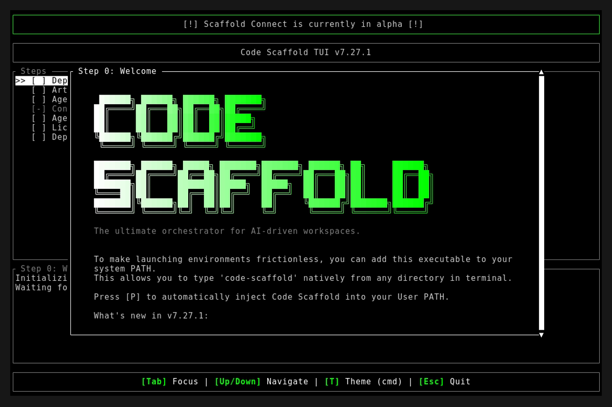
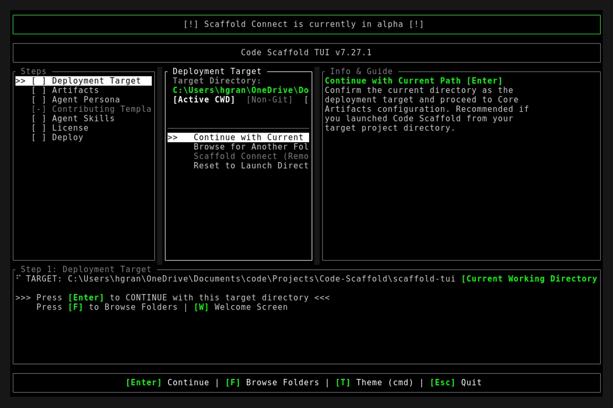
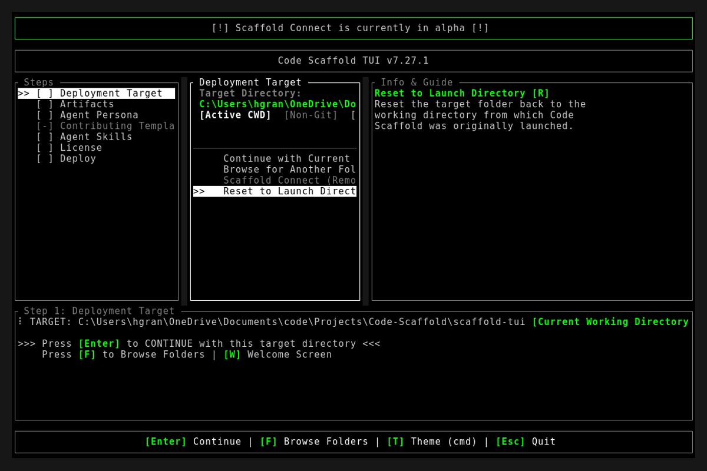

# Code Scaffold v7.27.1 Release Walkthrough

**Release Version:** `v7.27.1`
**Type:** Patch Release (+0.0.1)
**Date:** September 2026

## Overview
Code Scaffold `v7.27.1` enforces an uncompromising Anti-Slop Sandbox Policy across the skill ecosystem. Following an exhaustive audit of skill sandbox implementations, this release eliminates artificial mockups, placeholder 3D geometries, simulated terminal chrome, toy REPL clones, and static text cards. 14 skills have been flipped from `hasSandbox: true` to `hasSandbox: false`, standardizing 52 out of 56 skills to mount the authoritative Architectural Contract card on `code-scaffold.com`. Only four genuine, high-fidelity visual engines retain `hasSandbox: true`.

---

## Visual Demonstration

### Interactive TUI Visuals

---

## Key Features and Enhancements

### 1. Anti-Slop Sandbox Remediation and Invariant Enforcement
* **Removal of Artificial Mockups**: Flipped `hasSandbox` from `true` to `false` across 14 skills that previously rendered low-value placeholders, mockups, or CDN widgets:
  * `cad-tools` (v4) : Python CAD scripting engine (CadQuery, build123d, OpenSCAD). Three.js cylinder mockup replaced with Architectural Contract card.
  * `manim` (v4) : Python mathematical animation compiler. Hand-rolled JS Fourier simulation replaced with Architectural Contract card.
  * `ratatui` (v7) : Rust terminal UI library. Fake web HTML terminal frame replaced with Architectural Contract card.
  * `slidev` (v4) : Vite/Vue Markdown presentation compiler. Static 5-slide HTML deck replaced with Architectural Contract card.
  * `tasty` (v5) : Cognitive prompt engineering directive. Generic CSS slider replaced with Architectural Contract card.
  * `tldraw` (v3) : Spatial computing React SDK. Crude hand-rolled HTML5 canvas replaced with Architectural Contract card.
  * `proxmox` (v3) : Linux virtualization hypervisor. Static HTML rule cards replaced with Architectural Contract card.
  * `smart-home` (v2) : Home Assistant and HomeKit IoT orchestrator. Static HTML marketing cards replaced with Architectural Contract card.
  * `quiver` (v2) : AI vector API platform. Mock UI with synthetic delay replaced with Architectural Contract card.
  * `ghostprint` (v3) : Cryptographic code provenance CLI suite. Mock UI with simulated audit logs replaced with Architectural Contract card.
  * `markmap` (v3) : Markdown mindmap engine. Generic public REPL clone replaced with Architectural Contract card.
  * `mermaid` (v4) : Mermaid diagram generator. Static uneditable 5-node flowchart replaced with Architectural Contract card.
  * `excalidraw` (v4) : Excalidraw whiteboard. External iframe wrapper replaced with Architectural Contract card.
  * `p5js` (v4) : P5.js generative framework. Generic bouncing particle script replaced with Architectural Contract card.

### 2. Authoritative Architectural Contract Cards (52 Skills)
* **High-Utility Contract Presentation**: On `code-scaffold.com`, skills with `hasSandbox: false` mount the clean, authoritative Architectural Contract card rather than a misleading web mockup.
* **Surface Real Technical Contracts**: Surfaces the ASCII branding banner, CLI installation syntax, programmatic import code, YAML frontmatter schemas, domain constraints, and security permissions directly to developers and agents.

### 3. Preserved Bespoke Visual Engines (4 Skills)
Only four skills in the entire registry possess genuine, bespoke, high-fidelity visual implementations engineered specifically for Code Scaffold, retaining `hasSandbox: true`:
* **Kinetic Canvas (v6)** : 760 KB studio featuring 22 proprietary WebGL GLSL fragment shader programs (caustics, cellular voronoi, fluid aura, crystalline, volumetric light).
* **Braille Animations (v2)** : 347 KB compiled React application with proprietary Braille and ASCII art animation rendering engine and interactive terminal player.
* **UI Primitives (v4)** : 1,241-line custom showroom of frontier micro-interactions (kinetic fill buttons, border beams, gooey fluid physics, spring docks, bento grids, kinetic typography).
* **Scrollytelling (v3)** : Bespoke Three.js 3D exploded view with HUD rings, GSAP ScrollTrigger, and WebGL background shader.

### 4. SkillForge Protocol Codification
* **Anti-Slop Sandbox Directive**: Updated `project_details/skillforge/PROTOCOL.md` to formally prohibit artificial mockups, placeholder 3D shapes, or static text cards in sandboxes.
* **Whole-Number Version Bumps**: Incremented each modified skill by +1 across `meta.json`, `skill-manifest.json`, and `readme.md`.
* **Registry Synchronization**: Synchronized all version badges and paths in `.skills/README.md`.

### 5. GhostPrint Automated README Badge Protection (v4)
* **Default README Badge Assertion**: Enrolled repositories now automatically receive the standardized Shields.io [GhostPrint Protected] badge directly beneath the top-level `# [Project Title]` header in `README.md` upon project initialization, protection, or key ceremony.
* **CLI Command Suite**: Added dedicated `badge` subcommand (`node .skills/ghostprint/scripts/ghostprint.js badge`) and conversational natural language triggers (`"add ghostprint badge to readme"`) for on-demand badge generation and validation.
* **Bypass and Automation Flags**: Added `--no-badge` flag to bypass README modification when desired, alongside `--auto` / `-y` non-interactive support for autonomous agents.
* **Badge Standards Integration**: Integrated the GhostPrint provenance badge into the Shields.io playbook in `project_details/github.md` and `.templates/github.md`.

---

## Verification and Compliance Summary

* **SkillForge Architectural Gatekeeper**: 56 / 56 skills passing (100% compliant with zero warnings or errors).
* **Provenance Token Recalculation**: All 56 `skill-manifest.json` payloads updated with deterministic `cs:sha256:` tokens via `apply_skill_provenance.js`.
* **Rust Hygiene and Formatting**: `cargo fmt --check` exited 0, `cargo clippy` passed with 0 warnings, and `cargo test` succeeded across all 13 unit and integration tests.
* **Typographic Verification**: Strict typography enforced across all modified readmes and documentation files (zero en/em dashes and no hyphens as punctuation).
