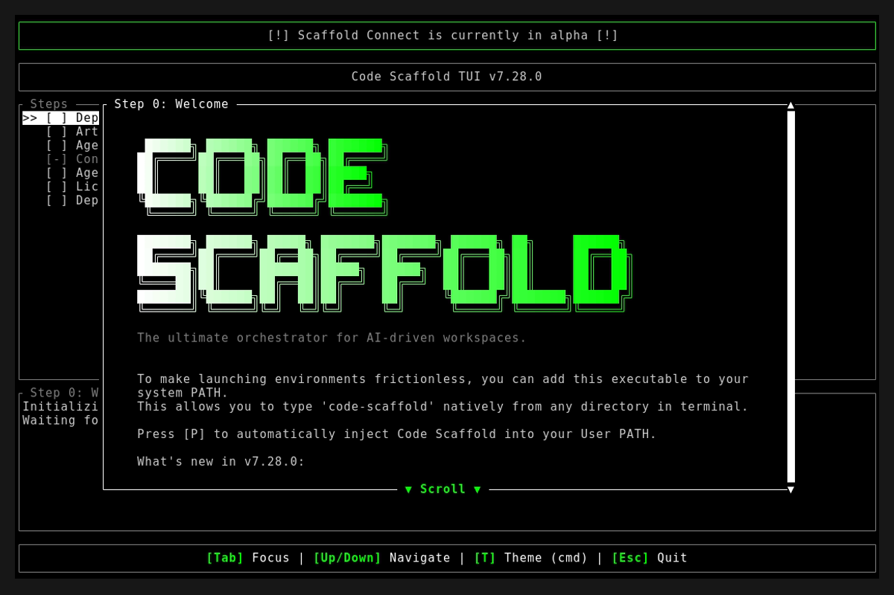
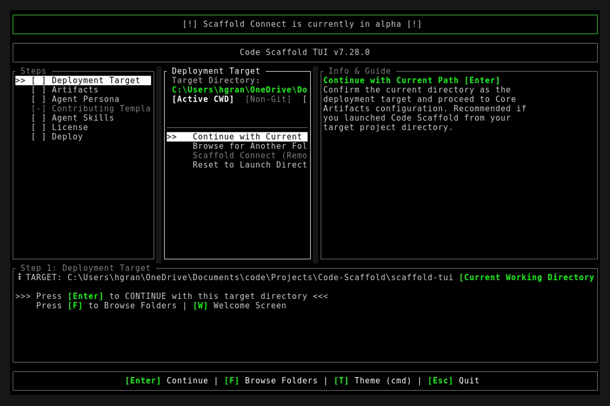
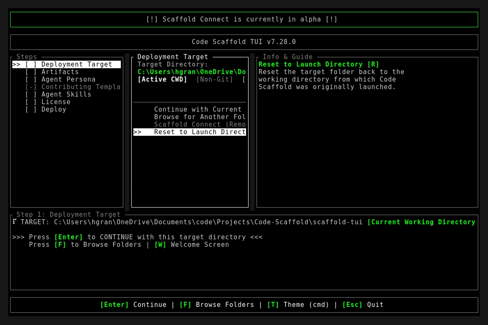

# Code Scaffold v7.28.0 Release Walkthrough

**Release Version:** `v7.28.0`
**Type:** Minor Release (+0.1.0)
**Date:** September 2026

## Overview
Code Scaffold `v7.28.0` delivers two major capabilities: the debut of the **Skeleton Performance Studio** skill (`skeleton`) engineered to eliminate Cumulative Layout Shift (CLS) and accelerate perceived load speeds, and an ecosystem-wide **Skill Logo Uniformity Overhaul** establishing strict 6-line high ANSI Shadow block art standards across all 57 skills in the registry. Additionally, this release integrates `skeleton` into the TUI's `Web Dev` persona auto-selection matrix and codifies mandatory Inception SEO, GEO, and AEO protocols into the permanent agent instructions.

---

## Visual Demonstration

### Interactive TUI Visuals

---

## Key Features and Enhancements

### 1. Dedicated Skeleton Performance Studio Skill (`skeleton` v1)
* **Five-File Architecture Compliance**: Full skill anatomy provisioned under `.skills/skeleton/` including `meta.json`, `skill-manifest.json`, `SKILL.md`, `readme.md`, and `sandbox/index.html`.
* **Perceptual Performance Engineering**: Solves Cumulative Layout Shift (CLS) and visual jank during dynamic web page loading using lightweight, GPU-accelerated CSS shimmer animations.
* **Component Patterns and Templates**: Bundles companion templates for pure CSS shimmer (`templates/shimmer.css`), responsive React 19 / Next.js Suspense wrappers (`templates/react-skeleton.tsx`), and route-level `loading.tsx` fallbacks.
* **Zero-CLS Layout Stability**: Pre-computes and mirrors exact production DOM geometry, card aspect ratios, and typography dimensions before data hydration.
* **Accessibility and Performance**: Built-in `@media (prefers-reduced-motion)` fallbacks and zero runtime dependencies.
* **Cryptographic Provenance**: Embedded zero-width steganographic signature and SHA256 integrity token (`cs:sha256:`).

### 2. TUI Web Dev Persona Auto-Selection Integration
* **Persona Companion Logic**: Updated `scaffold-tui/src/components/workspace.rs` so selecting the `Web Dev` persona automatically pre-selects `skeleton` alongside `playwright`, `tasty`, `open-design`, `seo-geo-aeo-auditor`, and `website-deploy-linux`.
* **Automated Test Coverage**: Added unit test `test_web_dev_persona_auto_selects_skeleton` in `scaffold-tui/src/app.rs`, bringing test coverage to 14 passing tests.

### 3. Ecosystem-Wide Skill ASCII Art Logo Uniformity
* **Root Cause Resolution**: Eliminated multi-word vertical stacking in `generate_skill_logo.ps1` that previously produced 12, 18, and 24-line banners that overcrowded terminal panes.
* **Single-Line ANSI Shadow Standard**: All skill logos are now strictly 6 lines high, use the ANSI Shadow Figlet font, and feature uniform 2-character leading and trailing margins (`'  ...  '`).
* **Strict Bounded Width**: Constrained all logos to a maximum width of 88 columns, ensuring zero line wrapping or visual distortion in standard 80-column split panes.
* **30-Skill Migration**: Migrated all 30 outlier skills (`clerk`, `docker`, `braille-animations`, `cybersecurity-toolkit`, `seo-geo-aeo-auditor`, `scrollytelling`, `hyperframes`, `tui-tools`, etc.) to concise brand slugs.
* **Whole-Number Skill Versioning**: Incremented versions by +1 across `meta.json`, `skill-manifest.json`, and `readme.md` for all 30 migrated skills.

### 4. SkillForge Gatekeeper and Compliance Invariants
* **Automated Compliance Assertion**: Upgraded `project_details/playbooks/verify_skills.js` to enforce strict 6-line height, uniform line widths, maximum width of 88 columns, and 2-space padding across all 57 skills.
* **Deterministic Provenance**: Recomputed cryptographic integrity tokens across all 57 skills via `apply_skill_provenance.js`.

### 5. Inception SEO, GEO and AEO Protocol Codification
* **SkillForge Protocol Update**: Codified Phase 3 Step 5 in `project_details/skillforge/PROTOCOL.md` requiring 4-dimensional keyword synthesis (15 to 30 terms), conversational trigger intent formulation, entity clarity for Generative Engine Optimization, and extractable Answer Engine Optimization formatting.
* **Permanent Agent Rules**: Updated `.agents/AGENTS.md` with strict logo uniformity standards and inception discovery requirements.

---

## Verification and Compliance Summary

* **SkillForge Architectural Gatekeeper**: 57 / 57 skills passing (100% compliant with zero warnings or errors).
* **Provenance Token Verification**: All 57 `skill-manifest.json` payloads updated with deterministic `cs:sha256:` tokens via `apply_skill_provenance.js`.
* **Rust Hygiene and Formatting**: `cargo fmt --check` exited 0, `cargo clippy` passed with 0 warnings, and `cargo test` succeeded across all 14 unit and integration tests.
* **Typographic Verification**: Strict typography enforced across all modified readmes and documentation files (zero en/em dashes and no hyphens as punctuation).
