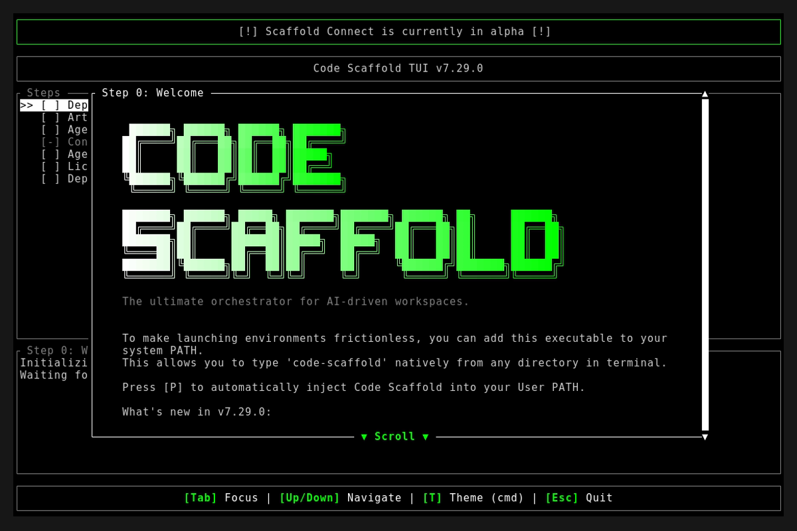
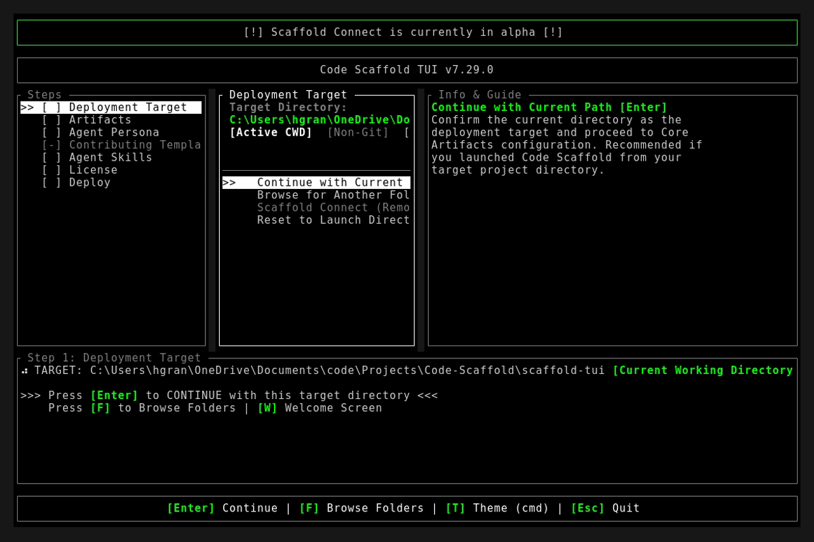
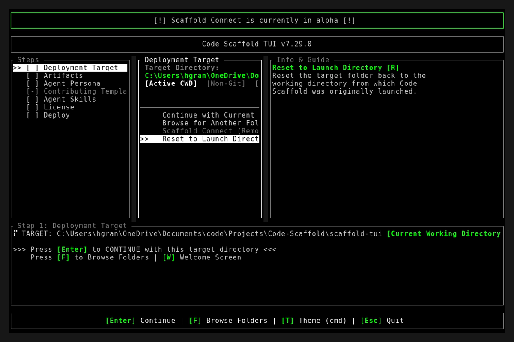

# Code Scaffold v7.29.0 Release Walkthrough

**Release Version:** `v7.29.0`
**Type:** Minor Release (+0.1.0)
**Date:** September 2026

## Overview
Code Scaffold `v7.29.0` introduces the **Universal Multi-Agent Pointer File Engine**, extending automatic skill context binding from 5 to 12 leading AI coding ecosystems. Across both the native Rust TUI engine (`code-scaffold`) and the standalone deployment package (`@code-scaffold/skills-cli` v1.0.13), every skill installation or project scaffolding cycle now idempotently provisions targeted pointer files for OpenAI Codex, Meta Muse, Kimi Code, Qwen Code, GitHub Copilot, Windsurf, Cline, Google Antigravity, Devin, Cursor, Claude Code, and OpenCode.

---

## Visual Demonstration

### Interactive TUI Visuals

---

## Key Features and Enhancements

### 1. Native Rust Universal Agent Pointer Engine (`pointers.rs`)
* **Core Module**: Built `scaffold-tui/src/skills_cli/pointers.rs` supporting automated pointer generation across 12 distinct agent environments.
* **Idempotent Injection Architecture**: Checks whether existing pointer files already reference `.skills/`. If present, it skips rewriting to preserve user modifications. If missing, it appends the authoritative `# Code Scaffold Skills` directive with clean newline hygiene.
* **Automated Unit Testing**: Implemented unit tests verifying that all 12 pointer files are created upon initial sync and asserting zero modifications on subsequent idempotent runs.

### 2. Full 12-Agent Ecosystem Matrix
Code Scaffold now generates precision-targeted pointer directives across the entire global AI coding landscape:
* **Google Antigravity** : `.agents/skills.json` (JSON catalog path mapping)
* **Devin CLI & Desktop** : `.devin/rules/skills.md` (Context engine routing rules)
* **Cursor** : `.cursor/rules/skills.mdc` (Semantic rule enforcement)
* **Claude Code** : `CLAUDE.md` (Session initialization behavioral contract)
* **OpenCode** : `.opencode.md` (Direct agent context binding)
* **OpenAI Codex & ChatGPT** : `CODEX.md` (CLI, canvas, and session operational guidance)
* **Meta Muse** : `MUSE.md` (Architecture guardrails and repository boundaries)
* **Kimi Code (Moonshot AI)** : `KIMI.md` (Directives for Moonshot 1M-token context engine)
* **Qwen Code (Alibaba Tongyi)** : `QWEN.md` (Tool usage directives and system prompt)
* **GitHub Copilot** : `.github/copilot-instructions.md` (Workspace instruction set and PR review guidelines)
* **Windsurf (Codeium Cascade)** : `.windsurfrules` (Cascade flow paradigm and tool routing)
* **Cline & Roo Code** : `.clinerules` (Operational boundaries and tool access permissions)

### 3. CLI Installer and Scaffolding Engine Integration
* **Skills Package Manager**: Updated `scaffold-tui/src/skills_cli/install.rs` so executing `code-scaffold skills install <skill>` immediately synchronizes all 12 agent pointers in the target repository.
* **TUI Scaffolding Cycle**: Integrated `scaffold-tui/src/manifest_engine.rs` so whenever a developer bootstraps a new project with skills selected, the engine binds skill context for all 12 agents during the build phase.

### 4. `@code-scaffold/skills-cli` Package Upgrade (v1.0.13)
* **NPM Installer Engine**: Refactored `packages/skills-cli/src/installer.js` with an asynchronous helper that provisions all 12 agent pointer files when deploying skills via `npx -y @code-scaffold/skills-cli add <author>/<skill>`.
* **NPM Registry Documentation**: Updated `packages/skills-cli/README.md` to document the full 12-agent auto-discovery matrix.

---

## Verification and Compliance Summary

* **SkillForge Gatekeeper Compliance**: 57 / 57 skills passing with 100% architectural compliance.
* **Rust Hygiene and Formatting**: `cargo fmt --check` exited 0, `cargo clippy` passed with 0 warnings, and `cargo test` succeeded across all 15 unit and integration tests.
* **Typographic Invariants**: Zero en/em dashes and no hyphens used as punctuation across all project documentation.
