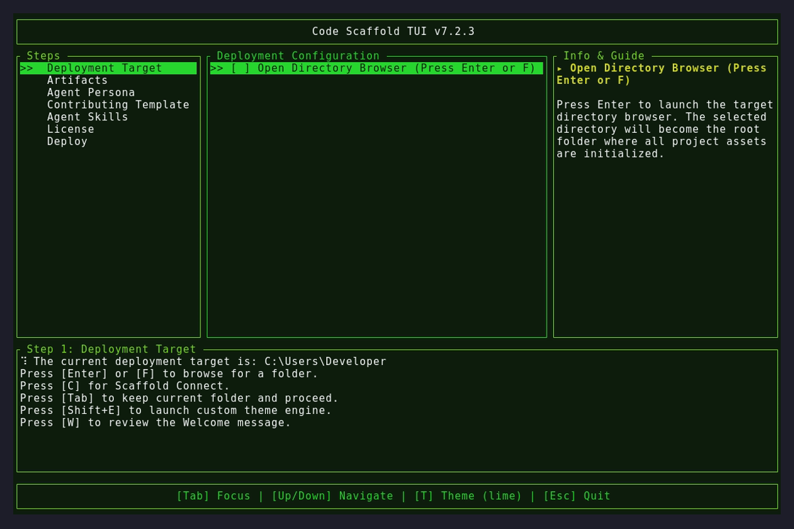
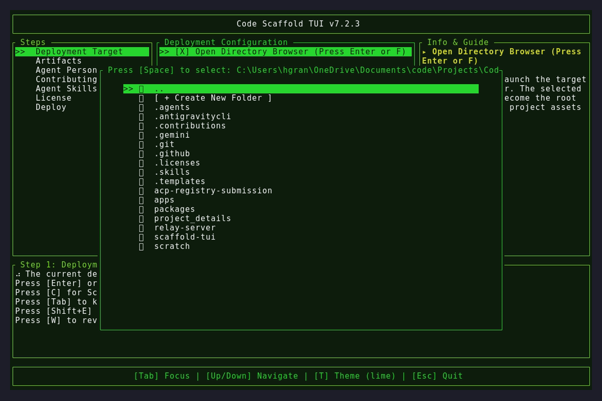
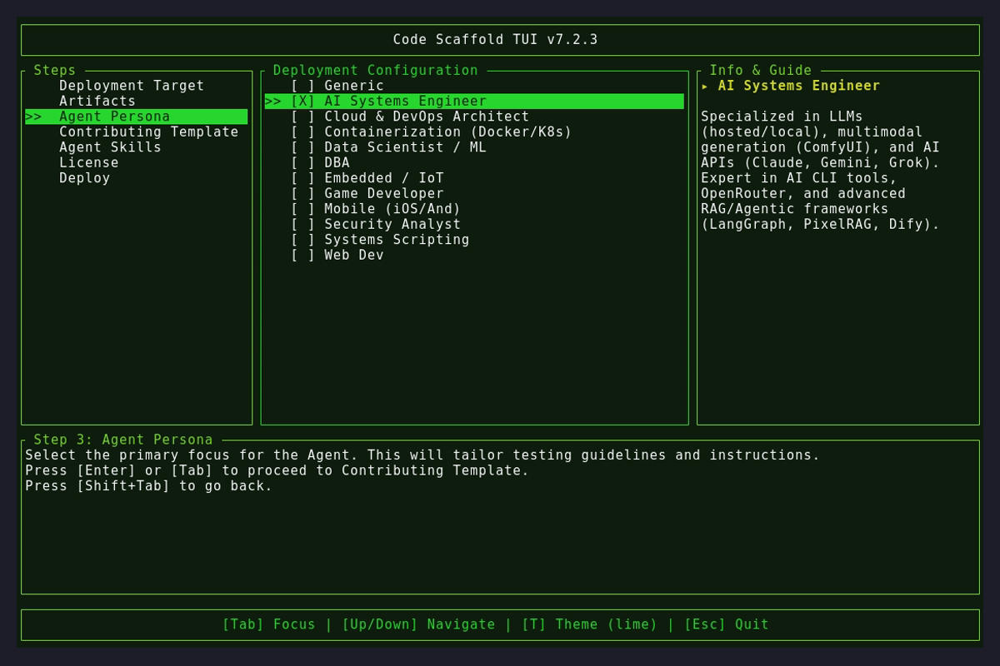

# Code Scaffold v7.3.0

## Changelog
* **Scaffold Connect (Feature):** Renamed "Agent Co-Pilot" to "Scaffold Connect" across the application.
* **Connection Stability (Feature):** Implemented a 29-second keep-alive heartbeat ping to prevent Deno host disconnections.
* **Session Lifecycle (Feature):** Implemented robust teardown, timer cancellation, and auto-relaunch logic (via `tokio` oneshot channels) when the connection drops or the PIN/Key is rotated.
* **Global Navigation (Feature):** The `ESC` key now operates as a universal "Back" button across all modal screens, returning users safely to the home screen.
* **Exit Confirmation (Feature):** Pressing `ESC` on the home screen now triggers a clean `ConfirmExit` prompt to prevent accidental closures.
* **TUI Automation (Patch):** Patched the WSL execution path logic to ensure `vhs` dependencies are correctly recognized during headless execution on Windows.
* **Skill Updates**: Updated `code-scaffold` skill to v4 with a robust Python WebSocket client script to improve efficiency for open-weight agent models.

## Automated TUI Captures

