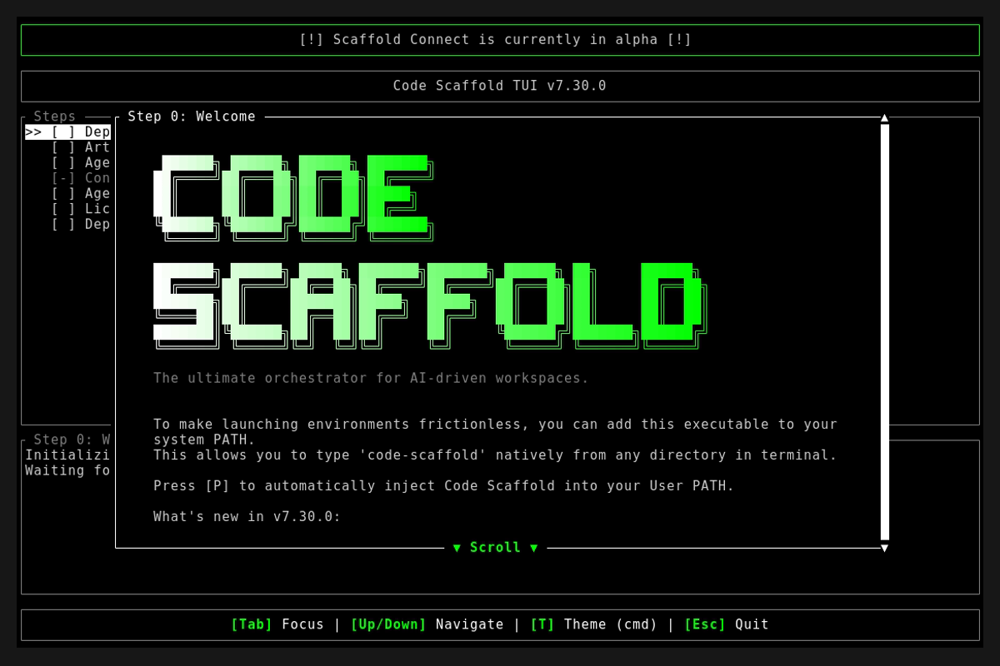
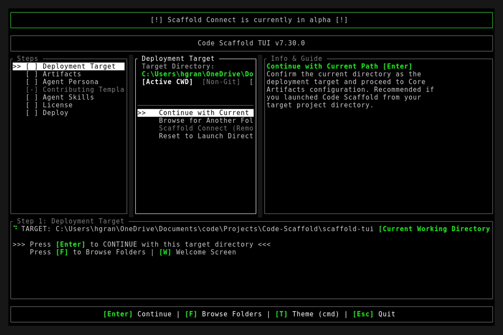
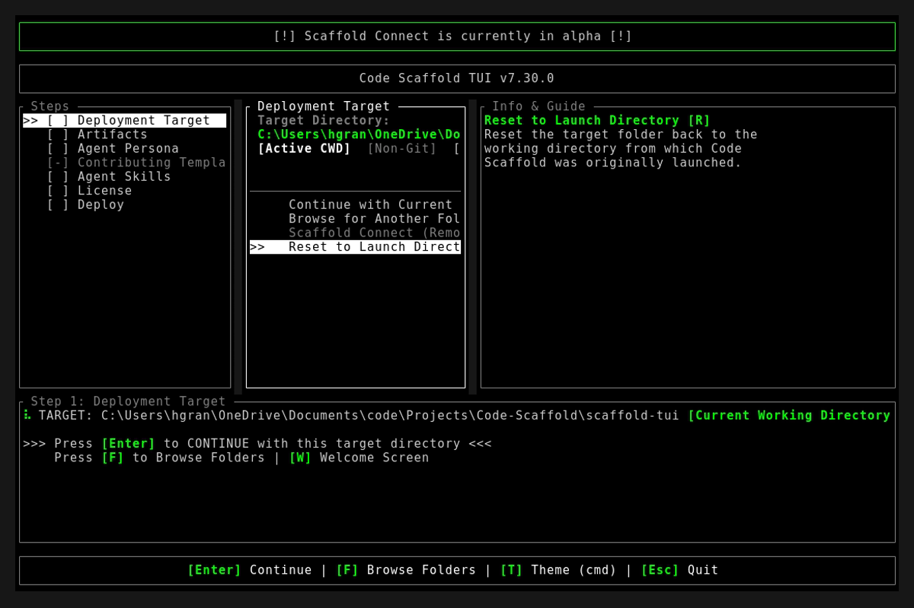

# Code Scaffold v7.30.0 Release Walkthrough

**Release Version:** `v7.30.0`
**Type:** Minor Release (+0.1.0)
**Date:** September 2026

## Overview
Code Scaffold `v7.30.0` ships four skill-grade payloads. **GhostImprint v5** renames GhostPrint to GhostImprint and replaces every simulated forensic with measured evidence or an explicit UNMEASURED label, adds the application receipt workflow plus tiered temporal anchors, and ships a 33-check zero-dependency selftest. **UI Primitives v6** absorbs four motion catalogs in the SkillForge make-it-our-own pattern: a Kinetic Typography Reveal System, Component Motion Expansion, Micro Spring Kit, and Ambient Backgrounds. **Changelog Plus v3** is a new immutable release history pipeline with headless terminal capture, declarative web capture, mandatory failure gates, and a maintained selftest. **Playwright Plus v5** renames the Playwright skill and adds the real declarative YAML workflow dispatcher it always documented, with job level run recording and gif conversion. The native Rust TUI (`code-scaffold`) carries the GhostImprint rename through the Security Analyst persona with full test coverage.

---

## Visual Demonstration

### Interactive TUI Visuals

---

## Key Features and Enhancements

### 1. GhostImprint v5: Rename Plus Real Measurement
* **Rename:** `.skills/ghostprint` becomes `.skills/ghostimprint` with script, badge, vault path, and documentation migration. Legacy vaults, badges, and TUI labels keep working through compatibility shims.
* **Measurement honesty:** the auditor fails closed without an identity, Layer 3 and Layer 6 are genuinely measured, Layers 4, 5, 7 (bound channels), and 8 measure against the new application receipt, and everything else reports UNMEASURED with the command that would make it measurable. All hardcoded verdicts, random p-values, and simulated probes are removed.
* **Receipt workflow:** new `record`, `record-plan`, `anchor`, and `receipt` commands log applied decisions, bind oracle probe triggers, and seal releases to git commits and trees.
* **Tiered temporal anchors:** local git anchors by default, notarized RFC 3161 plus Rekor witnesses opt-in with explicit privacy consent, sovereign on-chain anchoring reserved for a future iteration.
* **One way street warning:** the key ceremony states plainly that published releases are permanent and unprotect removes local enrollment only.
* **Durable selftest:** `scripts/ghostimprint-selftest.js` covers fail-closed identity, planted-fixture verdicts, receipt round-trips, anchor verification, timestamp vectors, and oracle logic with zero dependencies.

### 2. UI Primitives v6: Motion Catalog Expansion
* **Kinetic Typography Reveal System:** staggered blur plus rise reveals at word or character granularity with midpoint overshoot, split-letter rise, restrained shine sweeps, single-line gradient display treatments, layout-reserve typewriter with auto-dismissing caret, and viewport-paused circular rotating text (`references/kinetic-text-reveal.js` and `kinetic-text-reveal.css`).
* **Component Motion Expansion:** pixel-dissolve card reveals, click-to-focus fanned card stacks, and staggered masonry entrances that unobserve after play.
* **Micro Spring Kit:** press bounce controls, spring toggle switches, fade tooltips, an `aria-live` toast queue, and pointer burst particles.
* **Ambient Backgrounds:** CSS aurora backdrop bands plus a density-capped canvas drift field that pauses offscreen, as a lightweight alternative to the WebGL light-field.
* **Version normalization:** meta, manifest, frontmatter, readme, and index aligned to 6 with a recomputed integrity token.

### 3. TUI Rename Carry-Through
* **Security Analyst persona:** auto-select matcher recognizes `ghostimprint` while retaining `ghostprint` and `ghost-print` as legacy aliases. The persona test is renamed and green.

### 4. Changelog Plus v3: Immutable Release History Pipeline
* **Versioned history folders:** self contained `readme.md` plus `demo.gif` and splash, main, and final screenshots under a configurable changelog root defaulting to `project_details/changelog`, with one time directory preference init.
* **Two capture runners:** headless terminal capture through the WSL POSIX PTY bridge with a mandatory zero asset failure gate, plus web capture through declarative route manifests reusing the Playwright Plus module and helpers.
* **Declarative template:** `templates/capture-web.yaml` runs the slot contract through the Playwright Plus dispatcher for fully replayable releases.
* **Durable selftest:** 10 checks covering directory resolution order, manifest validation, and the asset gate with zero browser dependency.

### 5. Playwright Plus v5: Real Declarative Dispatcher
* **Display rename:** Playwright becomes Playwright Plus with folder, manifest name, and target IDs frozen.
* **YAML step dispatcher:** new `workflows/run.cjs` executes declared steps against a strict method allowlist with environment and base URL substitution, dev server auto detection, and zero arbitrary code evaluation, replacing the previously documented but unimplemented engine path.
* **Job level recording:** `record: {dir, gif}` blocks capture full run video with ffmpeg conversion to gif for release evidence.
* **Durable selftest:** 10 checks covering substitution, planning, allowlist rejection, and record validation.
* **Provenance cleanup:** package authorship normalized to Code Scaffold identity and `js-yaml` recorded as a proper dependency.

---

## Verification and Compliance Summary

* **SkillForge Gatekeeper Compliance**: 58 / 58 skills passing with 100% architectural compliance.
* **Rust Hygiene and Formatting**: `cargo fmt --check` exited 0, `cargo clippy` passed with 0 warnings, and `cargo test` succeeded across all 15 unit and integration tests.
* **GhostImprint Selftest**: 33 / 33 checks passing with zero dependencies.
* **Changelog Plus Selftest**: 10 / 10 checks passing with zero browser dependency.
* **Playwright Dispatcher Selftest**: 10 / 10 checks passing with zero browser dependency, plus a live recorded workflow run producing screenshot and gif artifacts.
* **Typographic Invariants**: Zero en/em dashes and no hyphens used as punctuation across all project documentation.
