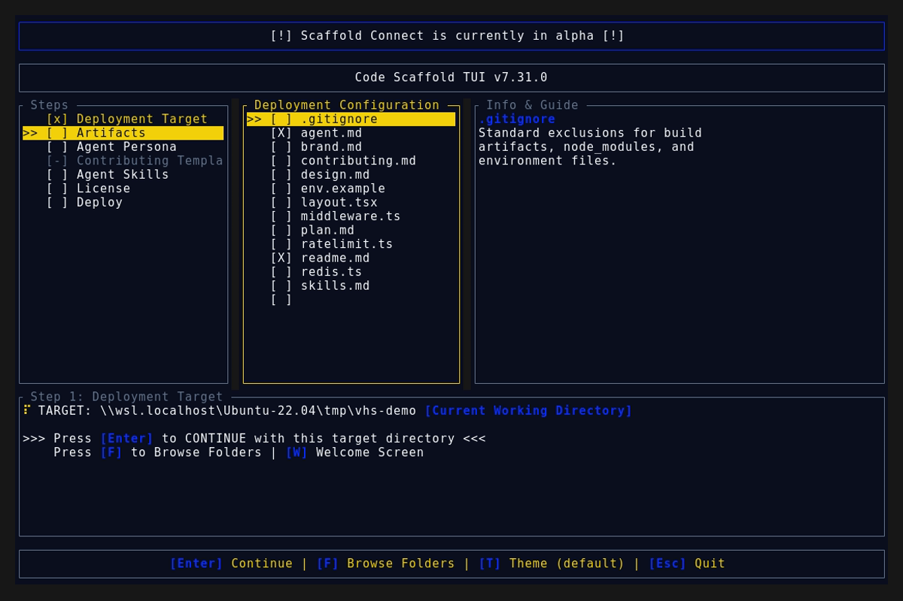
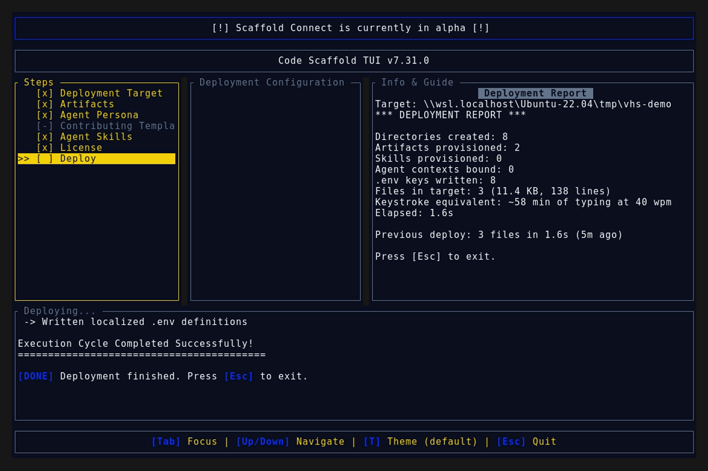

# Code Scaffold v7.31.0 Release Walkthrough

**Release Version:** `v7.31.0`
**Type:** Minor Release (+0.1.0)
**Date:** September 2026

## Overview
Code Scaffold `v7.31.0` is an engine experience release. Deploys now close with a **Deployment Report** card that types itself out beneath the guide QR code, reporting real measured metrics plus a keystroke equivalent and a previous deploy comparison. Step 1 is streamlined (ENTER advances with the working directory, F opens the folder browser with a deliberate confirm row), platform configuration moves out of the artifact list into the owning GitHub, Firebase, and Vercel skills with scaffold time `.env` seeding, and a new **Mobile PWA** skill ships installable web app packaging. A production payload fix guarantees standalone launches provision the full baseline instead of an empty manifest.

---

## Visual Demonstration

### Interactive TUI Visuals

---

## Key Features and Enhancements

### 1. Deployment Report Card
* **Measured metrics:** directories created, artifacts and skills provisioned, agent contexts bound, `.env` keys written, target file, byte, and line counts from a post deploy walk, plus wall elapsed time.
* **Keystroke equivalent:** total deployed characters converted at 40 words per minute, labeled honestly as typing time rather than time saved.
* **Previous deploy comparison:** last run persisted to prefs and shown with file count, elapsed time, and age.
* **Typewriter presentation:** the card types out under the guide QR code with a block cursor; any keypress completes it instantly and Esc exits as before.
* **Every surface:** TUI report card, headless console plus JSON report object, and ACP tool success payloads.

### 2. Wizard Streamlining
* **Step 1 has no menu:** ENTER or Space advances immediately with the current directory, F opens the folder browser, R resets, W returns to welcome.
* **Folder browser confirm row:** `[ Select This Folder ]` sits second beneath `..` so confirming the current folder is deliberate; ENTER confirms and Space still works anywhere.
* **Pane deduplication:** the workspace, description, and summary panes no longer repeat the same step 1 selections; the dead remote pairing teaser is removed.

### 3. Platform Skills Own Their Configuration
* **Retired artifacts:** `vercel.json`, `deploy.yml`, `github.md`, and `firebase.md` leave the selectable artifact list; the GitHub (v7), Firebase (v6), and Vercel (v4) skills carry the configuration, CI workflow, and environment key references instead.
* **Scaffold time `.env` seeding:** selecting a platform skill prepopulates its placeholder keys into the generated `.env`, which the owning skill self heals with the user afterwards. Existing values are never overwritten.
* **Accuracy fixes:** selecting no license no longer attempts a missing file copy, headless writes `LICENSE.md` consistently and gains `--contributing`, and the link verifier plus skill gatekeeper run before staging release pushes.

### 4. Production Payload Fix
* **Root cause:** standalone launches resolved a cache directory whose `manifest.json` was never persisted by sync, so every production deploy fell back to the empty manifest and provisioned almost nothing.
* **Resolution:** sync now writes the fetched remote manifest into the cache and refetches whenever the manifest, templates, or skills are absent, so production deploys provision the full baseline.

### 5. Mobile PWA v1
* **Installable packaging:** web manifest, maskable icon sets, versioned service worker with offline shell, install prompt flow with iOS instruction path, and pure unit tested platform detection.
* **Framework matrix:** Vite SPA, Next.js, Nuxt, SvelteKit, Angular, and static builds with exact tooling pinned in the skill dependency spec.
* **Stated limitations:** iOS manual install only, no store presence, shell only offline by default, secure context requirements, and push notifications out of scope.

---

## Verification and Compliance Summary

* **SkillForge Gatekeeper Compliance**: 59 / 59 skills passing with 100% architectural compliance.
* **Rust Hygiene and Formatting**: `cargo fmt --check` exited 0, `cargo clippy --deny warnings` passed with 0 warnings, and `cargo test` succeeded across all 43 unit tests.
* **Release Capture**: `demo.gif`, splash, deploy, and report screenshots recorded headless through WSL VHS against the v7.31.0 binary and visually verified.
* **Typographic Invariants**: Zero en/em dashes and no hyphens used as punctuation across all project documentation.
