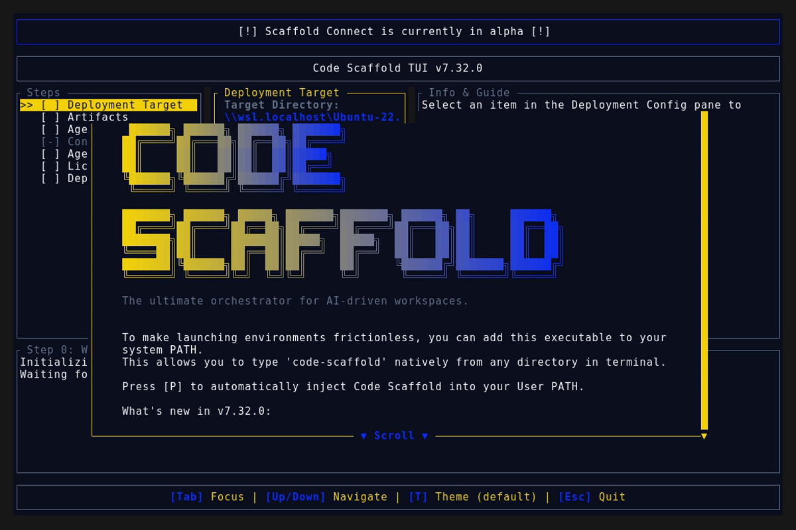
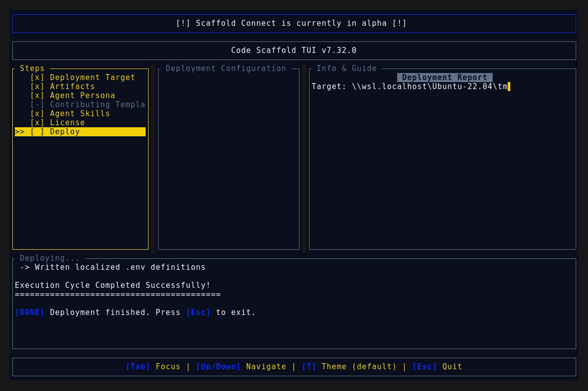
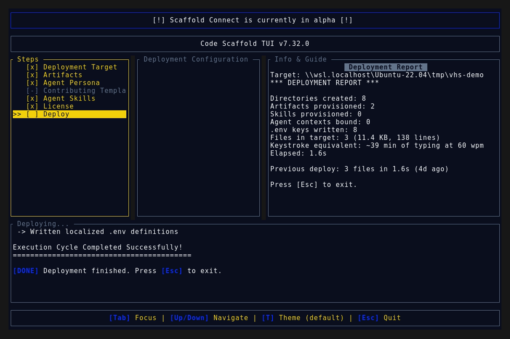
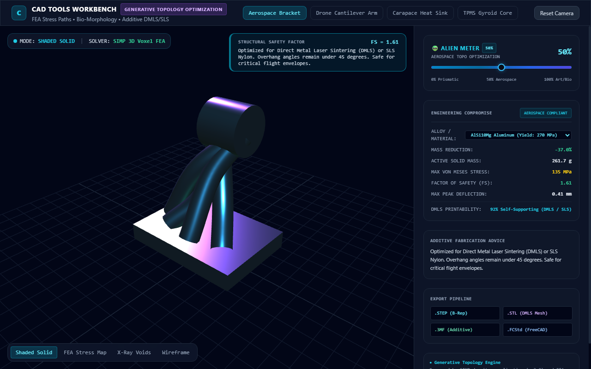

# Code Scaffold v7.32.0 Release Walkthrough

**Release Version:** `v7.32.0`
**Type:** Minor Release (+0.1.0)
**Date:** September 2026

## Overview
Code Scaffold `v7.32.0` is an engineering and generative design expansion release. The flagship **CAD Tools** skill undergoes a major generational evolution (v5 to v8), introducing native FreeCAD AI socket and headless automation, algorithmic SIMP topology optimization with the **Alien Meter** continuum slider, and an interactive full-screen 3D WebGL Three.js visual workbench. Additionally, this release establishes the architectural blueprint for the upcoming Real-Time Interactive Workbench and in-page conversational chat drawer, alongside core typing speed refinements in the manifest reporting engine.

---

## Visual Demonstration

### Interactive TUI Visuals

### 3D Generative Topology & Alien Meter Sandbox

---

## Key Features and Enhancements

### 1. CAD Tools v8: Generative Design & Topology Optimization
* **SIMP Mathematical Solver:** Implements Solid Isotropic Material with Penalization ($E_e = \rho_e^p E_0$) evaluating strain energy density and volume fraction constraints to prune non-load-bearing voxels.
* **The Alien Meter Continuum:** A calibrated dial parameterizing structural stiffness against bio-morphology:
  * *0% to 35% (Prismatic & Structural Baseline):* Maximum stiffness, high Factor of Safety (FS >= 2.5), low deflection, suited for subtractive CNC machining.
  * *35% to 75% (Aerospace Topo Optimization):* Organic load-bearing branching paths, compliant safety margins (FS 1.5 to 2.0), 30% to 55% mass savings for DMLS/SLS additive printing.
  * *75% to 100% (High Bio-Morphology & Bio-Art):* Hyper-skeletal, branching lattice webs maximizing visual drama and mass evacuation at the cost of structural stiffness (FS < 1.0, decorative only).
* **Live Engineering Compromise Card:** Real-time telemetry computing mass reduction percentage, active solid mass, peak Von Mises stress relative to alloy yield strengths, maximum elastic deflection, and DMLS self-supporting printability scores.

### 2. Interactive 3D WebGL Workbench Sandbox
* **Real-Time Procedural Deformation:** Full-screen Three.js stage in `.skills/cad-tools/sandbox/index.html` executing procedural mesh updates across four engineering presets (Aerospace Cantilever Bracket, Drone Arm, Carapace Heat Sink, and TPMS Gyroid Core).
* **Restrained Technical Spectrum:** Sleek analogous slider transitioning from precision CAD blue (`#0284c7`) to computational indigo (`#4f46e5`) with a machined dark dial thumb, eliminating rainbow visual artifacts.
* **Inspection Shader Modes:** Instant switching between Shaded Solid PBR, procedural FEA Stress Heatmap, X-Ray Internal Voids, and Wireframe lattice modes.
* **Multi-Format Export Pipeline:** Direct downloads for `.STEP` (B-Rep solid), `.STL` (DMLS mesh), `.3MF` (additive manufacturing), and `.FCStd` (native FreeCAD document).

### 3. FreeCAD AI Connector & Parametric Socket Bridge
* **Streamable HTTP & SSE MCP Socket:** Direct bidirectional communication with active FreeCAD GUI sessions via endpoint `POST /mcp` or legacy SSE (`GET /sse`) on port 3000.
* **Headless STDIO JSON-RPC:** Programmatic execution of modeling scripts via `FreeCADCmd` or `FreeCAD -c` with automated file-descriptor banner isolation.
* **Cognitive Modeling Workflows:** Standardized interaction routines for Measure and Propose against reference parts, concept refinement, and targeted feature tree modifications.
* **Transactional Rollbacks:** Wraps atomic CAD operations in native undo transactions (`openTransaction` and `commitTransaction`) with automated recovery on syntax or kernel geometry errors.

### 4. Real-Time Workbench & In-Page Chat Roadmap
* **Architectural Reference (`references/WORKBENCH_ROADMAP.md`):** Comprehensive four-phase blueprint bridging user, agent, and 3D viewport:
  * *Phase 1 (Live Artifact Sync):* Automatic Three.js hot-reloading when the agent writes meshes to `.cad_runtime/current_part.glb`.
  * *Phase 2 (In-Page Chat Drawer):* Sliding dark-slate glass chat panel packaging live 3D scene metadata into natural language prompts.
  * *Phase 3 (Bidirectional WebSocket IPC):* Local background daemon (`freecad_bridge.py --daemon`) executing live FreeCAD re-meshing when UI sliders scrub.
  * *Phase 4 (Real-Time FEA Stream):* Dynamic voxel stress field streaming and multi-agent engineering collaboration.

### 5. Core Engine & Typographic Refinements
* **Standard Keystroke Equivalence:** Adjusted typing speed calculations in `scaffold-tui/src/manifest_engine.rs` to a realistic 60 words per minute (300 characters per minute).
* **Provenance Watermarking:** Synchronized Phase 6 cryptographic integrity tokens and schema anchors across all 59 skills.

---

## Verification and Compliance Summary

* **SkillForge Gatekeeper Compliance:** 59 / 59 skills passed with 100% architectural compliance (`verify_skills.js`).
* **Rust Hygiene and Formatting:** `cargo fmt --check` exited 0, `cargo clippy --all-targets -- -D warnings` passed with 0 warnings, and `cargo test` succeeded across all 43 unit tests.
* **Release Media Capture:** `demo.gif`, splash screen, deployment view, and full report card recorded headless via WSL VHS against the v7.32.0 binary and visually verified.
* **Typographic Invariants:** Strictly zero en/em dashes and no hyphens used as punctuation across all project documentation.
