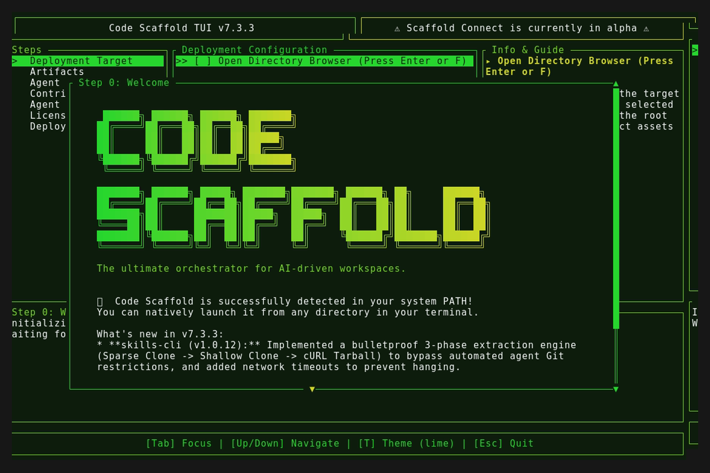
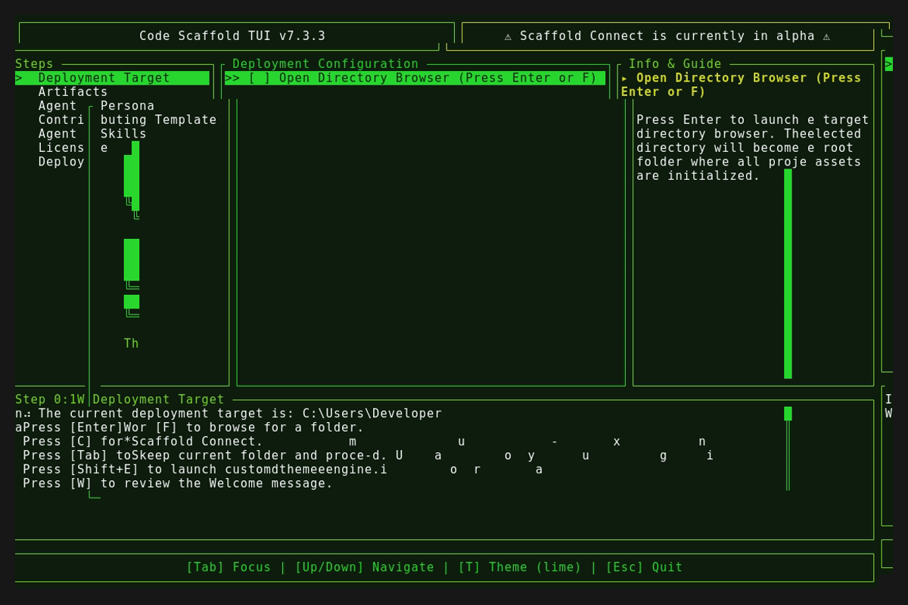
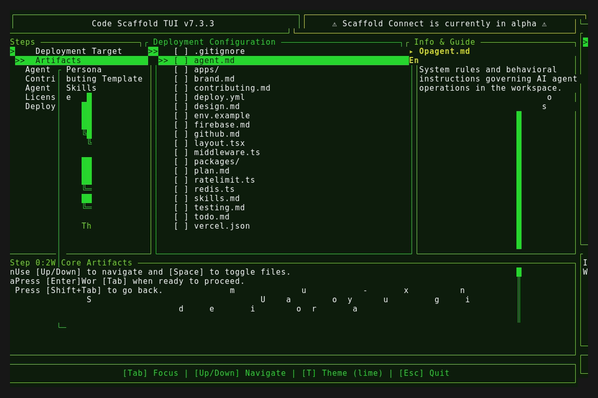

# Code Scaffold v7.4.0

## Changelog
* **Scaffold Connect Key Rotation**: Fixed a bug where requesting key rotation bypassed the connection loop and failed to remount the WebSocket tasks, resulting in a dead UI state.
* **OTA Update UI Freeze**: Fixed a bug causing the host shell's `More?` pagination prompt to bleed through and freeze the UI during self-updates by restructuring the app restart execution layer to correctly block and wait for child process exits.
* **Timer Constraint Logic**: Reworked the Scaffold Connect countdown timer so it exclusively begins counting down only *after* a successful `AGENT_PAIRED` handshake is achieved, eliminating false-positive expirations.
* **Alpha Header Split**: Redesigned the main TUI header into a dual-column layout to prominently and persistently separate the Scaffold Connect alpha warning from standard app context.
* **Mobile Pairing QR Code**: Integrated a dynamic Unicode QR code directly into the Scaffold Connect pairing screen to facilitate seamless mobile URI sharing. The QR code gracefully unmounts upon agent connection.
* **Code Scaffold Skill Upgraded to v6**: Overhauled the skill architecture to natively embed the Python WebSocket client script directly inside the `.skills` directory for frictionless headless agent execution, and added explicit documentation constraints to prevent agents from attempting to run phantom binaries.

## Artifacts

### Full Demo Sequence

### Welcome Splash

### Main Interface

### Interactive State

