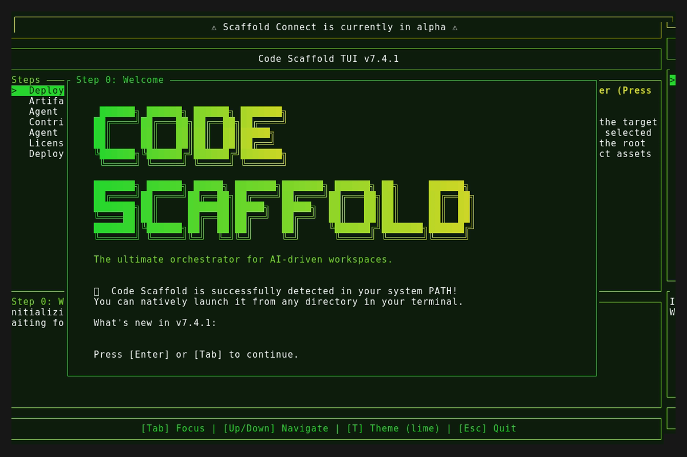

# Code Scaffold v7.4.1 (Patch)

## Changes
* **Confirm Exit Cancel Bug**: Fixed a bug where pressing `Esc` inside the Exit Confirmation modal abruptly closed the application instead of canceling and returning to the deployment state.
* **OTA Auto-Updater Freeze**: Eliminated a severe OS-level terminal hijacking bug on Windows during OTA updates. Replaced the aggressive background auto-restart with a clean, graceful `UpdateComplete` state that prompts for manual exit.
* **Persistent Bridge Loop**: Hardened the Scaffold Connect WebSocket backend to automatically maintain connection state and reconnect to the relay if the Python client drops, enabling agents to execute multiple consecutive scripts using the same URI.
* **Agent PowerShell Engine**: Upgraded the remote execution bridge to pipe commands through `pwsh` instead of `cmd.exe`, unlocking native resolution of common shell aliases (like `ls`) for cross-platform agents.
* **Full-Width Alpha Banner**: Restructured the UI layout engine to separate the master header into two distinct, vertically stacked elements, isolating the Scaffold Connect alpha warning into a dedicated full-width banner.
* **Agent Name Masking**: Removed dynamic agent name parsing/injection from the Scaffold Connect active connection banner to reduce visual clutter and misidentification, defaulting to `[🤖 Agent Connected]`.
* **Skill Upgrade Path**: Hardened the Code Scaffold skill `SKILL.md` by explicitly instructing agents to execute destructive cleanup (`rm -rf`) prior to installing an upgrade, mitigating `ENOTEMPTY` leftover state collisions.

## Visual Documentation

### Main Terminal Splash

### Automated Navigation Demo

