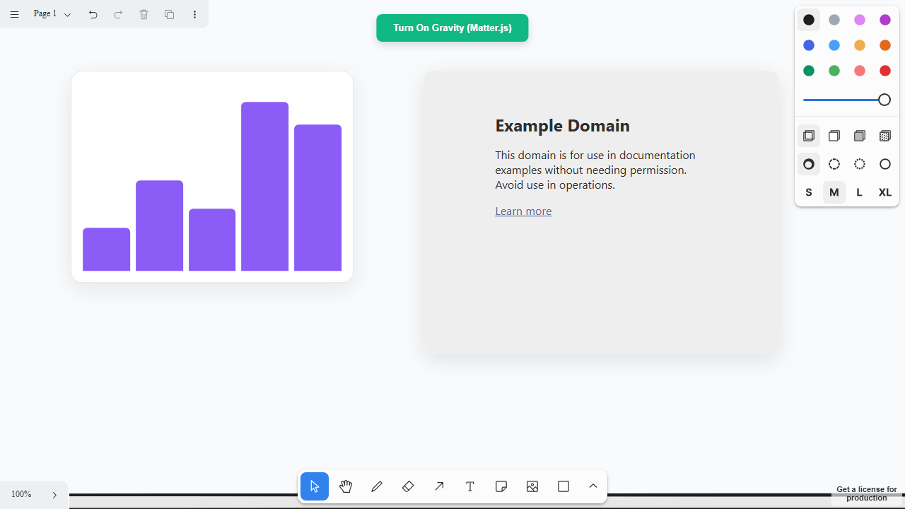

# Code Scaffold v7.5.0

## Release Information
* **Version**: v7.5.0
* **Type**: Minor Bump (+0.1.0)
* **Date**: July 18, 2026

## Changelog
* **A2UI Skill Integration:** Implemented the Agent-to-User Interface (A2UI) protocol skill, providing headless agents with the schema and renderer logic to securely stream declarative JSON UI payloads instead of executable code.
* **Tldraw Hit-Test Resolution:** Resolved a `Path2D` renderer crash in the `tldraw` skill by refactoring the `getIndicatorPath` implementations on `ChartShapeUtil` and `IframeShapeUtil` to return properly instantiated `Path2D` objects rather than SVG strings. 
* **Test Automation Watcher:** Deployed a background Playwright test-watcher to automatically validate tldraw UI interaction and physics loops headless-ly during development.

## Screenshots

### Tldraw Demo Web App

