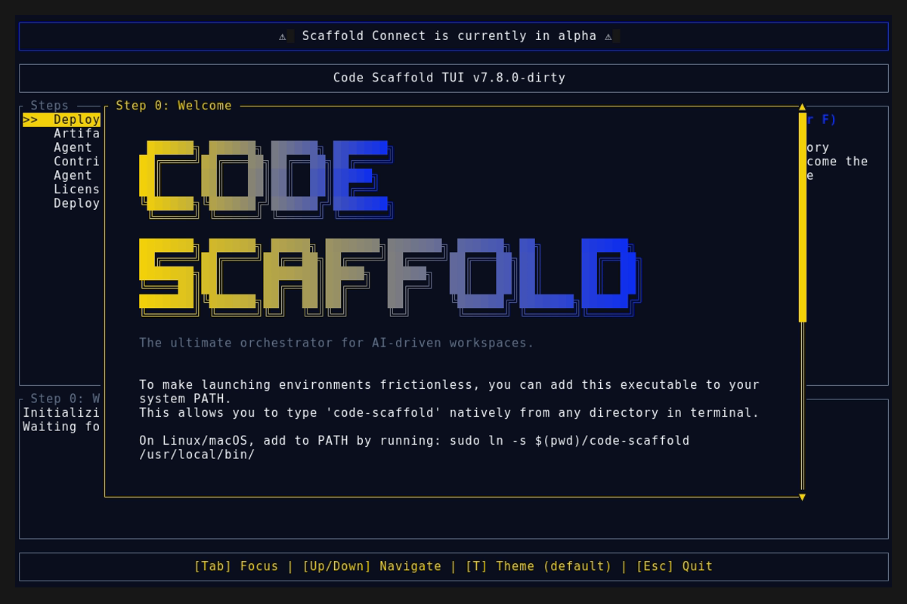

# Code Scaffold v7.8.0

## Release Overview

This release addresses significant TUI rendering artifact bugs (scrolling anomalies/ghosting) by implementing strict, global background fill layers to the application blocks. Furthermore, it enforces dynamic, algorithmic parsing for ANSI Shadow font flush-left logo generation rules to ensure uniform spacing across `A`, `C`, `G`, `O`, `Q`, and `T` characters. We have also explicitly established two brand new skills in the ecosystem via the SkillForge Protocol: `Codebase Memory MCP` and `OfficeCLI`.

### Visual Evidence

## Changelog

* **TUI Visual Engine Fixes:** Resolved severe scrolling artifacts, ghosting, and chevron duplication by implementing a global `Paragraph` background fill in the `ratatui` application layer (`scaffold-tui/src/app.rs`) which enforces full-screen clearing at the start of each render frame.
* **Dynamic Logo Rendering Architecture:** Established a strict algorithm for correcting `ANSI Shadow` figlet font alignment anomalies natively (specifically left-shift correction for A, C, G, O, Q and right-shift correction for T), permanently capturing this logic in the project rules (`AGENTS.md`) and applying it to all existing `meta.json` files across the library.
* **TUI-Tools Skill Enhancement:** Bumped `tui-tools` to `v5`, documented the ANSI Shadow alignment logic in its `SKILL.md`, and natively embedded the `alphabet_ansi_shadow.md` reference guide within `.skills/tui-tools/references/`.
* **New Skill - Codebase Memory MCP (v1):** Executed the SkillForge Protocol to incubate the `codebase-memory-mcp` skill, delivering a lightning-fast native graph intelligence server explicitly optimized for headless AI indexing and structural querying.
* **New Skill - OfficeCLI (v1):** Executed the SkillForge Protocol to incubate the `officecli` skill, allowing AI agents to seamlessly generate, interrogate, and modify Word, Excel, and PowerPoint documents headlessly.
* **Skill Topology Updates:** Automatically rendered and published a new Mermaid dependency graph (`topology_v2.svg`) reflecting the integration of the two new skills into the ecosystem.

## Versioning Rationale

**Minor Bump (v7.6.0 -> v7.8.0)**
*Note: The version `v7.7.0` was intentionally skipped.* 
The inclusion of two entirely new skills (`Codebase Memory MCP` and `OfficeCLI`) via the SkillForge Protocol represent significant feature additions to the ecosystem, which explicitly dictates a Minor `+0.1.0` bump based on the strict Semantic Versioning project rules. Because multiple distinct feature branches (the TUI rendering rewrite and the two new skills) were merged simultaneously in this deployment payload, the version was cumulatively bumped past the `v7.7.0` marker directly to `v7.8.0` to account for the bundled magnitude of these changes.
