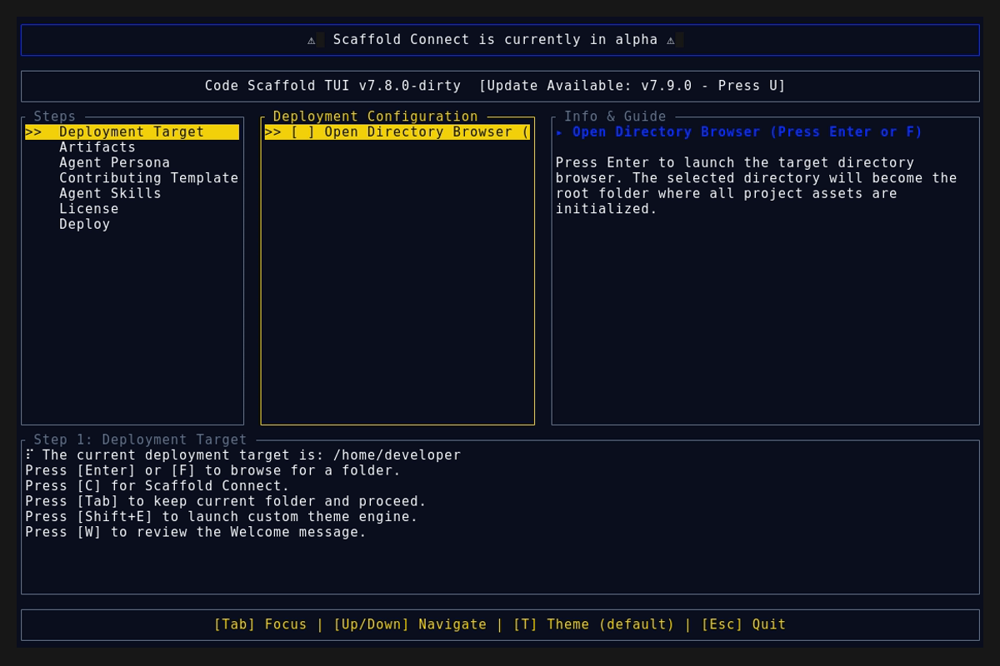

# Version 7.9.0

## Changelog
* **feat(tui):** Restored qrcode dependency and implemented dynamic QR rendering for the 'Agent Copilot' tool in `DescriptionPane`. 
* **refactor(tui):** Silenced the QR code display for standard skills/artifacts to keep the UI clean until future expansion.
* **fix(skills):** Patched logo generation script to strip anomalous blank bands and re-generated all `.skills` metadata logos for flawless multi-word vertical stacking in the TUI.
* **fix(tui):** Removed global `.wrap()` constraint on the description paragraph to allow ASCII art to correctly stretch and truncate without introducing phantom vertical line breaks.
* **feat(skills):** Incubated a net-new Code Scaffold skill leveraging the `skillforge` protocol for "Tasty" (Code Scaffold's bespoke anti-slop frontend styling engine). Added the skill to `.skills/tasty` and intelligently auto-configured the Web Dev agent persona to pre-select it automatically upon invocation.
* **feat(tui):** Implemented contextual descriptions for highlighted Artifacts in the `DescriptionPane`. Artifacts now dynamically display their intent, purpose, and structural value when selected in the terminal, bringing them to parity with Agent Skills.
* **refactor(core):** Restructured the repository's meta-documentation. Renamed the `history` directory to `changelog` and introduced dedicated `playbooks/` and `proof/` directories for strict agent-driven workflow execution.
* **fix(docs):** Re-recorded TUI `.gif` and `.png` visual assets utilizing the new programmatic WSL validation script to ensure consistent headless media integrity.
* **fix(tui):** Rewrote the span rendering logic in the `DescriptionPane` to properly isolate solid block characters from box-drawing outlines, successfully restoring the 2-tone 3D aesthetic to all ASCII skill logos.
