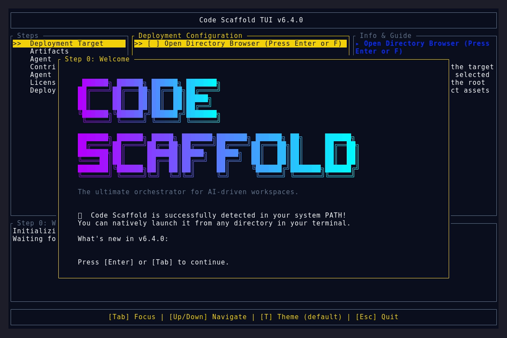
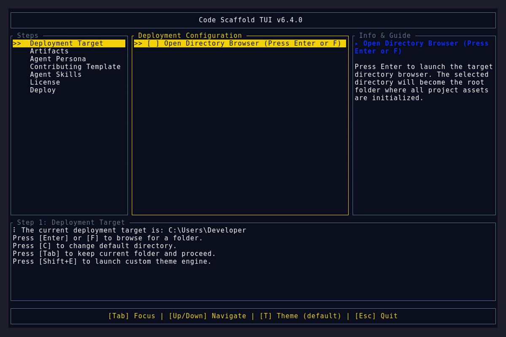
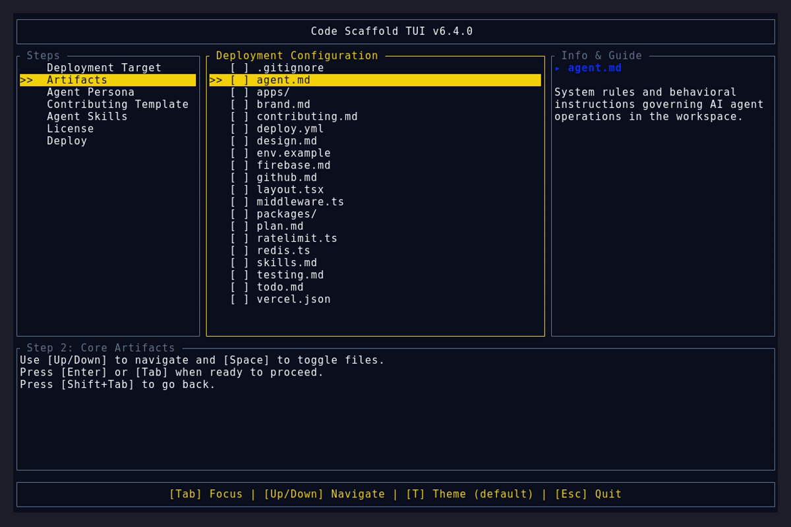

# Version 6.4.0

* **UI Wizard Redesign**: Renamed "Categories" to "Steps" and added a dedicated terminal "Deploy" step.
* **Contributing Templates**: Added the `.contributions/` payload with `strict-ownership.md` and `open-source.md` policies, and wired up the dynamic `ContributingTemplate` wizard flow with single-select enforcement.
* **Agent Client Protocol (ACP)**: Integrated official ACP compatibility documentation, detailing dual-mode (Agent/Client) engagement models and submission readiness for the ACP Registry.

## TUI Demo

### Splash Screen

### Main Selection

### Final Summary

