# SkillForge Synergy Protocol

Welcome to the autonomous R&D department of the Code Scaffold engine. 

The **SkillForge Protocol** is an administrative, developer-side routine designed to ensure that the engine's library of AI skills is continuously maintained, aggressively expanded, and interconnected. Rather than allowing Code Scaffold to stagnate as a static library of templates, SkillForge transforms it into a self-healing and self-improving ecosystem.

## What SkillForge Does

1. **Market Pulse Auditing**: The protocol actively scrapes live OEM documentation and market trends to identify deprecations (e.g., outdated API endpoints or deprecated CI/CD versions) and seamlessly patches the internal skill templates to match state-of-the-art standards.
2. **Cross-Skill Synthesis**: It maps the `.skills` directory to identify topological overlap. When synergies are found, SkillForge generates curated, multi-skill integration templates—such as teaching an agent how to bridge `tldraw` spatial canvases with `A2UI` declarative components.
3. **Rigid Skill Incubation**: Whenever a net-new skill is requested, SkillForge forces the creation pipeline through strict Code Scaffold architectural compliance. It demands the generation of `meta.json`, ad-hoc CLI distribution manifests, and highly sophisticated `SKILL.md` cognitive instructions that embed AI-specific value adds (like headless bypasses or GitHub Action workflows).

## Current Ecosystem Topology

SkillForge actively leverages visualization skills (like Mermaid and tldraw) to generate programmatic dependency graphs of its domain mapping. Below is the latest capability matrix and integration synergy map:

*Note: For AI agents tasked with executing this protocol, please refer to the strict cognitive instructions in `PROTOCOL.md`.*
